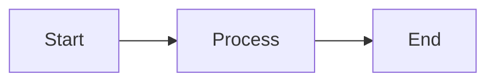

# Mermaid Diagram Setup

## ✅ Configuration Complete

Mermaid diagrams are now configured to render in the Astro Starlight documentation site using **client-side rendering**.

## How It Works

### 1. Mermaid Library

Added Mermaid.js CDN to the `<head>` section via `astro.config.mjs`:

```javascript
{
  tag: 'script',
  attrs: {
    src: 'https://cdn.jsdelivr.net/npm/mermaid@11/dist/mermaid.min.js',
  },
}
```

### 2. Zoom/Pan Library

Added svg-pan-zoom for interactive diagram navigation:

```javascript
{
  tag: 'script',
  attrs: {
    src: 'https://cdn.jsdelivr.net/npm/svg-pan-zoom@3.6.1/dist/svg-pan-zoom.min.js',
  },
}
```

### 3. Code Block Conversion

Added custom JavaScript that runs on page load to:

- Find all `<pre data-language="mermaid">` code blocks
- Extract the Mermaid code
- Convert them to `<div class="mermaid">` elements
- Initialize Mermaid with theme support (dark/light mode)
- Enable zoom/pan controls on all rendered diagrams

### 4. Theme Integration

Automatically detects Starlight's theme and renders diagrams accordingly:

- Dark mode → Dark Mermaid theme
- Light mode → Default Mermaid theme

### 5. Interactive Controls

Each diagram includes:

- **Zoom**: Scroll wheel to zoom in/out
- **Pan**: Click and drag to move around
- **Control buttons**: Zoom in, zoom out, reset view
- **Visual hint**: Shows "🔍 Scroll to zoom, drag to pan"

## Usage in Markdown

Simply use standard Markdown code blocks with `mermaid` language identifier:

````markdown

````

The JavaScript will automatically convert these to rendered diagrams when the page loads.

## Pages with Mermaid Diagrams

- ✅ `react/01-overview.md` - 7 diagrams
- ✅ `plan-execute-verify/01-overview.md` - 8 diagrams
- ✅ `plan-execute-verify/03-model-agnostic.md` - Multiple diagrams

## Advantages of Client-Side Rendering

1. **No Build Dependencies** - No need for Playwright or Puppeteer
2. **Faster Builds** - Diagrams rendered in browser, not during build
3. **Forgiving Syntax** - Mermaid handles minor syntax variations
4. **Theme Aware** - Automatically matches Starlight's dark/light theme
5. **Interactive Diagrams** - Built-in zoom/pan for large diagrams
6. **No Configuration Complexity** - Simple script injection

## Testing

To test locally:

```bash
npm run build
npm run preview
```

Then visit:

- http://localhost:4321/ai-agent-study/react/01-overview/
- http://localhost:4321/ai-agent-study/plan-execute-verify/01-overview/

## Troubleshooting

### Diagrams Not Rendering

1. Check browser console for JavaScript errors
2. Verify Mermaid CDN is accessible
3. Check if code blocks have `data-language="mermaid"` attribute

### Syntax Errors

If a diagram doesn't render, check Mermaid syntax:

- https://mermaid.js.org/intro/syntax-reference.html
- Test diagrams at: https://mermaid.live/

### Theme Issues

Diagram theme is set based on `data-theme` attribute on `<html>` element. If theme seems wrong, check:

```javascript
document.documentElement.getAttribute('data-theme');
```

## Dependencies

- **Mermaid.js v11** (latest) - Loaded from CDN (no npm package needed)
- **No build-time dependencies** - Pure client-side rendering

## Configuration Location

File: `astro.config.mjs`

```javascript
starlight({
  head: [
    // Mermaid script tags here
  ],
  // ...rest of config
});
```

---

Last Updated: 2026-02-06
