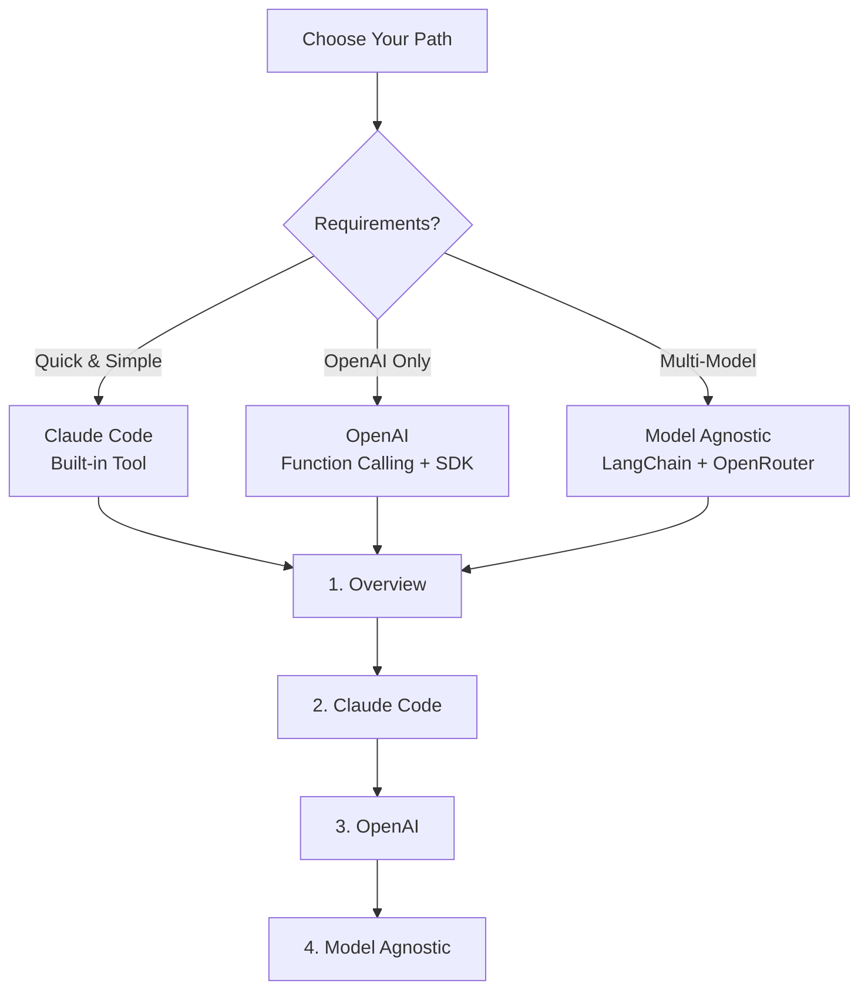
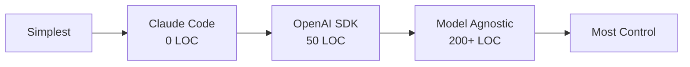
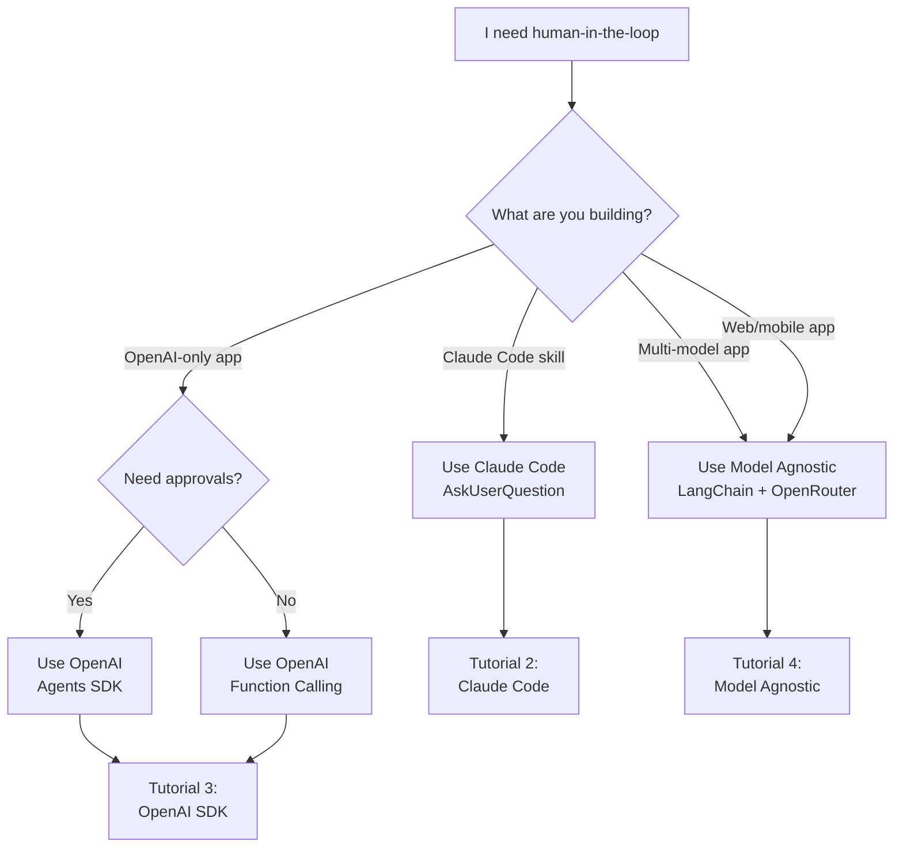
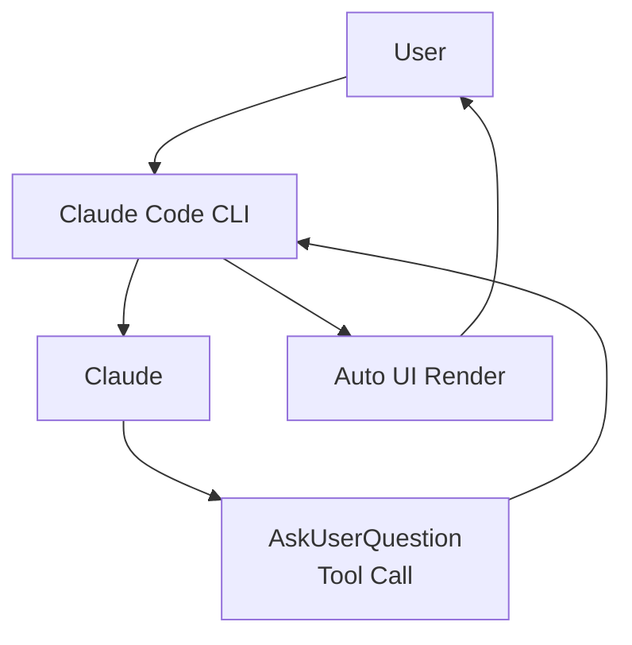
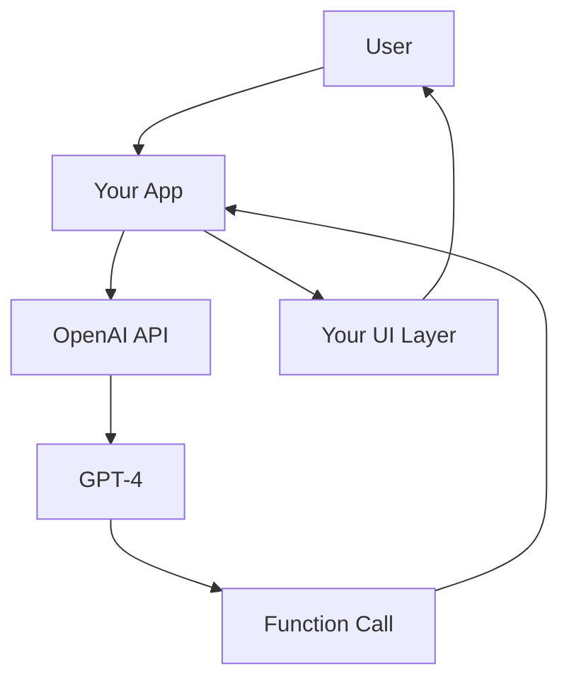
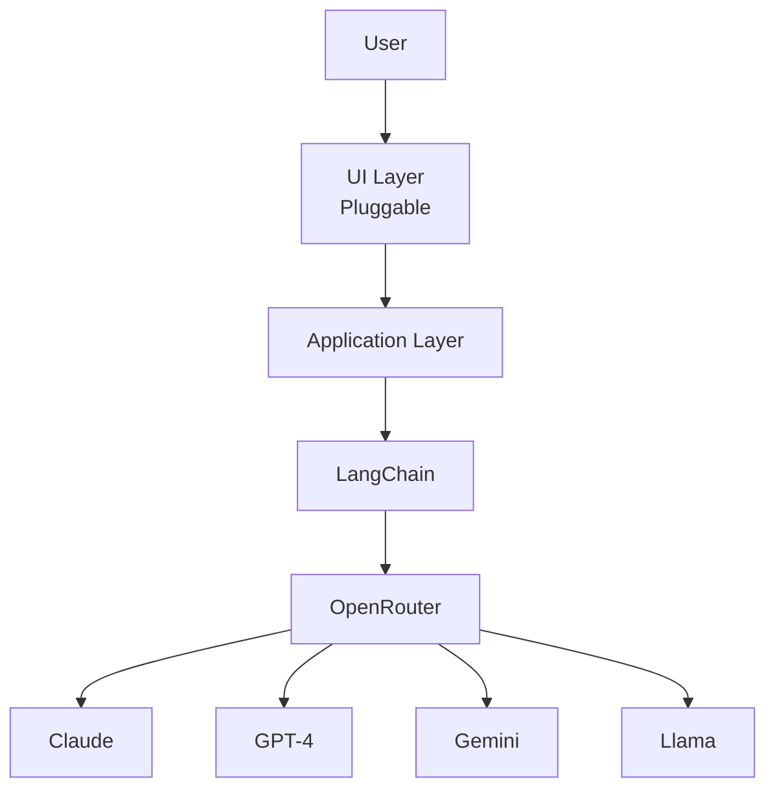

## What You'll Learn

This tutorial series teaches you how to build **interactive AI agents** that can pause execution, ask questions, and get user approval before taking actions. You'll learn three different approaches, from the simplest (Claude Code) to the most flexible (model-agnostic).

## Tutorial Series

### 1. [Overview](/ai-agent-study/human-in-the-loop/01-overview/)

**Start here to understand the fundamentals.**

Learn:

- What human-in-the-loop is and why it matters
- Common use cases (clarification, approval, configuration)
- Architecture patterns and constraints
- Comparison of different approaches
- When to use HITL vs autonomous agents

**Read this if:** You're new to human-in-the-loop or want to understand the big picture.

---

### 2. [Claude Code Implementation](/ai-agent-study/human-in-the-loop/02-claude-implementation/)

**The simplest approach - zero setup required.**

Learn:

- How Claude Code's built-in `AskUserQuestion` works
- Creating interactive skills with automatic UI rendering
- Design patterns (sequential, multi-select, progressive disclosure)
- Best practices for questions and options
- Limitations and when to use other approaches

**Read this if:** You're building Claude Code skills or want the fastest way to add HITL.

**Pros:**

- ✅ Zero code - just write instructions
- ✅ Automatic UI rendering in terminal
- ✅ No state management needed

**Cons:**

- ❌ Claude Code CLI only
- ❌ Can't customize UI
- ❌ Not portable to other platforms

---

### 3. [OpenAI Implementation](/ai-agent-study/human-in-the-loop/03-openai-implementation/)

**Two powerful approaches for OpenAI users.**

Learn:

- **Function Calling**: Manual implementation with full control
- **Agents SDK**: Built-in approval workflows with `needsApproval`
- Structured Outputs for guaranteed schema compliance
- Handling parallel tool calls
- Error handling and validation

**Read this if:** You're using OpenAI and want built-in approval features or need to understand function calling.

**Pros:**

- ✅ Provider-supported patterns
- ✅ Agents SDK has built-in approvals
- ✅ Structured Outputs guarantee compliance
- ✅ Good documentation and examples

**Cons:**

- ❌ OpenAI models only
- ❌ Still need to implement UI layer
- ❌ SDK adds dependency

---

### 4. [Model-Agnostic Implementation](/ai-agent-study/human-in-the-loop/04-model-agnostic/)

**Maximum flexibility - works with any LLM provider.**

Learn:

- LangChain + OpenRouter architecture
- Custom tool definition and execution loops
- Pluggable UI handlers (CLI, web, mobile)
- State management across pauses
- Constraints and trade-offs
- Production-ready patterns

**Read this if:** You need to support multiple LLM providers or build web/mobile apps.

**Pros:**

- ✅ Works with any model (Claude, GPT, Gemini, Llama, etc.)
- ✅ Full control over UI (terminal, web, mobile)
- ✅ Custom validation and logic
- ✅ Production-ready architecture

**Cons:**

- ❌ More code (~200+ lines)
- ❌ Manual state management
- ❌ Higher complexity

---

## Quick Comparison

### By Complexity

### By Use Case

| Use Case                          | Best Approach           |
| --------------------------------- | ----------------------- |
| **Claude Code skill development** | Claude Code built-in    |
| **Quick prototyping**             | Claude Code built-in    |
| **OpenAI-only production app**    | OpenAI Agents SDK       |
| **Custom approval logic**         | OpenAI Function Calling |
| **Web/mobile application**        | Model Agnostic          |
| **Multi-provider support**        | Model Agnostic          |
| **Maximum flexibility**           | Model Agnostic          |

### Feature Matrix

| Feature              | Claude Code   | OpenAI SDK  | Model Agnostic |
| -------------------- | ------------- | ----------- | -------------- |
| **Setup Time**       | Instant       | Minutes     | Hours          |
| **Lines of Code**    | 0             | ~50         | ~200+          |
| **UI Rendering**     | Automatic     | Manual      | Fully Custom   |
| **Model Support**    | Claude only   | OpenAI only | Any model      |
| **UI Options**       | Terminal only | Any (DIY)   | Any (DIY)      |
| **State Management** | Automatic     | SDK helps   | Manual         |
| **Approval Flow**    | Manual        | Built-in    | Manual         |
| **Production Ready** | Demos         | Yes         | Yes            |
| **Customization**    | Low           | Medium      | High           |
| **Portability**      | None          | Low         | High           |

## Decision Tree

## Architecture Comparison

### Claude Code: Integrated

**Characteristics:**

- Single, integrated system
- No separation between agent and UI
- Automatic everything
- Least flexible, easiest to use

### OpenAI: Semi-Integrated

**Characteristics:**

- Semi-integrated (SDK helps)
- Some separation (UI is yours)
- Manual UI implementation
- Medium flexibility, medium effort

### Model-Agnostic: Fully Separated

**Characteristics:**

- Fully separated layers
- Complete independence
- Maximum flexibility
- Most work, most control

## Common Patterns

### Pattern 1: Sequential Questions

Ask questions one after another based on previous answers.

**Example:** Project setup wizard

1. "What type of project?" → Web App
2. "Which framework?" → React
3. "Which styling?" → Tailwind CSS

**Best implemented in:**

- ✅ All three approaches
- Easiest in Claude Code
- Most flexible in Model Agnostic

### Pattern 2: Approval Gates

Require confirmation before sensitive operations.

**Example:** Database operations

- "Delete 10,000 records?"
- "Deploy to production?"
- "Send email to all users?"

**Best implemented in:**

- ✅ OpenAI Agents SDK (built-in `needsApproval`)
- ⚠️ Manual in Claude Code
- ⚠️ Manual in Model Agnostic

### Pattern 3: Conditional Branching

Different follow-up questions based on initial answer.

**Example:** Setup complexity

- Beginner → Use defaults, skip questions
- Intermediate → Ask key questions
- Advanced → Ask all configuration details

**Best implemented in:**

- ✅ All three approaches
- Most elegant in Model Agnostic (full control)

### Pattern 4: Multi-Select Features

Allow users to select multiple non-exclusive options.

**Example:** Feature selection

- Select all that apply:
  - ☑ Authentication
  - ☑ Database
  - ☐ Email
  - ☑ Testing

**Best implemented in:**

- ✅ Claude Code (`multiSelect: true`)
- ✅ OpenAI (custom logic)
- ✅ Model Agnostic (custom logic)

## Key Constraints Across All Approaches

### 1. Tool Calling Reliability

Not all models are equally good at tool calling:

| Model              | Reliability | Notes                  |
| ------------------ | ----------- | ---------------------- |
| Claude (Anthropic) | 95%+        | Best-in-class          |
| GPT-4 (OpenAI)     | 95%+        | Very reliable          |
| Gemini (Google)    | 85%+        | Generally good         |
| Llama 3            | 60-80%      | Depends on fine-tuning |
| Mistral            | 50-70%      | Limited support        |

**Implication:** Stick to Claude or GPT-4 for production systems.

### 2. UI Separation

Only Claude Code has built-in UI. For everything else, you must:

- Implement your own UI layer
- Handle rendering logic
- Manage user input collection
- Validate responses

### 3. State Management

Pausing execution requires preserving conversation state:

- Message history must be maintained
- Tool calls must be tracked
- Answers must be properly formatted
- Context must flow back to the LLM

### 4. User Experience

Consider cognitive load:

- **2-4 options** per question (max)
- **1-4 questions** per interaction
- **Clear descriptions** for each option
- **Progressive disclosure** for complexity

## Real-World Examples

### Example 1: Feature Development Assistant

**Scenario:** Help developers implement new features by asking clarifying questions.

**Best Approach:** Model-Agnostic

- Needs to work with multiple LLMs
- Web UI for better collaboration
- Complex validation logic
- Integration with GitHub, Jira

**Implementation:**

- Tutorial 4: Model-Agnostic
- Web UI (Streamlit or React)
- LangChain for flexibility
- OpenRouter for model access

### Example 2: Claude Code Skill

**Scenario:** Interactive database setup skill for Claude Code users.

**Best Approach:** Claude Code Built-in

- Target audience uses Claude Code
- Terminal UI is sufficient
- Want zero-setup experience
- Quick development

**Implementation:**

- Tutorial 2: Claude Code
- Use built-in `AskUserQuestion`
- Write skill in Markdown
- ~0 lines of code

### Example 3: Deployment Assistant

**Scenario:** ChatGPT-based deployment tool with safety checks.

**Best Approach:** OpenAI Agents SDK

- OpenAI-only is acceptable
- Need built-in approvals
- Production deployments (high risk)
- Standardized flow

**Implementation:**

- Tutorial 3: OpenAI Agents SDK
- Use `needsApproval: true`
- Conditional approvals for prod
- ~50 lines of code

## Getting Started

### Path 1: Complete Beginner

1. **Start:** [Overview](/ai-agent-study/human-in-the-loop/01-overview/) - Understand concepts
2. **Try:** [Claude Code](/ai-agent-study/human-in-the-loop/02-claude-implementation/) - Simplest implementation
3. **Explore:** Run the examples and modify them
4. **Advance:** Try OpenAI or Model-Agnostic when needed

### Path 2: OpenAI Developer

1. **Start:** [Overview](/ai-agent-study/human-in-the-loop/01-overview/) - Understand landscape
2. **Deep Dive:** [OpenAI](/ai-agent-study/human-in-the-loop/03-openai-implementation/) - Learn both approaches
3. **Implement:** Choose Function Calling or Agents SDK
4. **Consider:** Model-Agnostic for multi-provider support

### Path 3: Production Engineer

1. **Start:** [Overview](/ai-agent-study/human-in-the-loop/01-overview/) - Understand options
2. **Compare:** Read all three implementation tutorials
3. **Decide:** Based on requirements (single vs multi-provider)
4. **Implement:** [Model-Agnostic](/ai-agent-study/human-in-the-loop/04-model-agnostic/) for maximum flexibility

## Further Resources

### Official Documentation

- [Claude Code Documentation](https://github.com/anthropics/claude-code)
- [OpenAI Function Calling](https://platform.openai.com/docs/guides/function-calling)
- [OpenAI Agents SDK](https://openai.github.io/openai-agents-python/)
- [LangChain Documentation](https://python.langchain.com/docs/)
- [OpenRouter API](https://openrouter.ai/)

### Related Patterns

- [ReAct Pattern](/ai-agent-study/react/01-overview/) - Simple reasoning and acting loop
- [Plan-Execute-Verify](/ai-agent-study/plan-execute-verify/01-overview/) - Production-grade agent pattern

### Community Resources

- [Anthropic Cookbook](https://github.com/anthropics/anthropic-cookbook)
- [OpenAI Cookbook](https://cookbook.openai.com/)
- [LangChain Human-in-the-Loop Guide](https://python.langchain.com/docs/how_to/human_in_the_loop)
- [Prompt Engineering Guide - Function Calling](https://www.promptingguide.ai/agents/function-calling)

## Need Help?

- **Conceptual questions?** → Start with [Overview](/ai-agent-study/human-in-the-loop/01-overview/)
- **Claude Code specific?** → See [Claude Implementation](/ai-agent-study/human-in-the-loop/02-claude-implementation/)
- **OpenAI specific?** → Check [OpenAI Implementation](/ai-agent-study/human-in-the-loop/03-openai-implementation/)
- **Architecture questions?** → Review [Model-Agnostic Implementation](/ai-agent-study/human-in-the-loop/04-model-agnostic/)

---

**Ready to start?** → Begin with the [Overview](/ai-agent-study/human-in-the-loop/01-overview/) to understand the fundamentals!
