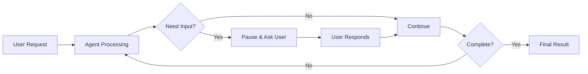
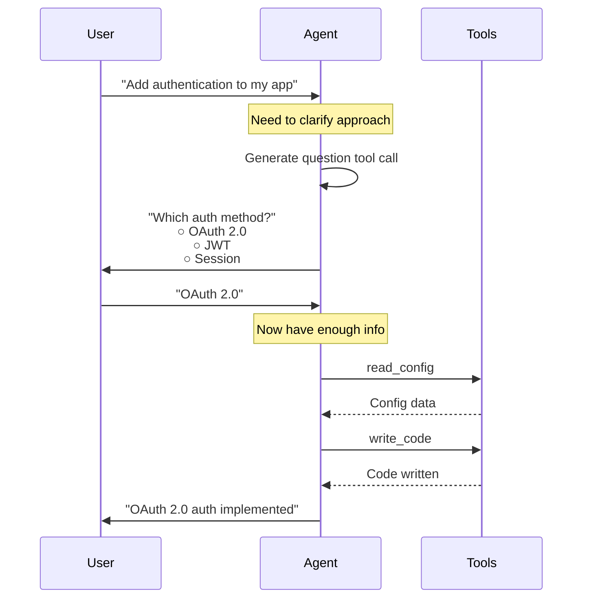
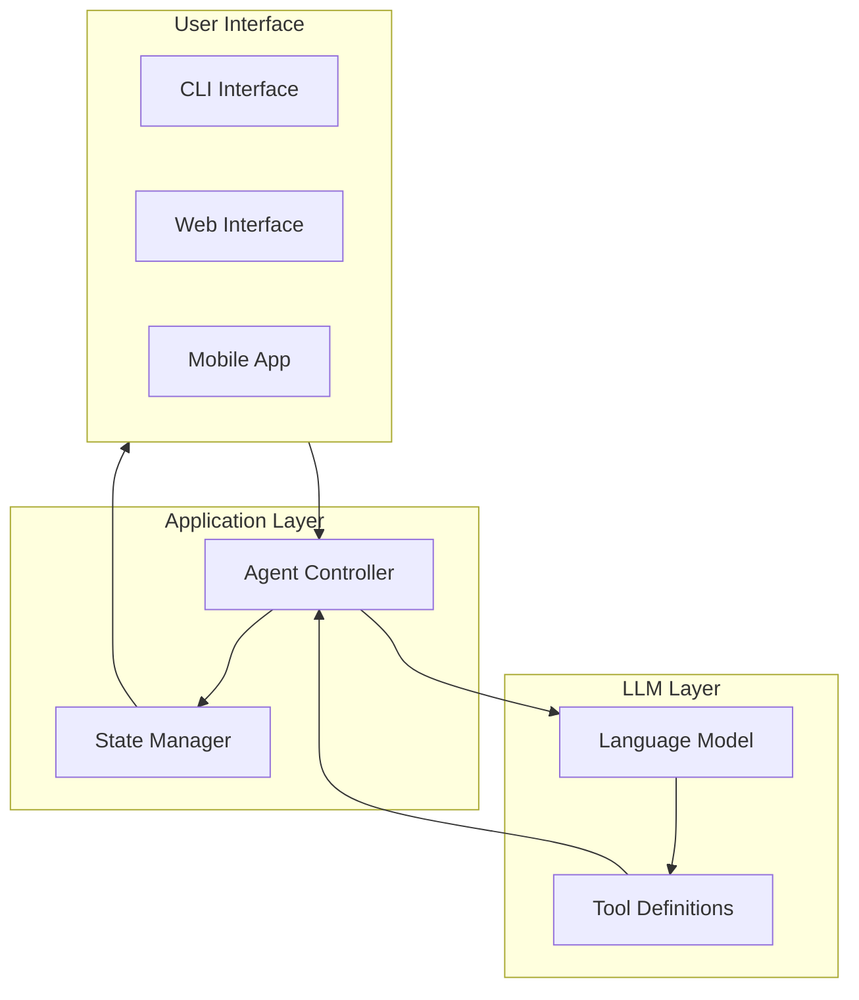
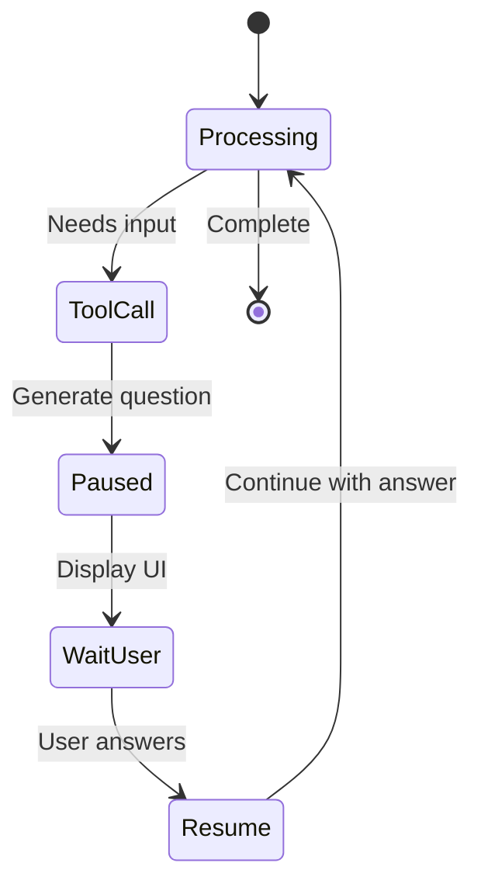
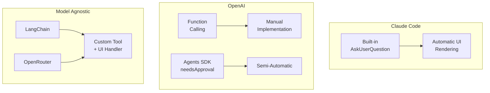
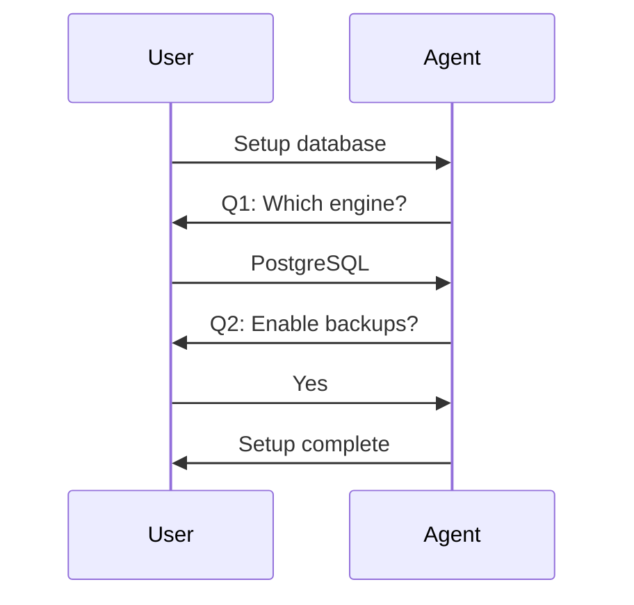
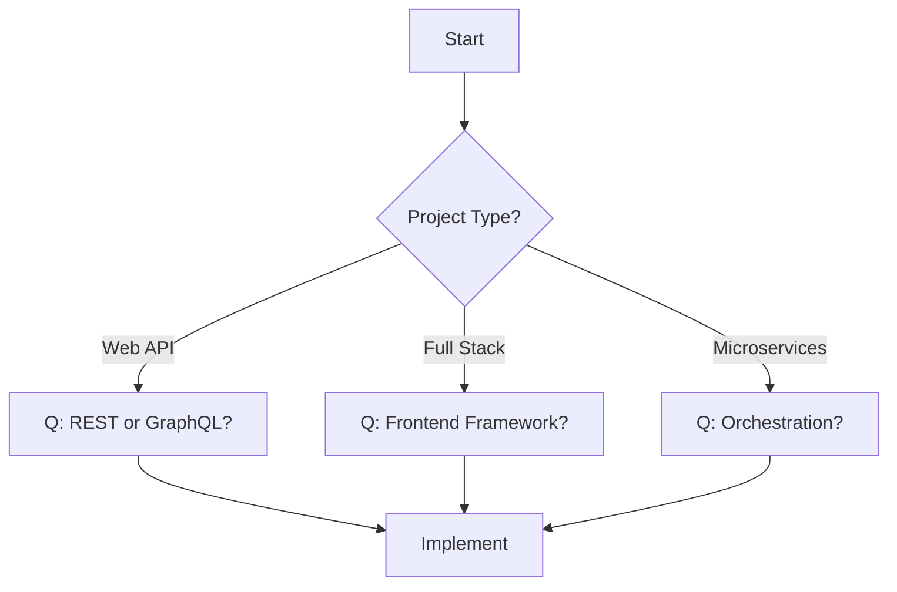
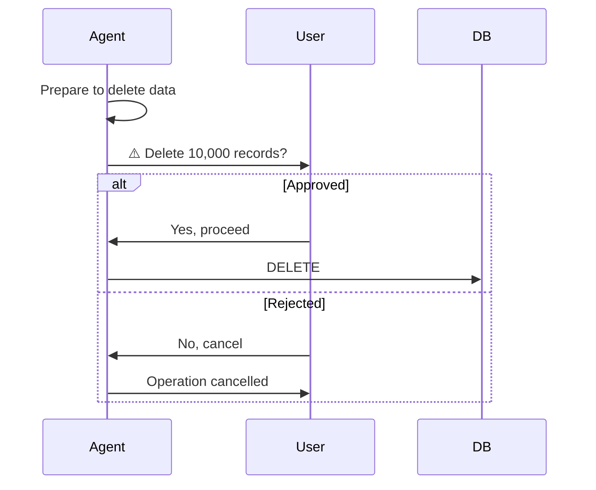
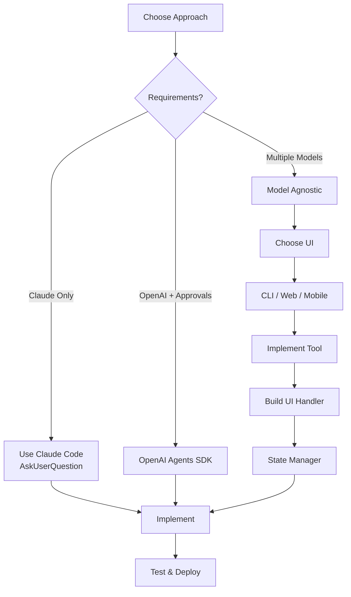

## What is Human-in-the-Loop?

**Human-in-the-Loop (HITL)** is a pattern where AI agents pause execution to gather user input, ask clarifying questions, or request approval before proceeding. This enables agents to handle ambiguous situations, make better decisions, and provide safety guardrails for sensitive operations.

## Core Concept



## Why Human-in-the-Loop?

### Common Use Cases

1. **Clarifying Requirements**
   - "Which database should I use?"
   - "What authentication method do you prefer?"
   - "Should this be a REST API or GraphQL?"

2. **Approval Workflows**
   - "Deploy to production? (impacts 10,000 users)"
   - "Delete all test data?"
   - "Send email to 5,000 customers?"

3. **Configuration Gathering**
   - "Which features do you want to enable?"
   - "Select deployment regions"
   - "Choose dependencies to install"

4. **Decision Making**
   - "Multiple approaches found. Which one?"
   - "Trade-off between speed and accuracy. Your preference?"
   - "Conflicting requirements detected. How to resolve?"

## Interaction Flow



## Key Characteristics

### ✅ Benefits

- **Better Decisions**: Agent gets clarification instead of guessing
- **Safety**: Approval required for risky operations
- **Flexibility**: Adapts to user preferences
- **Transparency**: User sees and controls agent actions
- **Error Prevention**: Catches misunderstandings early

### ⚠️ Challenges

- **Interrupts Flow**: Breaks autonomous operation
- **Requires UI**: Need to present questions to users
- **State Management**: Must preserve context during pauses
- **Complexity**: More moving parts than autonomous agents

## Architecture Overview



## How It Works: Technical View

### 1. Tool Calling Mechanism

Modern LLMs can generate structured JSON for "tool calls" - predefined functions the model can invoke:

```json
{
  "tool_call": {
    "name": "ask_user_question",
    "arguments": {
      "question": "Which database?",
      "options": ["PostgreSQL", "MongoDB", "Redis"]
    }
  }
}
```

### 2. Execution Pause

When the agent generates an `ask_user_question` tool call:



### 3. State Preservation

The application must maintain conversation state:

```python
messages = [
    SystemMessage("You are a helpful assistant"),
    HumanMessage("Add authentication"),
    AIMessage("I need to know which method"),
    AIMessage(tool_calls=[...]),  # ← Paused here
    # User answers...
    ToolMessage("OAuth 2.0"),     # ← Answer added
    AIMessage("Implementing OAuth...")  # ← Resumed
]
```

## Provider Comparison

Different LLM providers handle HITL differently:



### Key Differences

| Aspect            | Claude Code          | OpenAI             | Model Agnostic  |
| ----------------- | -------------------- | ------------------ | --------------- |
| **Built-in Tool** | ✅ `AskUserQuestion` | ❌ Must define     | ❌ Must define  |
| **UI Rendering**  | ✅ Automatic         | ⚠️ SDK helps       | ❌ Manual       |
| **Approval Flow** | Manual               | ✅ `needsApproval` | ❌ Manual       |
| **Flexibility**   | ❌ CLI only          | ⚠️ Limited         | ✅ Full control |
| **Complexity**    | Low                  | Medium             | High            |

## Implementation Approaches

### Approach 1: Built-in Tool (Claude Code)

**Pros:**

- Dead simple for developers
- Integrated UI
- Zero configuration

**Cons:**

- Claude Code specific
- Limited to terminal UI
- No customization

### Approach 2: Provider SDK (OpenAI Agents)

**Pros:**

- Standardized approval flow
- Provider-supported
- Good documentation

**Cons:**

- Provider-specific
- Limited UI options
- SDK dependency

### Approach 3: Custom Implementation (Model Agnostic)

**Pros:**

- Works with any LLM
- Full UI control (CLI, web, mobile)
- Maximum flexibility

**Cons:**

- Most code to write
- Manual state management
- Complex architecture

## Workflow Patterns

### Pattern 1: Sequential Questions

Ask questions one at a time:



### Pattern 2: Conditional Branching

Follow-up questions based on answers:



### Pattern 3: Approval Gates

Require confirmation for sensitive operations:



## When to Use HITL

| ✅ Use HITL When...               | ❌ Skip HITL When...           |
| --------------------------------- | ------------------------------ |
| Multiple valid approaches exist   | Requirements are crystal clear |
| User preferences matter           | Fully automated workflows      |
| Operations are risky/irreversible | Simple, safe operations        |
| Requirements are ambiguous        | User is not available          |
| Configuration is complex          | Batch processing               |

## Best Practices

### 1. Design Clear Questions

**Bad:**

```
Question: "Choose one"
Options: ["A", "B", "C"]
```

**Good:**

```
Question: "Which database engine should we use?"
Options: [
  "PostgreSQL - Relational, ACID compliant, complex queries",
  "MongoDB - Document store, flexible schema, horizontal scaling",
  "Redis - In-memory, microsecond latency, caching"
]
```

### 2. Limit Options

- **2-4 options** per question (5+ is overwhelming)
- Use progressive disclosure for complex choices
- Group related options

### 3. Provide Context

- Explain **why** you're asking
- Describe **implications** of each choice
- Mention **trade-offs** when relevant

### 4. Handle Errors Gracefully

- Validate user input
- Allow "cancel" or "back"
- Provide defaults when appropriate
- Log all interactions

## Constraints & Considerations

### Technical Constraints

1. **Tool Calling Variability**: Not all models have equal tool-calling capabilities
2. **No Universal Standard**: Each provider implements HITL differently
3. **State Management**: Application must handle conversation pauses
4. **UI Separation**: Rendering logic separate from agent logic

### Design Constraints

1. **Response Time**: Users expect sub-second UI rendering
2. **Context Preservation**: Must not lose conversation history
3. **Error Recovery**: Handle network issues, timeouts
4. **Multi-turn Support**: Questions may lead to more questions

### UX Constraints

1. **Cognitive Load**: Too many questions = poor UX
2. **Progressive Disclosure**: Start simple, get detailed only when needed
3. **Clear Actions**: Users must understand what will happen
4. **Undo/Cancel**: Provide escape hatches

## Implementation Roadmap



## Next Steps

Explore specific implementations:

1. **[Claude Code Implementation](/ai-agent-study/human-in-the-loop/02-claude-implementation/)** - Built-in `AskUserQuestion` tool
2. **[OpenAI Implementation](/ai-agent-study/human-in-the-loop/03-openai-implementation/)** - Function calling & Agents SDK
3. **[Model Agnostic Implementation](/ai-agent-study/human-in-the-loop/04-model-agnostic/)** - LangChain + OpenRouter approach

## Further Reading

- [Tool Calling Guide](https://platform.openai.com/docs/guides/function-calling)
- [Claude Code Documentation](https://github.com/anthropics/claude-code)
- [LangChain Human-in-the-Loop](https://python.langchain.com/docs/how_to/human_in_the_loop)
- [OpenAI Agents SDK](https://openai.github.io/openai-agents-python/)
