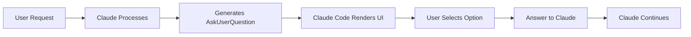
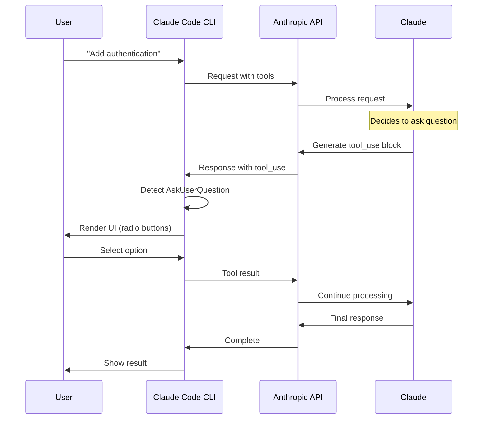
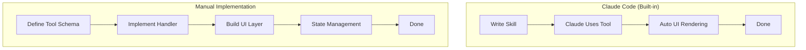

## Overview

Claude Code provides the **most seamless** human-in-the-loop experience through its built-in `AskUserQuestion` tool. Unlike other approaches, Claude Code handles **both** the tool definition and UI rendering automatically.



## How It Works

### The Built-in Tool

Claude Code automatically provides the `AskUserQuestion` tool to Claude. You don't need to define it yourself.

**Tool Signature:**

```typescript
interface AskUserQuestionInput {
  questions: Question[];
  answers?: Record<string, string | string[]>;
  metadata?: { source?: string };
}

interface Question {
  question: string; // The question text
  header: string; // Short label (max 12 chars)
  multiSelect: boolean; // Allow multiple selections?
  options: Option[]; // 2-4 choices
}

interface Option {
  label: string; // Display text (1-5 words)
  description: string; // Explanation (1-2 sentences)
}
```

### The Architecture



## Creating Interactive Skills

### Basic Skill Structure

Create a skill file in `~/.claude/plugins/your-plugin/skills/`:

```markdown
---
description: 'Interactive database setup'
allowed-tools: ['AskUserQuestion', 'Read', 'Write', 'Bash']
---

# Database Setup

Help the user set up a database for their project.

## Phase 1: Gather Requirements

Use the AskUserQuestion tool to collect user preferences.

**Question 1 - Database Engine:**

- question: "Which database engine should we use?"
- header: "Database"
- multiSelect: false
- options:
  - PostgreSQL (Relational, ACID compliant, best for complex queries)
  - MongoDB (Document store, flexible schema, rapid iteration)
  - Redis (In-memory, fast, best for caching and sessions)

**Question 2 - Features:**

- question: "Which features do you want to enable?"
- header: "Features"
- multiSelect: true
- options:
  - Migrations (Database schema versioning)
  - Seeding (Sample data generation)
  - Backups (Automated backup system)
  - Replication (High availability setup)

## Phase 2: Implementation

Based on the user's selections:

1. Install the chosen database driver
2. Generate configuration files
3. Set up selected features
4. Create example code

## Phase 3: Confirmation

Show what was created and provide next steps.
```

### How Claude Interprets This

When Claude reads this skill, it:

1. Sees instructions to use `AskUserQuestion`
2. Reads the question specifications
3. Generates a structured tool call matching the schema
4. Waits for the response
5. Continues based on the answer

## Tool Call Example

### What Claude Generates

```json
{
  "type": "tool_use",
  "id": "toolu_01ABC",
  "name": "AskUserQuestion",
  "input": {
    "questions": [
      {
        "question": "Which database engine should we use?",
        "header": "Database",
        "multiSelect": false,
        "options": [
          {
            "label": "PostgreSQL",
            "description": "Relational, ACID compliant, best for complex queries"
          },
          {
            "label": "MongoDB",
            "description": "Document store, flexible schema, rapid iteration"
          },
          {
            "label": "Redis",
            "description": "In-memory, fast, best for caching and sessions"
          }
        ]
      }
    ]
  }
}
```

### What Claude Code Does

1. **Parses** the tool call
2. **Renders** interactive UI:

   ```
   ❓ Which database engine should we use?
   ━━━━━━━━━━━━━━━━━━━━━━━━━━━━━━━━━━━━━
   ○ PostgreSQL
     Relational, ACID compliant, best for complex queries

   ○ MongoDB
     Document store, flexible schema, rapid iteration

   ○ Redis
     In-memory, fast, best for caching and sessions

   ○ Other
   ```

3. **Waits** for user selection
4. **Returns** result to Claude:

   ```json
   {
     "Database": "PostgreSQL"
   }
   ```

## Design Patterns

### Pattern 1: Sequential Questions

Ask questions one after another:

```markdown
## Step 1: Choose Stack

Use AskUserQuestion:

**Question**: "Which technology stack?"

- Node.js + Express
- Python + FastAPI
- Go + Fiber

## Step 2: Choose Database (Based on Step 1)

If Node.js:
**Question**: "Which Node.js database client?"

- pg (PostgreSQL)
- mongoose (MongoDB)
- ioredis (Redis)

If Python:
**Question**: "Which Python database library?"

- psycopg2 (PostgreSQL)
- pymongo (MongoDB)
- redis-py (Redis)
```

### Pattern 2: Multi-Select Features

Allow multiple selections:

```markdown
**Question**: "Which features do you want?"

- header: "Features"
- multiSelect: true # ← Allow multiple selections
- options:
  - Authentication (User login and sessions)
  - API (REST API endpoints)
  - Database (Database integration)
  - Testing (Unit and integration tests)
```

### Pattern 3: Progressive Disclosure

Start simple, get detailed only when needed:

```markdown
## Question 1: Experience Level

**Question**: "What's your experience level?"

- Beginner (Use defaults and best practices)
- Intermediate (Customize common settings)
- Advanced (Full control over configuration)

## Conditional Follow-ups

If Beginner:
Apply defaults, skip detailed questions

If Intermediate:
Ask about key preferences (auth, database, deployment)

If Advanced:
Ask detailed questions about architecture, optimization, security
```

## Best Practices

### 1. Clear, Specific Questions

**❌ Bad:**

```markdown
**Question**: "Choose one"

- Option 1
- Option 2
```

**✅ Good:**

```markdown
**Question**: "Which authentication method should we implement?"

- OAuth 2.0 (Industry standard, supports Google, GitHub, etc.)
- JWT (Stateless tokens, good for APIs and microservices)
- Session (Traditional server-side sessions with cookies)
```

### 2. Descriptive Options

**❌ Bad:**

```markdown
- Fast one
- Reliable one
- Other one
```

**✅ Good:**

```markdown
- Redis (In-memory, microsecond latency, best for caching)
- PostgreSQL (ACID compliant, data integrity, complex queries)
- MongoDB (Flexible schema, horizontal scaling, rapid development)
```

### 3. Respect Constraints

- **Header**: Max 12 characters
- **Options**: 2-4 per question (5+ is overwhelming)
- **Questions**: 1-4 per tool call
- **Description**: 1-2 sentences, focus on key benefits

**❌ Bad header:**

```markdown
header: "Authentication Method Selection" # 30 chars!
```

**✅ Good header:**

```markdown
header: "Auth method" # 11 chars
```

### 4. Use Multi-Select Appropriately

**✅ Use for non-exclusive choices:**

```markdown
**Question**: "Which features do you want to enable?"
multiSelect: true

- Logging
- Metrics
- Alerts
- Backups
```

**❌ Don't use for exclusive choices:**

```markdown
**Question**: "Which database engine?"
multiSelect: true # ❌ Wrong! Can only use one engine
```

## Real-World Example

### Feature Development Skill

```markdown
---
description: 'Guided feature development with human-in-the-loop'
allowed-tools: ['AskUserQuestion', 'Glob', 'Grep', 'Read', 'Write', 'Edit', 'Bash']
---

# Feature Development Workflow

## Phase 1: Understand Codebase

Use Glob and Grep to understand existing architecture:

1. Find similar features
2. Identify patterns and conventions
3. Locate relevant files

## Phase 2: Clarify Requirements

Use AskUserQuestion to gather requirements.

**Question 1 - Feature Scope:**

- question: "What's the scope of this feature?"
- header: "Scope"
- multiSelect: false
- options:
  - Small (Single file, < 100 lines, 1-2 hours)
  - Medium (Multiple files, < 500 lines, 1 day)
  - Large (Architectural changes, > 500 lines, multiple days)

**Question 2 - Implementation Approach:**

- question: "Which implementation approach do you prefer?"
- header: "Approach"
- multiSelect: false
- options:
  - Quick (Minimal changes, get it working fast)
  - Balanced (Good balance of speed and quality)
  - Thorough (Best practices, comprehensive tests, documentation)

**Question 3 - Requirements:**

- question: "What else should this feature include?"
- header: "Include"
- multiSelect: true
- options:
  - Tests (Unit and integration tests)
  - Documentation (API docs and examples)
  - Error Handling (Comprehensive error cases)
  - Logging (Debug and audit logging)

## Phase 3: Design

Based on answers, design the implementation:

- If Small + Quick: Inline implementation, minimal abstraction
- If Medium + Balanced: Modular design, key tests
- If Large + Thorough: Full architecture, comprehensive suite

## Phase 4: Implement

Write the code following the chosen approach.

## Phase 5: Review

Show what was created and ask for confirmation:

**Question**: "Does this look good?"

- Yes, perfect (Mark as complete)
- Needs tweaks (Make requested changes)
- Start over (Redesign from scratch)
```

## Tool Response Format

### What Claude Receives

When the user selects options, Claude receives:

```json
{
  "Scope": "Medium",
  "Approach": "Balanced",
  "Include": ["Tests", "Error Handling"]
}
```

Claude can then use this in its reasoning:

```
The user chose Medium scope with Balanced approach.
They want Tests and Error Handling included.

I should:
1. Create 2-3 files
2. Focus on core functionality + tests
3. Include comprehensive error handling
4. Skip documentation for now
```

## Limitations

### UI Constraints

- **Terminal Only**: Only works in Claude Code CLI
- **No Custom Styling**: Can't change colors, fonts, etc.
- **Limited Controls**: Radio buttons and checkboxes only

### Interaction Constraints

- **Synchronous**: Blocks until user responds
- **No Validation**: Can't add custom validation rules
- **No Branching**: Can't conditionally show/hide options in same question

### Scale Constraints

- **Max 4 Questions**: Per tool call
- **Max 4 Options**: Per question
- **Max 12 Chars**: For header

## Debugging Tips

### Question Not Appearing?

**Check 1: Tool in allowed-tools?**

```markdown
---
allowed-tools: ['AskUserQuestion', ...] # ✅ Must include
---
```

**Check 2: Valid format?**

```markdown
# ✅ Correct format

**Question**: "Which one?"

- Option A (Description)
- Option B (Description)

# ❌ Wrong format

Question: Which one?
Options: A, B
```

**Check 3: Constraints met?**

- 2-4 options? ✅
- Header ≤ 12 chars? ✅
- Questions clear? ✅

### Invalid Response?

Claude Code validates the tool call. If invalid:

- Check required fields (`question`, `header`, `options`)
- Verify `multiSelect` is boolean
- Ensure 2-4 options per question

## Comparison with Other Approaches



| Aspect          | Claude Code      | Manual           |
| --------------- | ---------------- | ---------------- |
| **Setup**       | Zero             | Define tool + UI |
| **UI**          | Automatic        | Build yourself   |
| **Flexibility** | Limited          | Full control     |
| **Complexity**  | Low (~0 LOC)     | High (~200+ LOC) |
| **Portability** | Claude Code only | Any platform     |

## When to Use Claude Code's Approach

| ✅ Use When...              | ❌ Avoid When...       |
| --------------------------- | ---------------------- |
| Building Claude Code skills | Need custom UI         |
| Terminal interface is fine  | Web/mobile required    |
| Rapid prototyping           | Multi-provider support |
| Standard Q&A patterns       | Complex validation     |
| Learning HITL concepts      | Production web apps    |

## Next Steps

- **Want more control?** → See [OpenAI Implementation](/ai-agent-study/human-in-the-loop/03-openai-implementation/)
- **Need flexibility?** → Check [Model Agnostic Approach](/ai-agent-study/human-in-the-loop/04-model-agnostic/)

## Further Reading

- [Claude Code Documentation](https://github.com/anthropics/claude-code)
- [Tool Calling Guide](https://docs.anthropic.com/en/docs/build-with-claude/tool-use)
- [Claude Code Plugin Development](https://github.com/anthropics/claude-code/tree/main/plugins)
