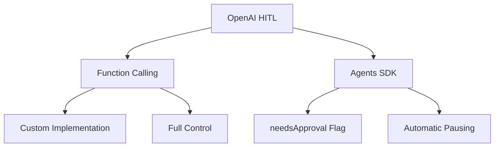
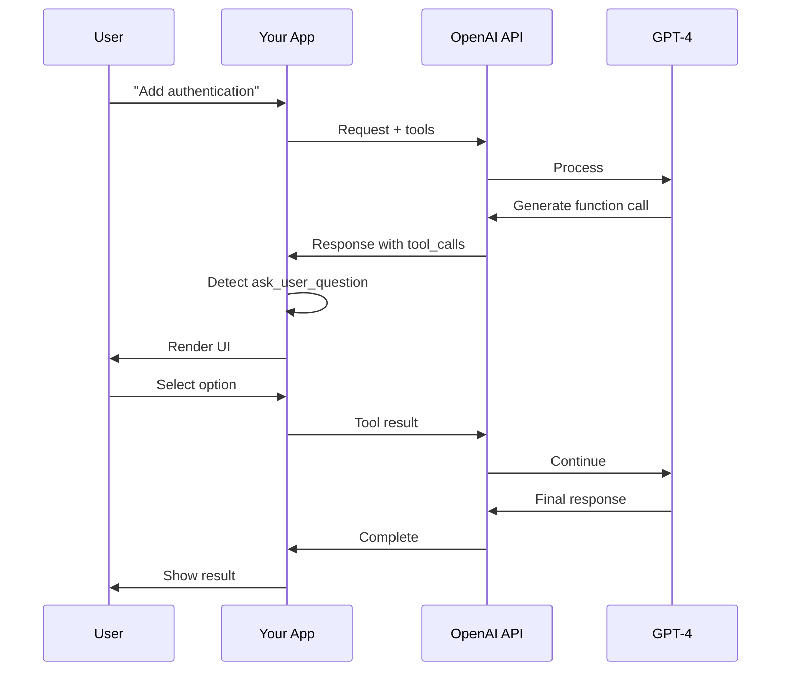
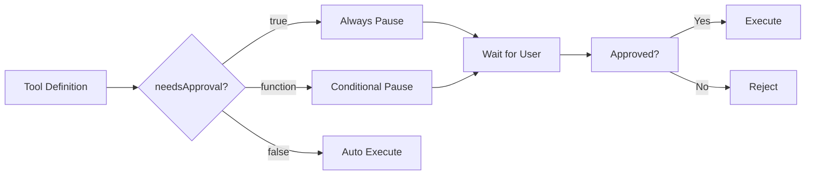
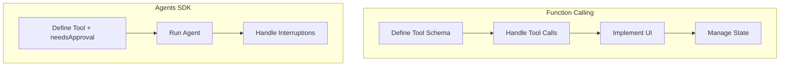

## Overview

OpenAI provides **two main approaches** for human-in-the-loop:

1. **Function Calling** (Chat Completions API) - Manual implementation with full control
2. **Agents SDK** - Built-in approval workflows with `needsApproval`



## Approach 1: Function Calling

### How It Works

You define custom functions (tools) that GPT can call:



### Define the Tool

```python
import openai
import json

# Define the ask_user_question function
tools = [
    {
        "type": "function",
        "function": {
            "name": "ask_user_question",
            "description": "Ask the user a multiple choice question and wait for their response",
            "parameters": {
                "type": "object",
                "properties": {
                    "question": {
                        "type": "string",
                        "description": "The question to ask the user"
                    },
                    "options": {
                        "type": "array",
                        "description": "Available answer choices",
                        "items": {
                            "type": "object",
                            "properties": {
                                "label": {
                                    "type": "string",
                                    "description": "Display text for this option"
                                },
                                "value": {
                                    "type": "string",
                                    "description": "Value to return if selected"
                                },
                                "description": {
                                    "type": "string",
                                    "description": "Explanation of this option"
                                }
                            },
                            "required": ["label", "value", "description"]
                        },
                        "minItems": 2,
                        "maxItems": 5
                    },
                    "allow_multiple": {
                        "type": "boolean",
                        "description": "Whether user can select multiple options"
                    }
                },
                "required": ["question", "options"]
            }
        }
    }
]
```

### Make the Request

```python
# Send request to OpenAI
response = openai.chat.completions.create(
    model="gpt-4o",
    messages=[
        {"role": "system", "content": "You are a helpful assistant that asks clarifying questions."},
        {"role": "user", "content": "Help me set up authentication for my app"}
    ],
    tools=tools,
    tool_choice="auto"  # Let model decide when to use tools
)
```

### Handle the Response

```python
# Check for tool calls
if response.choices[0].message.tool_calls:
    tool_call = response.choices[0].message.tool_calls[0]

    if tool_call.function.name == "ask_user_question":
        # Parse arguments
        args = json.loads(tool_call.function.arguments)

        # Display to user (your custom UI logic)
        user_answer = display_question_ui(
            question=args["question"],
            options=args["options"],
            allow_multiple=args.get("allow_multiple", False)
        )

        # Return result to GPT
        messages.append(response.choices[0].message)
        messages.append({
            "role": "tool",
            "tool_call_id": tool_call.id,
            "content": json.dumps({"selected": user_answer})
        })

        # Continue conversation
        response = openai.chat.completions.create(
            model="gpt-4o",
            messages=messages,
            tools=tools
        )
```

### Example: Full Implementation

```python
def interactive_agent(user_request: str):
    """Run an interactive agent with human-in-the-loop"""

    messages = [
        {"role": "system", "content": "You are a helpful assistant. Use ask_user_question when you need clarification."},
        {"role": "user", "content": user_request}
    ]

    max_iterations = 10

    for iteration in range(max_iterations):
        # Call OpenAI
        response = openai.chat.completions.create(
            model="gpt-4o",
            messages=messages,
            tools=tools
        )

        message = response.choices[0].message

        # Check if done
        if not message.tool_calls:
            return message.content

        # Handle tool calls
        for tool_call in message.tool_calls:
            if tool_call.function.name == "ask_user_question":
                # Ask user
                args = json.loads(tool_call.function.arguments)
                user_answer = ask_user_in_terminal(args)

                # Add to conversation
                messages.append(message)
                messages.append({
                    "role": "tool",
                    "tool_call_id": tool_call.id,
                    "content": json.dumps({"answer": user_answer})
                })

    return "Max iterations reached"


def ask_user_in_terminal(args):
    """Simple terminal UI"""
    print(f"\n❓ {args['question']}")
    print("─" * 70)

    for i, option in enumerate(args['options'], 1):
        print(f"  {i}. {option['label']}")
        print(f"     {option['description']}")
        print()

    choice = input(f"Select option (1-{len(args['options'])}): ").strip()
    idx = int(choice) - 1
    return args['options'][idx]['value']
```

### Structured Outputs (Guaranteed Compliance)

Use `strict: true` for 100% schema compliance:

```python
tools = [
    {
        "type": "function",
        "function": {
            "name": "ask_user_question",
            "strict": True,  # ← Enables Structured Outputs
            "parameters": {
                "type": "object",
                "properties": {
                    "question": {"type": "string"},
                    "options": {
                        "type": "array",
                        "items": {
                            "type": "object",
                            "properties": {
                                "label": {"type": "string"},
                                "value": {"type": "string"}
                            },
                            "required": ["label", "value"],
                            "additionalProperties": False
                        }
                    }
                },
                "required": ["question", "options"],
                "additionalProperties": False
            }
        }
    }
]
```

**Benefits:**

- 🎯 100% schema compliance
- 🛡️ Type safety guaranteed
- 🚫 No hallucinated fields
- ✅ Better reliability

## Approach 2: OpenAI Agents SDK

### Overview

The Agents SDK provides **built-in approval workflows**:



### Installation

```bash
npm install openai @openai/agents
```

### Basic Usage

```typescript
import { Agent } from '@openai/agents';

const agent = new Agent({
  name: 'My Agent',
  model: 'gpt-4o',
  instructions: 'You are a helpful assistant',
  tools: [
    {
      name: 'send_email',
      description: 'Send an email to customers',
      needsApproval: true, // ← Always requires approval
      execute: async ({ to, subject, body }) => {
        // This only runs after approval
        return await sendEmail(to, subject, body);
      },
    },
  ],
});
```

### Run with Approval Flow

```typescript
// Run the agent
const result = await agent.run('Send welcome email to new customers');

// Check for interruptions (approval requests)
if (result.interruptions && result.interruptions.length > 0) {
  for (const interruption of result.interruptions) {
    // Show approval UI to user
    const approved = await showApprovalUI({
      action: interruption.tool.name,
      arguments: interruption.arguments,
      description: interruption.tool.description,
    });

    if (approved) {
      result.state.approve(interruption);
    } else {
      result.state.reject(interruption);
    }
  }

  // Resume execution after approvals
  const finalResult = await agent.resume(result.state);
  console.log(finalResult.content);
}
```

### Conditional Approval

Use a function to decide when approval is needed:

```typescript
const agent = new Agent({
  tools: [
    {
      name: 'delete_data',
      description: 'Delete data from database',
      needsApproval: async ({ table, where }) => {
        // Require approval only for sensitive tables
        const sensitiveTables = ['users', 'payments', 'accounts'];
        return sensitiveTables.includes(table);
      },
      execute: async ({ table, where }) => {
        return await db.delete(table, where);
      },
    },
    {
      name: 'send_email',
      description: 'Send email',
      needsApproval: async ({ recipients }) => {
        // Require approval for bulk emails
        return recipients.length > 100;
      },
      execute: async ({ recipients, subject, body }) => {
        return await sendBulkEmail(recipients, subject, body);
      },
    },
  ],
});
```

### Complete Example

```typescript
import { Agent } from '@openai/agents';

// Create agent with approval workflow
const deploymentAgent = new Agent({
  name: 'Deployment Assistant',
  model: 'gpt-4o',
  instructions: `You help users deploy applications.
    Always use appropriate tools for each environment.`,

  tools: [
    // Production - always needs approval
    {
      name: 'deploy_to_production',
      description: 'Deploy to production environment',
      needsApproval: true,
      execute: async ({ version }) => {
        await deployToProduction(version);
        return { status: 'deployed', environment: 'production', version };
      },
    },

    // Staging - no approval needed
    {
      name: 'deploy_to_staging',
      description: 'Deploy to staging environment',
      needsApproval: false,
      execute: async ({ version }) => {
        await deployToStaging(version);
        return { status: 'deployed', environment: 'staging', version };
      },
    },

    // Rollback - conditional approval
    {
      name: 'rollback',
      description: 'Rollback to previous version',
      needsApproval: async ({ environment }) => {
        // Approval only needed for production
        return environment === 'production';
      },
      execute: async ({ environment, version }) => {
        await rollback(environment, version);
        return { status: 'rolled back', environment, version };
      },
    },
  ],
});

// Usage
async function deployApp() {
  const result = await deploymentAgent.run('Deploy version 2.5.0 to production');

  // Handle approvals
  if (result.interruptions?.length > 0) {
    console.log('⚠️ Approval required:');

    for (const interruption of result.interruptions) {
      console.log(`\nAction: ${interruption.tool.name}`);
      console.log(`Arguments:`, interruption.arguments);

      // Show approval UI (your implementation)
      const approved = await promptUser(`Approve ${interruption.tool.name}?`, ['Yes', 'No']);

      if (approved) {
        console.log('✅ Approved');
        result.state.approve(interruption);
      } else {
        console.log('❌ Rejected');
        result.state.reject(interruption);
      }
    }

    // Resume after handling approvals
    const finalResult = await deploymentAgent.resume(result.state);
    console.log('\n📝 Final result:', finalResult.content);
  } else {
    console.log('\n✅ Completed without approvals');
    console.log(result.content);
  }
}
```

## Comparison: Function Calling vs Agents SDK



| Aspect               | Function Calling       | Agents SDK                   |
| -------------------- | ---------------------- | ---------------------------- |
| **Setup**            | Manual tool definition | Define with `needsApproval`  |
| **Approval Flow**    | Manual implementation  | Built-in with interruptions  |
| **State Management** | Manual                 | Automatic via `result.state` |
| **Complexity**       | High (~200+ LOC)       | Medium (~50 LOC)             |
| **Flexibility**      | Full control           | Standardized pattern         |
| **UI**               | Fully custom           | Need to implement            |
| **Best For**         | Custom workflows       | Standard approvals           |

## Best Practices

### 1. Use Structured Outputs

```python
# ✅ Good: Guaranteed schema compliance
{
    "strict": True,
    "parameters": {
        "type": "object",
        "properties": {...},
        "additionalProperties": False  # No extra fields
    }
}

# ❌ Bad: Loose schema
{
    "parameters": {
        "type": "object",
        "properties": {...}
        # No strict mode, no protection
    }
}
```

### 2. Handle Parallel Tool Calls

```python
# GPT-4 can make multiple tool calls at once
if response.choices[0].message.tool_calls:
    for tool_call in response.choices[0].message.tool_calls:
        # Process each tool call
        result = execute_tool(tool_call)
```

### 3. Validate User Input

```python
def ask_user_in_terminal(args):
    """Validated terminal input"""
    while True:
        try:
            choice = input(f"Select (1-{len(args['options'])}): ").strip()
            idx = int(choice) - 1

            if 0 <= idx < len(args['options']):
                return args['options'][idx]['value']
            else:
                print("❌ Invalid choice. Try again.")
        except (ValueError, KeyboardInterrupt):
            print("❌ Invalid input.")
```

### 4. Error Handling

```python
def execute_tool(tool_call):
    """Safe tool execution"""
    try:
        function_name = tool_call.function.name
        arguments = json.loads(tool_call.function.arguments)

        # Execute
        result = TOOL_MAP[function_name](**arguments)

        return {
            "role": "tool",
            "tool_call_id": tool_call.id,
            "content": json.dumps(result)
        }

    except json.JSONDecodeError as e:
        return {
            "role": "tool",
            "tool_call_id": tool_call.id,
            "content": json.dumps({
                "error": f"Invalid JSON: {str(e)}"
            })
        }

    except Exception as e:
        return {
            "role": "tool",
            "tool_call_id": tool_call.id,
            "content": json.dumps({
                "error": f"Execution failed: {str(e)}"
            })
        }
```

### 5. Tool Choice Control

```python
# Let model decide
tool_choice="auto"

# Force tool use
tool_choice="required"

# Specific tool
tool_choice={"type": "function", "function": {"name": "ask_user_question"}}

# No tools
tool_choice="none"
```

## Common Pitfalls

### ❌ Pitfall 1: Not Handling Parallel Calls

```python
# Wrong: Assumes only one tool call
tool_call = response.choices[0].message.tool_calls[0]  # May crash!

# Correct: Handle multiple
for tool_call in response.choices[0].message.tool_calls:
    process_tool_call(tool_call)
```

### ❌ Pitfall 2: Forgetting to Add Messages

```python
# Wrong: Loses context
response = openai.chat.completions.create(
    model="gpt-4o",
    messages=messages  # Missing assistant message and tool result
)

# Correct: Maintain full history
messages.append(response.choices[0].message)  # Assistant message
messages.append(tool_result)                   # Tool result
response = openai.chat.completions.create(
    model="gpt-4o",
    messages=messages
)
```

### ❌ Pitfall 3: Invalid JSON Parsing

```python
# Wrong: No error handling
args = json.loads(tool_call.function.arguments)

# Correct: Handle errors
try:
    args = json.loads(tool_call.function.arguments)
except json.JSONDecodeError:
    return create_error_response(tool_call.id, "Invalid JSON")
```

### ❌ Pitfall 4: Not Checking finish_reason

```python
# Wrong: Assumes content exists
print(response.choices[0].message.content)  # May be None!

# Correct: Check finish_reason
finish_reason = response.choices[0].finish_reason
if finish_reason == "tool_calls":
    handle_tool_calls(response.choices[0].message.tool_calls)
elif finish_reason == "stop":
    print(response.choices[0].message.content)
```

## When to Use Each Approach

| Use Case               | Recommendation               |
| ---------------------- | ---------------------------- |
| **Simple Q&A**         | Function Calling             |
| **Approval workflows** | Agents SDK                   |
| **Custom validation**  | Function Calling             |
| **Standard approvals** | Agents SDK                   |
| **Complex UI**         | Function Calling             |
| **Quick setup**        | Agents SDK                   |
| **Multi-provider**     | Function Calling + LangChain |

## Next Steps

- **Need flexibility?** → Check [Model Agnostic Approach](/ai-agent-study/human-in-the-loop/04-model-agnostic/)
- **Want simplicity?** → Review [Claude Code Implementation](/ai-agent-study/human-in-the-loop/02-claude-implementation/)

## Further Reading

- [OpenAI Function Calling](https://platform.openai.com/docs/guides/function-calling)
- [OpenAI Agents SDK](https://openai.github.io/openai-agents-python/)
- [Structured Outputs Guide](https://platform.openai.com/docs/guides/structured-outputs)
- [OpenAI Cookbook](https://cookbook.openai.com/)
