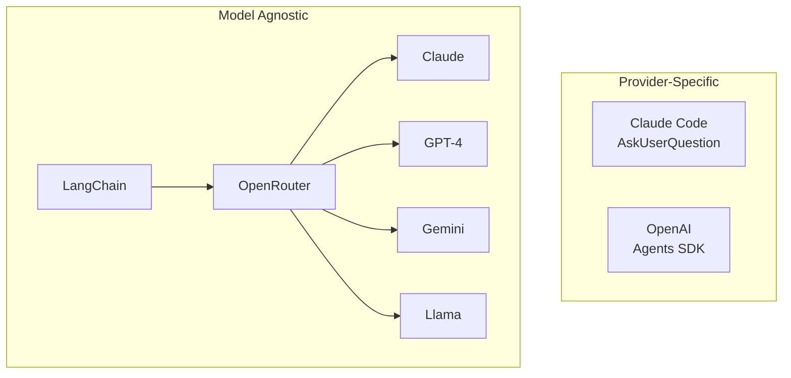
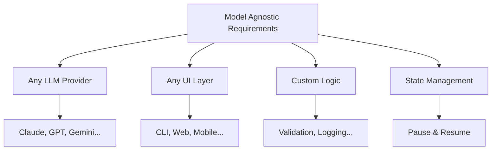
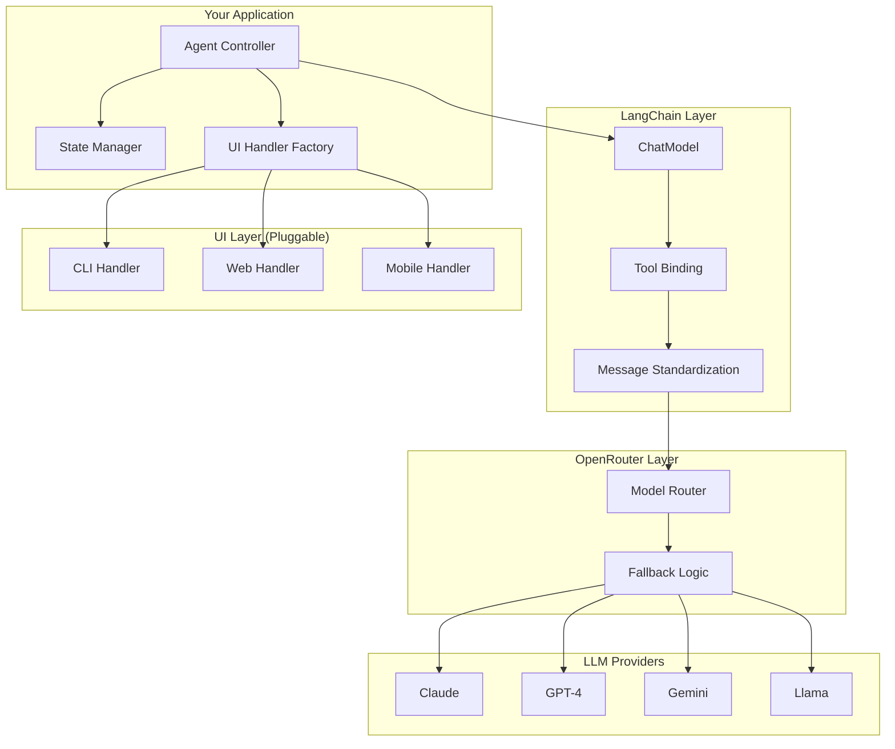
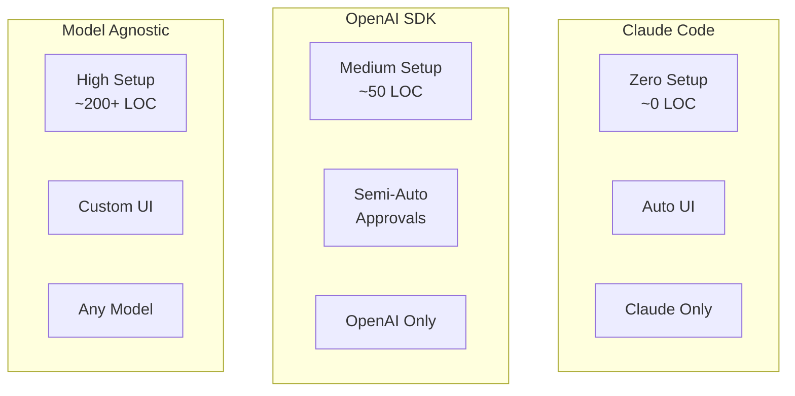
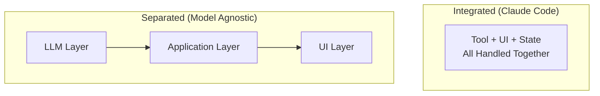
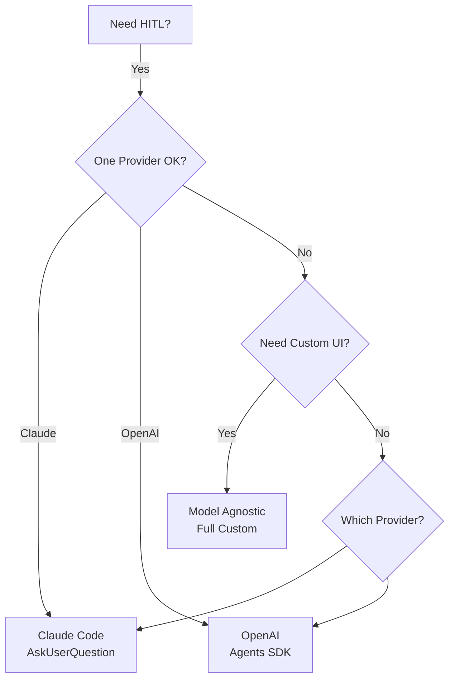

## Overview

Building human-in-the-loop agents that work across **any LLM provider** (Claude, GPT, Gemini, Llama, Mistral, etc.) requires a different architecture than provider-specific approaches. This guide shows how to use **LangChain + OpenRouter** to create flexible, multi-model HITL agents.



## The Challenge

### Why Provider Tools Don't Work

**Claude Code's `AskUserQuestion`:**

- ✅ Seamless experience
- ❌ Only works in Claude Code CLI
- ❌ Only works with Claude models
- ❌ Tightly coupled to infrastructure

**OpenAI's Agents SDK:**

- ✅ Built-in approvals
- ❌ Only works with OpenAI models
- ❌ SDK-specific API
- ❌ Limited to their patterns

### What We Need



## Architecture Constraints

### Constraint 1: Tool Calling Variability

**Not all models have equal tool-calling capabilities:**

| Provider               | Native Support | Reliability | Notes                      |
| ---------------------- | -------------- | ----------- | -------------------------- |
| **Claude** (Anthropic) | ✅ Excellent   | 95%+        | Best-in-class tool calling |
| **GPT-4** (OpenAI)     | ✅ Excellent   | 95%+        | Very reliable              |
| **Gemini** (Google)    | ✅ Good        | 85%+        | Generally reliable         |
| **Llama 3**            | ⚠️ Depends     | 60-80%      | Fine-tune dependent        |
| **Mistral**            | ⚠️ Limited     | 50-70%      | Often needs prompting      |
| **Local Models**       | ❌ Varies      | 30-60%      | Highly variable            |

**Implication:** You need fallback strategies for weaker models.

### Constraint 2: No Standard "Ask User" Tool

Unlike file operations or web searches, **there's no universal standard** for "pause and ask the user."

This means:

- ❌ You must define the tool yourself
- ❌ You must handle execution loop interruption
- ❌ You must manage state between pause and resume
- ❌ You must implement the UI layer

### Constraint 3: State Management

When you pause to ask the user, you must preserve context:

```python
# Current conversation state when pausing
messages = [
    SystemMessage("You are an assistant"),
    HumanMessage("Build a feature"),
    AIMessage("I need to know which database"),
    AIMessage(tool_calls=[{
        "name": "ask_user_question",
        "args": {...}
    }])  # ← Paused here
]

# After user answers:
messages.append(ToolMessage(
    content="PostgreSQL",
    tool_call_id="..."
))  # ← Add answer

# Resume with full context
response = llm.invoke(messages)
```

**Implication:** Your application manages conversation state across pauses.

### Constraint 4: UI is Application-Specific

Provider tools like Claude Code have built-in UIs. **You must provide your own:**

- Terminal (CLI, rich CLI)
- Web (React, Vue, Streamlit)
- Mobile (React Native, Flutter)
- API (REST, GraphQL)

**Implication:** Separation of concerns between agent logic and UI rendering.

## LangChain + OpenRouter Architecture

### Why This Stack?

**LangChain:**

- 🔄 Unified interface for all providers
- 🛠️ Standardized tool calling
- 📝 Message format conversion
- 🎯 Rich ecosystem (memory, callbacks, chains)

**OpenRouter:**

- 🌐 Single API for 100+ models
- 🔀 Automatic routing and fallback
- 💰 Cost optimization
- 🔑 Single API key for all providers

### Architecture Diagram



## Implementation

### Setup

```bash
pip install langchain langchain-openai langchain-core
```

```python
import os

# OpenRouter API key (single key for all models)
os.environ["OPENROUTER_API_KEY"] = "your-key"
```

### Step 1: Define the Tool

```python
from langchain_core.tools import tool
from typing import List

@tool
def ask_user_question(
    question: str,
    options: List[str],
    multi_select: bool = False
) -> str:
    """
    Ask the user a question with multiple choice options.

    Use this when you need user input to make decisions.

    Args:
        question: The question to ask (be clear and specific)
        options: List of 2-4 options for the user to choose from
        multi_select: If True, user can select multiple options

    Returns:
        The user's selected option(s)

    Example:
        ask_user_question(
            question="Which database should we use?",
            options=["PostgreSQL", "MongoDB", "Redis"],
            multi_select=False
        )
    """
    # This is intercepted by the agent's execution loop
    return "PAUSE_FOR_USER_INPUT"
```

### Step 2: Create UI Handler Interface

```python
from abc import ABC, abstractmethod

class UIHandler(ABC):
    """Abstract base for UI implementations"""

    @abstractmethod
    def ask_question(
        self,
        question: str,
        options: List[str],
        multi_select: bool = False
    ) -> str:
        """Render question and get user response"""
        pass


class CLIHandler(UIHandler):
    """Simple command-line interface"""

    def ask_question(
        self,
        question: str,
        options: List[str],
        multi_select: bool = False
    ) -> str:
        print(f"\n{'='*70}")
        print(f"❓ {question}")
        print(f"{'='*70}")

        for i, option in enumerate(options, 1):
            print(f"  {i}. {option}")

        if multi_select:
            print("\nSelect multiple (comma-separated, e.g., 1,3)")

        while True:
            try:
                choice = input(f"\nSelect (1-{len(options)}): ").strip()

                if multi_select:
                    indices = [int(c.strip()) - 1 for c in choice.split(',')]
                    if all(0 <= idx < len(options) for idx in indices):
                        selected = [options[idx] for idx in indices]
                        return ", ".join(selected)
                else:
                    idx = int(choice) - 1
                    if 0 <= idx < len(options):
                        return options[idx]

                print("❌ Invalid choice. Try again.")
            except (ValueError, KeyboardInterrupt):
                print("❌ Invalid input.")
```

### Step 3: Build the Interactive Agent

```python
from langchain_core.messages import (
    HumanMessage,
    AIMessage,
    SystemMessage,
    ToolMessage
)
from langchain_openai import ChatOpenAI

class InteractiveAgent:
    """
    Model-agnostic agent with human-in-the-loop support.

    Works with any LLM via OpenRouter + LangChain.
    """

    SYSTEM_PROMPT = """You are a helpful assistant that can interact with users.

When you need user input to make decisions, use the ask_user_question tool.

Guidelines:
- Ask clear, specific questions
- Provide 2-4 well-described options
- Use multi_select=True for non-exclusive choices
- Use multi_select=False for mutually exclusive choices"""

    def __init__(
        self,
        llm,
        tools: List,
        ui_handler: UIHandler = None
    ):
        self.llm = llm
        self.tools = tools
        self.tool_map = {tool.name: tool for tool in tools}
        self.llm_with_tools = llm.bind_tools(tools)
        self.ui_handler = ui_handler or CLIHandler()

    def run(
        self,
        user_request: str,
        max_iterations: int = 20,
        verbose: bool = True
    ) -> str:
        """Run the agent with human-in-the-loop support"""

        messages = [
            SystemMessage(content=self.SYSTEM_PROMPT),
            HumanMessage(content=user_request)
        ]

        if verbose:
            print(f"\n{'='*70}")
            print("🤖 INTERACTIVE AGENT STARTED")
            print(f"{'='*70}")

        for iteration in range(1, max_iterations + 1):
            if verbose:
                print(f"\n{'─'*70}")
                print(f"Iteration {iteration}/{max_iterations}")

            # Call LLM
            response = self.llm_with_tools.invoke(messages)
            messages.append(response)

            # Check if done (no tool calls)
            if not response.tool_calls:
                if verbose:
                    print("\n✅ COMPLETED")
                return response.content

            # Process tool calls
            for tool_call in response.tool_calls:
                tool_name = tool_call["name"]
                tool_args = tool_call["args"]

                if verbose:
                    print(f"\n⚡ Tool: {tool_name}")

                # Special handling for ask_user_question
                if tool_name == "ask_user_question":
                    result = self._handle_user_question(tool_args, verbose)
                else:
                    result = self._execute_tool(tool_name, tool_args)

                # Add tool result to messages
                messages.append(ToolMessage(
                    content=str(result),
                    tool_call_id=tool_call["id"]
                ))

        return "⚠️ Max iterations reached"

    def _handle_user_question(self, tool_args, verbose):
        """Handle ask_user_question tool call"""
        question = tool_args.get("question", "Please choose")
        options = tool_args.get("options", [])
        multi_select = tool_args.get("multi_select", False)

        if verbose:
            print(f"   Question: {question}")
            print(f"   Options: {len(options)}")

        # Use UI handler to get user input
        answer = self.ui_handler.ask_question(
            question=question,
            options=options,
            multi_select=multi_select
        )

        return answer

    def _execute_tool(self, tool_name, tool_args):
        """Execute a regular tool"""
        if tool_name in self.tool_map:
            tool = self.tool_map[tool_name]
            try:
                return tool.invoke(tool_args)
            except Exception as e:
                return f"Error: {str(e)}"
        else:
            return f"Error: Unknown tool {tool_name}"
```

### Step 4: Get LLM via OpenRouter

```python
def get_llm(
    model: str = "anthropic/claude-sonnet-4",
    temperature: float = 0,
    max_tokens: int = 4000
) -> ChatOpenAI:
    """
    Get LLM via OpenRouter.

    Supported models:
    - anthropic/claude-sonnet-4
    - anthropic/claude-opus-4
    - openai/gpt-4-turbo
    - openai/gpt-3.5-turbo
    - google/gemini-pro-1.5
    - meta-llama/llama-3-70b-instruct
    - mistralai/mistral-large
    """
    return ChatOpenAI(
        model=model,
        openai_api_key=os.environ["OPENROUTER_API_KEY"],
        openai_api_base="https://openrouter.ai/api/v1",
        temperature=temperature,
        max_tokens=max_tokens
    )
```

### Step 5: Usage

```python
# Choose any model via OpenRouter
llm = get_llm("anthropic/claude-sonnet-4")
# Or: llm = get_llm("openai/gpt-4-turbo")
# Or: llm = get_llm("google/gemini-pro-1.5")

# Create agent
tools = [ask_user_question]
agent = InteractiveAgent(llm, tools)

# Run
result = agent.run("Help me set up authentication for my app")
print(result)
```

## Advanced: Rich UI Handlers

### Terminal UI with InquirerPy

```bash
pip install InquirerPy
```

```python
from InquirerPy import inquirer
from InquirerPy.base.control import Choice

class RichCLIHandler(UIHandler):
    """Rich terminal UI with InquirerPy"""

    def ask_question(
        self,
        question: str,
        options: List[str],
        multi_select: bool = False
    ) -> str:
        choices = [Choice(value=opt, name=opt) for opt in options]

        if multi_select:
            selected = inquirer.checkbox(
                message=question,
                choices=choices,
                instruction="(Space to select, Enter to confirm)"
            ).execute()
            return ", ".join(selected)
        else:
            selected = inquirer.select(
                message=question,
                choices=choices,
                instruction="(Use arrow keys, Enter to select)"
            ).execute()
            return selected


# Usage
ui = RichCLIHandler()
agent = InteractiveAgent(llm, tools, ui_handler=ui)
```

### Web UI with Streamlit

```python
import streamlit as st
from queue import Queue
import threading

class StreamlitUIHandler(UIHandler):
    """Web-based UI using Streamlit"""

    def __init__(self):
        self.response_queue = Queue()

    def ask_question(
        self,
        question: str,
        options: List[str],
        multi_select: bool = False
    ) -> str:
        # Store question in session state
        st.session_state.current_question = {
            "question": question,
            "options": options,
            "multi_select": multi_select
        }

        # Wait for user response
        return self.response_queue.get()


# Streamlit app
def main():
    st.title("Interactive AI Agent")

    if "messages" not in st.session_state:
        st.session_state.messages = []

    # Display chat history
    for msg in st.session_state.messages:
        with st.chat_message(msg["role"]):
            st.write(msg["content"])

    # Pending question?
    if "current_question" in st.session_state:
        q = st.session_state.current_question

        st.subheader(q["question"])

        if q["multi_select"]:
            selected = st.multiselect("Choose options:", q["options"])
        else:
            selected = st.radio("Choose one:", q["options"])

        if st.button("Submit"):
            ui_handler.response_queue.put(selected)
            del st.session_state.current_question
            st.rerun()

    # User input
    if prompt := st.chat_input("What would you like to do?"):
        run_agent_in_background(prompt)
```

## Comparison: All Approaches



| Aspect          | Claude Code | OpenAI SDK  | Model Agnostic |
| --------------- | ----------- | ----------- | -------------- |
| **Setup**       | Zero        | Medium      | High           |
| **Code**        | ~0 LOC      | ~50 LOC     | ~200+ LOC      |
| **UI**          | Auto (CLI)  | Manual      | Fully custom   |
| **Models**      | Claude only | OpenAI only | Any model      |
| **Flexibility** | Low         | Medium      | High           |
| **Complexity**  | Very low    | Medium      | High           |
| **Portability** | None        | Low         | High           |
| **Production**  | Demos       | Good        | Best           |

## Trade-offs

### More Code vs More Flexibility

**Claude Code:**

```markdown
Use AskUserQuestion to ask which database.
```

**Model Agnostic:**

```python
# ~200 lines:
# 1. Define tool
# 2. Create UI handler
# 3. Build agent with execution loop
# 4. Handle state management
# 5. Implement error handling
```

### Manual State vs Full Control

**Automatic (Claude Code):**

- ✅ No state management needed
- ❌ Can't customize flow
- ❌ Tied to one provider

**Manual (Model Agnostic):**

- ❌ Must manage conversation state
- ✅ Full control over flow
- ✅ Works with any provider

### Separation of Concerns



## When to Use Model-Agnostic

| ✅ Use When...                 | ❌ Avoid When...          |
| ------------------------------ | ------------------------- |
| Need multi-model support       | Claude Code is sufficient |
| Building production web/mobile | Simple CLI demos          |
| Custom UI required             | Standard UI is fine       |
| Complex validation logic       | Straightforward workflows |
| Scale across providers         | Single provider is OK     |

## Best Practices

### 1. Model Fallback Strategy

```python
def get_llm_with_fallback(preferred_model: str):
    """Try preferred, fallback to reliable models"""

    models = [
        preferred_model,
        "anthropic/claude-sonnet-4",  # Reliable fallback
        "openai/gpt-4-turbo",          # Another option
    ]

    for model in models:
        try:
            llm = get_llm(model)
            # Test with simple call
            llm.invoke([HumanMessage(content="Hi")])
            return llm
        except Exception as e:
            print(f"Failed {model}: {e}")
            continue

    raise RuntimeError("No working LLM available")
```

### 2. UI Factory Pattern

```python
class UIFactory:
    """Create UI handlers based on environment"""

    @staticmethod
    def create(ui_type: str) -> UIHandler:
        if ui_type == "cli":
            return CLIHandler()
        elif ui_type == "rich-cli":
            return RichCLIHandler()
        elif ui_type == "web":
            return StreamlitUIHandler()
        elif ui_type == "api":
            return APIUIHandler()
        else:
            raise ValueError(f"Unknown UI type: {ui_type}")


# Usage
ui_type = os.environ.get("UI_TYPE", "cli")
ui = UIFactory.create(ui_type)
agent = InteractiveAgent(llm, tools, ui_handler=ui)
```

### 3. Logging & Monitoring

```python
import json
from datetime import datetime

class LoggingAgent(InteractiveAgent):
    """Agent that logs all interactions"""

    def __init__(self, *args, log_file: str = "interactions.jsonl", **kwargs):
        super().__init__(*args, **kwargs)
        self.log_file = log_file

    def _handle_user_question(self, tool_args, verbose):
        # Log question
        self._log_event("question_asked", tool_args)

        # Get answer
        answer = super()._handle_user_question(tool_args, verbose)

        # Log answer
        self._log_event("question_answered", {"answer": answer})

        return answer

    def _log_event(self, event_type, data):
        with open(self.log_file, 'a') as f:
            log_entry = {
                "timestamp": datetime.now().isoformat(),
                "event": event_type,
                "data": data
            }
            f.write(json.dumps(log_entry) + "\n")
```

### 4. Error Recovery

```python
def run(self, user_request: str, max_iterations: int = 20):
    """Run with error recovery"""
    try:
        messages = [...]

        for iteration in range(max_iterations):
            try:
                response = self.llm_with_tools.invoke(messages)
                # ...

                if tool_name == "ask_user_question":
                    try:
                        answer = self.ui_handler.ask_question(...)
                    except KeyboardInterrupt:
                        return "User cancelled"
                    except Exception as e:
                        # Fallback to simple input
                        answer = input("Error in UI. Enter answer: ")

            except Exception as e:
                print(f"Error in iteration {iteration}: {e}")
                continue

    except Exception as e:
        return f"Agent failed: {str(e)}"
```

## Complete Example

Key features:

- ✅ Works with any model via OpenRouter
- ✅ Pluggable UI handlers (CLI, Rich CLI, Web)
- ✅ State management
- ✅ Error handling
- ✅ Logging support
- ✅ ~200 lines of clean code

## Summary

### Key Takeaways

1. **No Universal Standard**: Each provider implements HITL differently
2. **LangChain + OpenRouter**: Best stack for model-agnostic implementation
3. **More Complexity, More Control**: Trade code for flexibility
4. **Separation of Concerns**: LLM, Application, UI layers
5. **Production Ready**: Suitable for web/mobile apps

### Decision Matrix



### When to Choose Each

| Scenario                          | Recommendation       |
| --------------------------------- | -------------------- |
| **Building Claude Code skill**    | Claude Code built-in |
| **OpenAI-only production app**    | OpenAI Agents SDK    |
| **Multi-model research platform** | Model Agnostic       |
| **Web/mobile app**                | Model Agnostic       |
| **Quick prototype**               | Claude Code built-in |
| **Scale across providers**        | Model Agnostic       |

## Next Steps

- **Learn basics** → Review [Overview](/ai-agent-study/human-in-the-loop/01-overview/)
- **Explore patterns** → Check other tutorials in this series

## Further Reading

- [LangChain Documentation](https://python.langchain.com/docs/)
- [OpenRouter API](https://openrouter.ai/)
- [InquirerPy](https://github.com/kazhala/InquirerPy)
- [Streamlit](https://streamlit.io/)
- [Human-in-the-Loop Design Patterns](https://www.promptingguide.ai/agents/function-calling)
