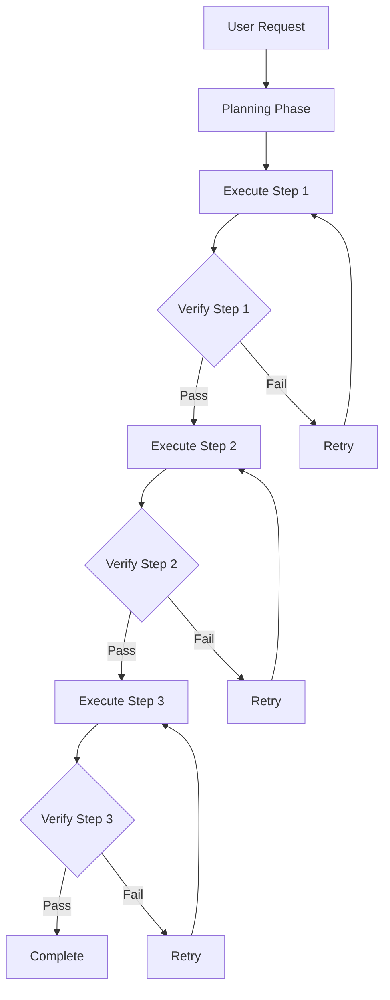
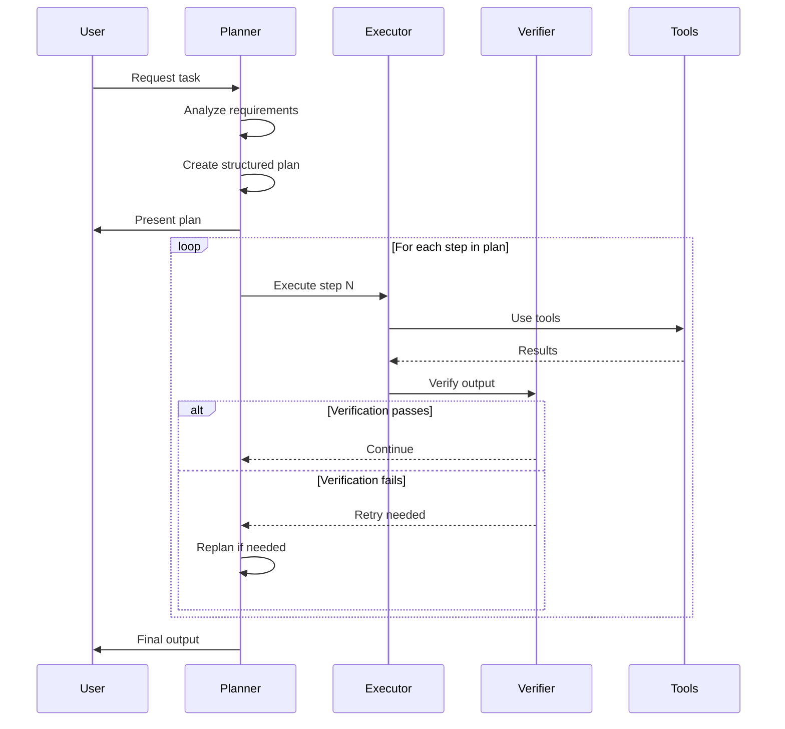
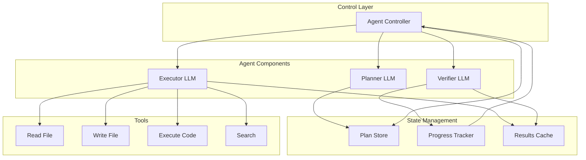
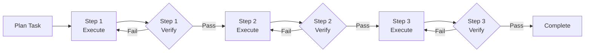
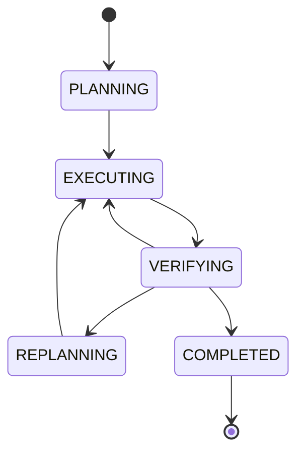
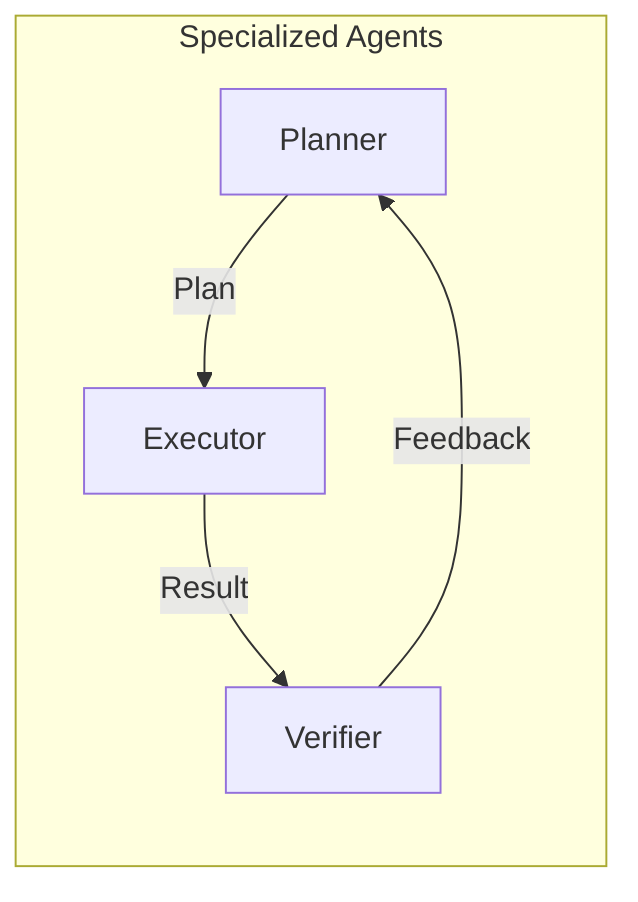
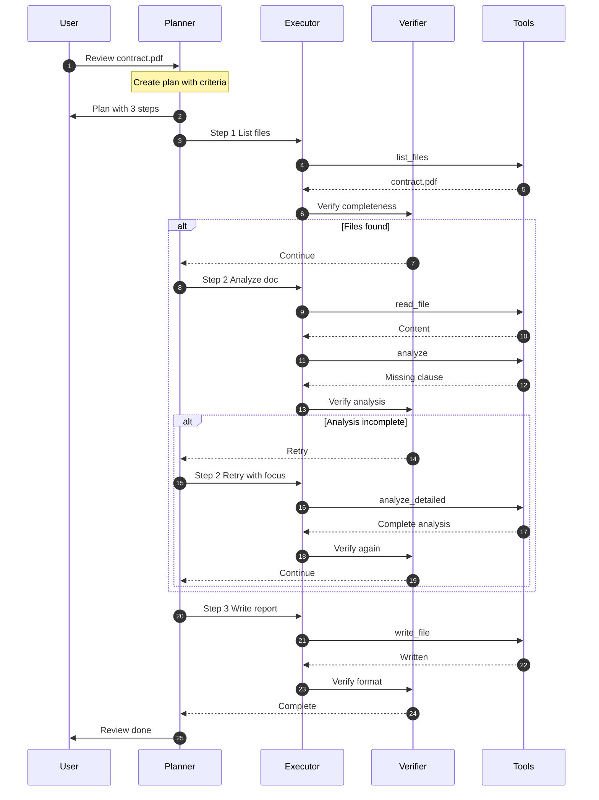
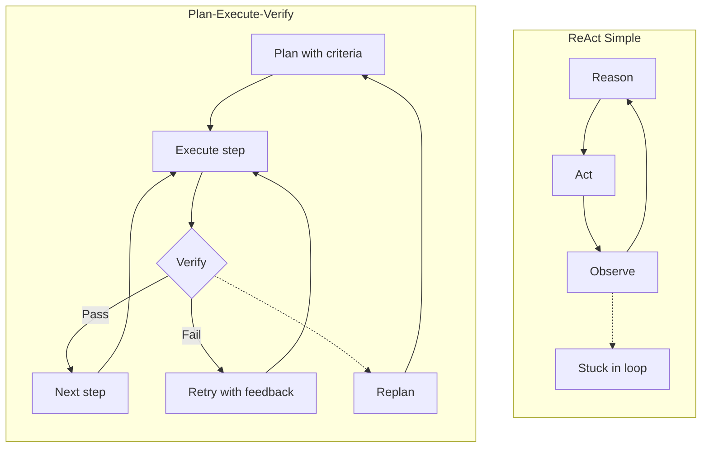
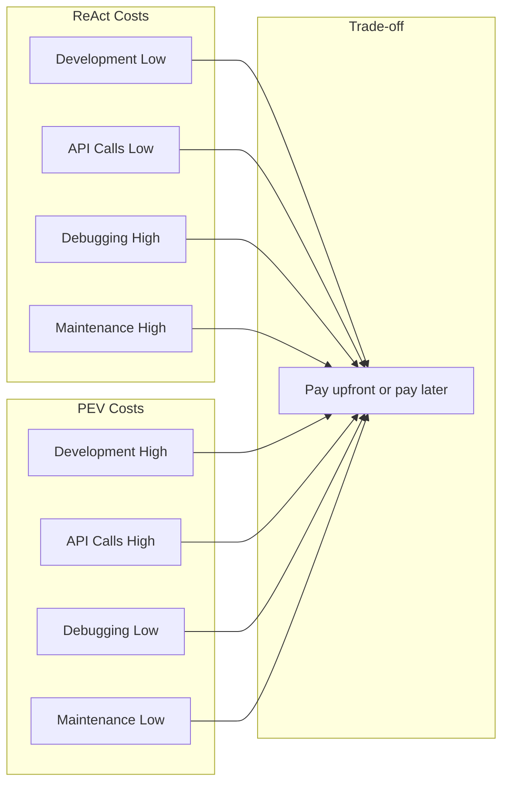

## What is Plan-Execute-Verify?

**Plan-Execute-Verify (PEV)** is a production-grade AI agent architecture that separates concerns into three specialized phases:

1. **Plan**: Create a structured plan with acceptance criteria
2. **Execute**: Run each step independently
3. **Verify**: Check quality before proceeding

This separation enables robust error handling, quality assurance, and automatic recovery.

## Core Concept

## Control Flow

Unlike ReAct's simple loop, PEV has distinct phases with quality gates:

## Architecture Diagram

## Example: Legal Document Review

Here's how PEV handles the same legal document review task with quality gates:

## State Machine View

## Key Characteristics

### OK Strengths

- **Robust**: Built-in error handling and recovery
- **Quality Assured**: Verification before proceeding
- **Transparent**: Clear plan with acceptance criteria
- **Production Ready**: Handles edge cases automatically
- **Deterministic**: Can audit every decision

### ⚠️ Trade-offs

- **More Complex**: ~1000-1500 lines vs ~400 for ReAct
- **Slower**: Multiple LLM calls per step
- **Higher Cost**: 3x API calls (Plan + Execute + Verify)
- **Overkill**: For simple linear tasks

## When to Use PEV

| OK Use PEV When...           | FAIL Avoid PEV When...      |
| ---------------------------- | --------------------------- |
| Production systems           | Quick prototypes/MVPs       |
| Quality is critical          | Simple 3-step tasks         |
| Complex workflows (5+ steps) | Learning agent basics       |
| Need audit trails            | Cost is primary concern     |
| Error recovery required      | Fast iteration needed       |
| Multi-stage verification     | Real-time response critical |

## Three-Agent Architecture

**Why separate agents?**

- **Planner**: Optimized for strategic thinking (can use slower, smarter models)
- **Executor**: Optimized for fast tool execution (can use faster models)
- **Verifier**: Optimized for quality checks (can use different evaluation criteria)

## Message Flow Example

Here's a detailed interaction showing verification:

## Comparison with ReAct

## Cost-Benefit Analysis

**PEV Philosophy**: Pay higher cost upfront (development + API calls) to reduce long-term costs (debugging + maintenance).

## Best For

- **Production Systems**: Customer-facing applications
- **Complex Workflows**: Multi-step, decision-heavy tasks
- **Quality Critical**: Legal, medical, financial domains
- **Auditability**: Need to explain every decision
- **Reliability**: Cannot afford agent failures

## Implementation Options

Continue to one of the implementation guides:

1. **[Claude SDK Implementation](/ai-agent-study/plan-execute-verify/02-claude-implementation/)** - Full production example
2. **[Model Agnostic Design](/ai-agent-study/plan-execute-verify/03-model-agnostic/)** - Multi-provider architecture
3. **[LangChain Implementation](/ai-agent-study/plan-execute-verify/04-langchain/)** - Framework-based approach

## Next Steps

- **New to PEV?** → Start with [Claude SDK Implementation](/ai-agent-study/plan-execute-verify/02-claude-implementation/)
- **Need flexibility?** → Read [Model Agnostic Design](/ai-agent-study/plan-execute-verify/03-model-agnostic/)
- **Want rapid development?** → Try [LangChain Implementation](/ai-agent-study/plan-execute-verify/04-langchain/)
- **Still learning?** → Go back to [ReAct Pattern](/ai-agent-study/react/01-overview/) for basics
