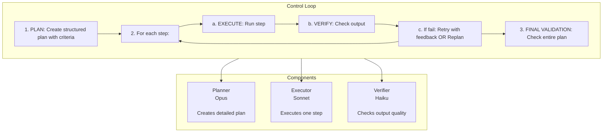

## Overview

The Plan-Execute-Verify (PEV) pattern separates concerns into three specialized components, each optimized for its role. This architecture is significantly more robust than simple [ReAct loops](/ai-agent-study/react/01-overview/) and is suitable for production systems.

**Best for:**

- Production applications
- Complex multi-step workflows
- Quality-critical operations
- Tasks requiring reliability
- Systems needing error recovery

**Overkill for:**

- Simple linear workflows
- Quick prototypes
- Learning exercises
- Tasks with < 3 steps

See [react-pattern.md](/ai-agent-study/react/01-overview/) if you're just learning or building simple workflows.

## ⚠️ Important: Educational Implementation vs Production SDK

**This tutorial teaches PEV architecture by building from scratch using the base Anthropic SDK.** This is valuable for:

- Understanding PEV pattern mechanics deeply
- Learning how to architect complex agent systems
- Customizing agent behavior at a granular level
- Research and experimentation

**For production applications, consider the [Claude Agent SDK](https://platform.claude.com/docs/en/agent-sdk/overview) which provides PEV-like capabilities:**

- ✅ **Planning**: `plan` permission mode for creating structured plans before execution
- ✅ **Execution**: Built-in tools (Read, Write, Edit, Bash, Glob, Grep) with automatic execution
- ✅ **Verification**: Hooks (`PreToolUse`, `PostToolUse`) for validation at each step
- ✅ **Retry Logic**: Hooks can implement retry with feedback automatically
- ✅ **Structured Outputs**: `output_format` parameter for JSON schema validation
- ✅ **Session Management**: Built-in conversation management and resumption
- ✅ **Subagents**: Parallel execution with specialized agents
- ✅ **Error Handling**: Production-tested error recovery

**When to use each:**

- **Manual PEV (this guide)**: Deep customization, research, learning architecture patterns
- **Claude Agent SDK**: Production systems, faster development, proven reliability

**Architecture Comparison:**

| Component       | This Guide                                                | Claude Agent SDK Equivalent                        |
| --------------- | --------------------------------------------------------- | -------------------------------------------------- |
| **Planner**     | Custom Opus-based planner (~200 lines)                    | `plan` permission mode + hooks                     |
| **Executor**    | Custom Sonnet-based executor (~300 lines)                 | Built-in tool execution                            |
| **Verifier**    | Custom Haiku verifier + deterministic checks (~400 lines) | `PreToolUse`/`PostToolUse` hooks + `output_format` |
| **Retry Logic** | Manual retry with feedback (~100 lines)                   | Hooks with retry decisions                         |
| **Total**       | ~1,300 lines                                              | ~50-100 lines with SDK                             |

Continue reading to understand PEV architecture deeply, then explore the Agent SDK for production implementation.

## Architecture



## The Three Components

### 1. Planner

**Purpose:** Create a detailed, structured plan with acceptance criteria

**Model:** Claude Opus 4.6 (most capable for planning)

**Responsibilities:**

- Understand high-level goal
- Break into concrete, measurable steps
- Define acceptance criteria for each step
- Identify dependencies between steps
- Plan for error cases

**Input:** User request + context

**Output:** Structured plan (JSON)

### 2. Executor

**Purpose:** Execute one step at a time, focused on quality

**Model:** Claude Sonnet 4.5 (balanced speed/capability)

**Responsibilities:**

- Execute actions for current step only
- Use context from previous steps
- Meet acceptance criteria
- Report confidence level
- Note any issues encountered

**Input:** Step definition + previous results + feedback

**Output:** Step results + artifacts

### 3. Verifier

**Purpose:** Validate step outputs against acceptance criteria

**Model:** Claude Haiku 4.5 (fast/cheap) + deterministic checks

**Responsibilities:**

- Check each acceptance criterion
- Provide evidence for pass/fail
- Decide: pass, retry, or replan
- Give specific feedback for improvements
- Track quality metrics

**Input:** Step definition + execution results

**Output:** Verification result + feedback

## Building the Agent Step-by-Step

Let's build the Plan-Execute-Verify agent incrementally, understanding each component before assembling them together.

### Step 1: Core Data Structures

First, we need data models to represent plans, steps, and results. Here's the most important one - the `Step`:

```python
from dataclasses import dataclass, field
from typing import List, Dict, Any, Optional
from enum import Enum

class StepStatus(Enum):
    PENDING = "pending"
    IN_PROGRESS = "in_progress"
    COMPLETE = "complete"
    FAILED = "failed"

@dataclass
class Step:
    """A single step in the plan"""
    step_id: str
    name: str
    description: str
    actions: List[Dict[str, Any]]
    acceptance_criteria: List[str]  # How we verify success
    expected_outputs: List[str]     # Artifacts to create
    dependencies: List[str] = field(default_factory=list)
    estimated_complexity: str = "medium"
    status: StepStatus = StepStatus.PENDING
    feedback: List[str] = field(default_factory=list)
    retry_count: int = 0

    def add_feedback(self, feedback: str):
        """Add feedback from verification"""
        self.feedback.append(feedback)
```

**Key Design Elements:**

- **Acceptance Criteria** - Measurable conditions for success
- **Dependencies** - Enable parallel execution of independent steps
- **Feedback Loop** - Verifier can guide retries
- **Retry Tracking** - Know when to give up and replan

We also need `Plan`, `StepResult`, `VerificationResult`, and other supporting classes (see complete implementation below).

### Step 2: Planner - System Prompt Design

The Planner uses Opus 4.6 to create structured plans. The system prompt is critical:

```python
PLANNER_SYSTEM_PROMPT = """You are an expert planning specialist.

Your job: Create detailed, structured plans for complex tasks.

Output format (strict JSON):
{
  "goal": "High-level objective",
  "context": {...},
  "steps": [
    {
      "step_id": "1",
      "name": "Brief step name",
      "description": "Detailed description",
      "actions": [{"tool": "tool_name", "params": {...}}],
      "acceptance_criteria": [
        "Specific, measurable criterion 1",
        "Specific, measurable criterion 2"
      ],
      "expected_outputs": ["artifact1", "artifact2"],
      "dependencies": ["step_id_1"],
      "estimated_complexity": "low|medium|high"
    }
  ],
  "rollback_strategy": "What to do if plan fails",
  "success_criteria": ["Overall success criterion 1"]
}

Guidelines:
- Make acceptance criteria SPECIFIC and MEASURABLE
- Include dependencies between steps
- Think about failure cases
- Break complex steps into smaller ones
"""
```

**Why This Works:**

- Strict JSON format ensures parseable output
- Specific/measurable criteria enable automated verification
- Dependencies allow parallel execution
- Complexity estimation helps cost optimization

### Step 3: Planner - Creating and Replanning

The Planner has two main methods:

```python
import anthropic
import json

class PlannerComponent:
    def __init__(self, api_key: str):
        self.client = anthropic.Anthropic(api_key=api_key)

    def create_plan(self, user_request: str, context: Dict[str, Any]) -> Plan:
        """Create initial plan"""
        prompt = f"""
Create a detailed plan for this request:

REQUEST: {user_request}

CONTEXT:
{json.dumps(context, indent=2)}

Provide a complete plan in JSON format.
"""

        response = self.client.messages.create(
            model="claude-opus-4-6",  # Most capable for planning
            max_tokens=8000,
            system=PLANNER_SYSTEM_PROMPT,
            messages=[{"role": "user", "content": prompt}]
        )

        plan_json = self._extract_json(response.content[0].text)
        return Plan.from_json(plan_json)
```

**Replanning** happens when a step fails critically:

```python
    def replan(self, original_plan: Plan, failed_step: Step,
               verification: VerificationResult) -> Plan:
        """Create new plan after critical failure"""
        # Include what worked, what failed, why it failed
        # Let Opus create a better plan based on learnings
        # ... (see complete implementation)
```

### Step 4: Executor - System Prompt Design

The Executor uses Sonnet 4.5 for balanced speed/capability:

```python
EXECUTOR_SYSTEM_PROMPT = """You are a step execution specialist.

Your job: Execute ONE step at a time with high quality.

You receive:
1. Current step to execute (with acceptance criteria)
2. Full plan context
3. Results from previous steps
4. Any feedback from previous attempts

Response format (strict JSON):
{
  "reasoning": "Why you're taking these specific actions",
  "actions_taken": [
    {"tool": "tool_name", "params": {...}, "result": "what happened"}
  ],
  "step_output": {
    "artifacts": ["files created"],
    "findings": "What you discovered",
    "meets_criteria": {"criterion_1": true}
  },
  "confidence": 0.95,
  "notes": "Any concerns or issues"
}

Rules:
- Focus ONLY on the current step
- Be thorough - meet EVERY acceptance criterion
- Reference previous step outputs when needed
- Report any errors in notes
"""
```

**Key Features:**

- One step at a time (prevents getting ahead)
- Self-assessment via confidence scores
- Structured output for verification

### Step 5: Executor - Executing Steps

The Executor builds context from previous steps and feedback:

```python
class ExecutorComponent:
    def __init__(self, api_key: str):
        self.client = anthropic.Anthropic(api_key=api_key)
        self.results_cache: Dict[str, StepResult] = {}

    def execute_step(self, step: Step, plan_context: Dict,
                     previous_results: Dict[str, StepResult]) -> StepResult:
        """Execute a single step"""

        # Build context from dependencies
        prev_results_context = {}
        for dep_id in step.dependencies:
            if dep_id in previous_results:
                result = previous_results[dep_id]
                prev_results_context[dep_id] = {
                    "outputs": result.step_output,
                    "artifacts": result.artifacts
                }

        # Include feedback from previous attempts
        feedback_context = ""
        if step.feedback:
            feedback_context = f"""
PREVIOUS ATTEMPTS FAILED VERIFICATION:
{chr(10).join(f"- {fb}" for fb in step.feedback)}

Please address these issues in this attempt.
"""

        # Execute with tool calling
        tools = self._get_tools()
        response = self.client.messages.create(
            model="claude-sonnet-4-5",
            max_tokens=8000,
            system=EXECUTOR_SYSTEM_PROMPT,
            tools=tools,
            messages=[{"role": "user", "content": prompt}]
        )

        # Process response and return result
        # ... (see complete implementation)
```

**Execution Flow:**

1. Gather context from completed dependencies
2. Include feedback from failed attempts
3. Execute with tool calling
4. Return structured result

### Step 6: Verifier - Two-Stage Verification

The Verifier uses a fast deterministic check, then Haiku 4.5 for semantic verification:

```python
class VerifierComponent:
    def __init__(self, api_key: str):
        self.client = anthropic.Anthropic(api_key=api_key)
        self.deterministic = DeterministicChecker()

    def verify(self, step: Step, result: StepResult) -> VerificationResult:
        """
        Two-stage verification:
        1. Fast deterministic checks (files exist, size > 0)
        2. LLM semantic verification (meets criteria)
        """

        # Stage 1: Fast checks
        det_result = self.deterministic.verify(step, result)
        if not det_result["passed"]:
            return VerificationResult(
                overall_pass=False,
                action=VerificationAction.RETRY,
                feedback_for_executor=det_result["feedback"],
                # ... (see complete implementation)
            )

        # Stage 2: Semantic verification with Haiku
        return self._llm_verify(step, result)
```

**Deterministic Checker** (fast, no LLM calls):

```python
class DeterministicChecker:
    """Fast, rule-based verification checks"""

    def verify(self, step: Step, result: StepResult) -> Dict:
        """Run deterministic checks"""

        # Check artifacts exist
        for artifact in result.artifacts:
            if not os.path.exists(artifact):
                return {
                    "passed": False,
                    "evidence": f"Artifact {artifact} not found",
                    "feedback": f"File {artifact} was not created."
                }

        # Check file sizes
        for artifact in result.artifacts:
            if artifact.endswith('.md'):
                size = os.path.getsize(artifact)
                if size < 100:
                    return {"passed": False, "feedback": f"File too small"}

        # Check confidence level
        if result.confidence < 0.5:
            return {"passed": False, "feedback": "Low confidence"}

        return {"passed": True}
```

**Why Two Stages:**

- Deterministic checks catch obvious failures instantly (no API cost)
- LLM checks verify semantic quality and acceptance criteria

### Step 7: Main Control Loop - Orchestration

Finally, the main agent orchestrates everything:

```python
class LegalReviewAgent:
    """Main agent orchestrating Plan-Execute-Verify loop"""

    def __init__(self, api_key: str):
        self.planner = PlannerComponent(api_key)
        self.executor = ExecutorComponent(api_key)
        self.verifier = VerifierComponent(api_key)

    def run(self, user_request: str, folder_path: str) -> Optional[Plan]:
        """
        Main control loop:
        1. PLAN: Create structured plan
        2. For each step: EXECUTE → VERIFY (with retry/replan)
        3. FINAL VALIDATION
        """

        # Phase 1: Planning
        context = {"folder_path": folder_path}
        plan = self.planner.create_plan(user_request, context)

        # Phase 2: Execution with Verification
        for step in plan.steps:
            success = self._execute_step_with_verification(step, plan)

            if not success:
                # Replan and restart
                plan = self.planner.replan(plan, step, verification)
                return self.run(user_request, folder_path)

        # Phase 3: Final Validation
        final_check = self.verifier.verify_entire_plan(plan)

        return plan if final_check.overall_pass else None
```

**Retry Logic** (up to 3 attempts per step):

```python
    def _execute_step_with_verification(self, step: Step, plan: Plan) -> bool:
        """Execute a step with retry/replan logic"""

        max_retries = 3

        for attempt in range(1, max_retries + 1):
            step.status = StepStatus.IN_PROGRESS

            # EXECUTE
            result = self.executor.execute_step(
                step, plan.context, self.executor.results_cache
            )

            # VERIFY
            verification = self.verifier.verify(step, result)

            if verification.overall_pass:
                step.status = StepStatus.COMPLETE
                return True

            elif verification.action == VerificationAction.RETRY:
                if attempt < max_retries:
                    step.add_feedback(verification.feedback_for_executor)
                    step.retry_count += 1
                else:
                    step.status = StepStatus.FAILED
                    return False

            else:  # REPLAN
                step.status = StepStatus.FAILED
                return False

        return False
```

**Control Flow:**

1. Plan → Execute each step → Verify
2. If verification fails: Retry with feedback (up to 3x)
3. If still failing: Replan entire workflow
4. Final validation ensures all criteria met

## Complete Implementation

Here's the full working code combining all components:

````python
from dataclasses import dataclass, field
from typing import List, Dict, Any, Optional
from enum import Enum
import anthropic
import json
import os


# ============================================================================
# DATA MODELS
# ============================================================================

class StepStatus(Enum):
    PENDING = "pending"
    IN_PROGRESS = "in_progress"
    COMPLETE = "complete"
    FAILED = "failed"

class VerificationAction(Enum):
    PASS = "pass"
    RETRY = "retry"
    REPLAN = "replan"

@dataclass
class Step:
    """A single step in the plan"""
    step_id: str
    name: str
    description: str
    actions: List[Dict[str, Any]]
    acceptance_criteria: List[str]
    expected_outputs: List[str]
    dependencies: List[str] = field(default_factory=list)
    estimated_complexity: str = "medium"
    status: StepStatus = StepStatus.PENDING
    feedback: List[str] = field(default_factory=list)
    retry_count: int = 0

    def add_feedback(self, feedback: str):
        self.feedback.append(feedback)

    def to_dict(self) -> Dict:
        return {
            "step_id": self.step_id,
            "name": self.name,
            "description": self.description,
            "actions": self.actions,
            "acceptance_criteria": self.acceptance_criteria,
            "expected_outputs": self.expected_outputs,
            "dependencies": self.dependencies,
            "estimated_complexity": self.estimated_complexity
        }

@dataclass
class Plan:
    """Complete plan with context"""
    goal: str
    context: Dict[str, Any]
    steps: List[Step]
    success_criteria: List[str]
    rollback_strategy: str = ""

    @classmethod
    def from_json(cls, data: Dict) -> 'Plan':
        steps = [
            Step(
                step_id=s["step_id"],
                name=s["name"],
                description=s["description"],
                actions=s["actions"],
                acceptance_criteria=s["acceptance_criteria"],
                expected_outputs=s["expected_outputs"],
                dependencies=s.get("dependencies", []),
                estimated_complexity=s.get("estimated_complexity", "medium")
            )
            for s in data["steps"]
        ]

        return cls(
            goal=data["goal"],
            context=data["context"],
            steps=steps,
            success_criteria=data["success_criteria"],
            rollback_strategy=data.get("rollback_strategy", "")
        )

    def get_all_artifacts(self) -> List[str]:
        """Get all artifacts produced by completed steps"""
        artifacts = []
        for step in self.steps:
            if step.status == StepStatus.COMPLETE:
                artifacts.extend(step.expected_outputs)
        return artifacts

@dataclass
class StepResult:
    """Result from executing a step"""
    step_id: str
    reasoning: str
    actions_taken: List[Dict[str, Any]]
    step_output: Dict[str, Any]
    confidence: float
    notes: str
    artifacts: List[str] = field(default_factory=list)

    def to_dict(self) -> Dict:
        return {
            "step_id": self.step_id,
            "reasoning": self.reasoning,
            "actions_taken": self.actions_taken,
            "step_output": self.step_output,
            "confidence": self.confidence,
            "notes": self.notes,
            "artifacts": self.artifacts
        }

@dataclass
class CriterionResult:
    """Result for a single acceptance criterion"""
    criterion: str
    passed: bool
    evidence: str
    confidence: float
    feedback: Optional[str] = None

@dataclass
class VerificationResult:
    """Result from verifying a step"""
    overall_pass: bool
    criteria_results: List[CriterionResult]
    action: VerificationAction
    feedback_for_executor: Optional[str]
    severity: Optional[str]

    @classmethod
    def from_json(cls, data: Dict) -> 'VerificationResult':
        criteria_results = [
            CriterionResult(
                criterion=c["criterion"],
                passed=c["passed"],
                evidence=c["evidence"],
                confidence=c["confidence"],
                feedback=c.get("feedback")
            )
            for c in data["criteria_results"]
        ]

        return cls(
            overall_pass=data["overall_pass"],
            criteria_results=criteria_results,
            action=VerificationAction(data["action"]),
            feedback_for_executor=data.get("feedback_for_executor"),
            severity=data.get("severity")
        )


# ============================================================================
# PLANNER COMPONENT
# ============================================================================

PLANNER_SYSTEM_PROMPT = """You are an expert planning specialist.

Your job: Create detailed, structured plans for complex tasks.

Output format (strict JSON):
{
  "goal": "High-level objective",
  "context": {
    "key": "value",
    "any": "relevant context"
  },
  "steps": [
    {
      "step_id": "1",
      "name": "Brief step name",
      "description": "Detailed description of what to do",
      "actions": [
        {"tool": "tool_name", "params": {"param": "value"}}
      ],
      "acceptance_criteria": [
        "Specific, measurable criterion 1",
        "Specific, measurable criterion 2"
      ],
      "expected_outputs": ["artifact1", "artifact2"],
      "dependencies": ["step_id_1", "step_id_2"],
      "estimated_complexity": "low|medium|high"
    }
  ],
  "rollback_strategy": "What to do if plan fails",
  "success_criteria": [
    "Overall success criterion 1",
    "Overall success criterion 2"
  ]
}

Guidelines:
- Make acceptance criteria SPECIFIC and MEASURABLE
- Include dependencies between steps
- Think about failure cases
- Make criteria verifiable by code or small model
- Break complex steps into smaller ones
- Use "low" complexity for simple file operations, "high" for complex analysis
"""

class PlannerComponent:
    def __init__(self, api_key: str):
        self.client = anthropic.Anthropic(api_key=api_key)

    def create_plan(self, user_request: str, context: Dict[str, Any]) -> Plan:
        """Create initial plan"""
        prompt = f"""
Create a detailed plan for this request:

REQUEST: {user_request}

CONTEXT:
{json.dumps(context, indent=2)}

Provide a complete plan in JSON format.
"""

        response = self.client.messages.create(
            model="claude-opus-4-6",
            max_tokens=8000,
            system=PLANNER_SYSTEM_PROMPT,
            messages=[{"role": "user", "content": prompt}]
        )

        plan_json = self._extract_json(response.content[0].text)
        return Plan.from_json(plan_json)

    def replan(self, original_plan: Plan, failed_step: Step,
               verification: VerificationResult) -> Plan:
        """Create new plan after critical failure"""

        completed_steps = [s for s in original_plan.steps if s.status == StepStatus.COMPLETE]
        completed_summary = "\n".join([
            f"- {s.step_id}: {s.name} (✓)"
            for s in completed_steps
        ])

        prompt = f"""
The original plan failed critically. Create a NEW plan.

ORIGINAL PLAN:
{json.dumps(original_plan.__dict__, default=str, indent=2)}

FAILED STEP:
{json.dumps(failed_step.to_dict(), indent=2)}

FAILURE REASON:
{verification.feedback_for_executor}

COMPLETED STEPS:
{completed_summary}

Requirements for new plan:
1. Address the root cause of failure
2. Reuse completed work where possible
3. Adjust approach based on what we learned
4. Add more robust acceptance criteria
5. Consider alternative strategies

Provide the new plan in JSON format.
"""

        response = self.client.messages.create(
            model="claude-opus-4-6",
            max_tokens=8000,
            system=PLANNER_SYSTEM_PROMPT + "\n\nYou are REPLANNING after a failure.",
            messages=[{"role": "user", "content": prompt}]
        )

        plan_json = self._extract_json(response.content[0].text)
        return Plan.from_json(plan_json)

    def _extract_json(self, text: str) -> Dict:
        """Extract JSON from LLM response"""
        if "```json" in text:
            start = text.find("```json") + 7
            end = text.find("```", start)
            json_str = text[start:end].strip()
        elif "```" in text:
            start = text.find("```") + 3
            end = text.find("```", start)
            json_str = text[start:end].strip()
        else:
            json_str = text.strip()

        return json.loads(json_str)


# ============================================================================
# EXECUTOR COMPONENT
# ============================================================================

EXECUTOR_SYSTEM_PROMPT = """You are a step execution specialist.

Your job: Execute ONE step at a time with high quality.

You receive:
1. Current step to execute (with acceptance criteria)
2. Full plan context
3. Results from previous steps
4. Any feedback from previous attempts

Response format (strict JSON):
{
  "reasoning": "Why you're taking these specific actions",
  "actions_taken": [
    {"tool": "tool_name", "params": {...}, "result": "what happened"}
  ],
  "step_output": {
    "artifacts": ["files created", "data extracted"],
    "findings": "What you discovered",
    "meets_criteria": {
      "criterion_1": true,
      "criterion_2": true
    }
  },
  "confidence": 0.95,
  "notes": "Any concerns, edge cases, or issues"
}

Rules:
- Focus ONLY on the current step
- Be thorough - meet EVERY acceptance criterion
- If you can't meet a criterion, explain in notes
- Reference previous step outputs when needed
- Report any errors in notes
- Be specific in your outputs
"""

class ExecutorComponent:
    def __init__(self, api_key: str):
        self.client = anthropic.Anthropic(api_key=api_key)
        self.results_cache: Dict[str, StepResult] = {}

    def execute_step(self, step: Step, plan_context: Dict,
                     previous_results: Dict[str, StepResult]) -> StepResult:
        """Execute a single step"""

        # Build feedback context if step has been retried
        feedback_context = ""
        if step.feedback:
            feedback_context = f"""
PREVIOUS ATTEMPTS FAILED VERIFICATION:
{chr(10).join(f"- {fb}" for fb in step.feedback)}

Please address these issues in this attempt.
"""

        # Build previous results context
        prev_results_context = {}
        for dep_id in step.dependencies:
            if dep_id in previous_results:
                result = previous_results[dep_id]
                prev_results_context[dep_id] = {
                    "outputs": result.step_output,
                    "artifacts": result.artifacts
                }

        prompt = f"""
Execute this step:

STEP: {step.name}
DESCRIPTION: {step.description}

ACTIONS TO TAKE:
{json.dumps(step.actions, indent=2)}

ACCEPTANCE CRITERIA (you MUST meet these):
{json.dumps(step.acceptance_criteria, indent=2)}

EXPECTED OUTPUTS:
{json.dumps(step.expected_outputs, indent=2)}

PREVIOUS STEP RESULTS:
{json.dumps(prev_results_context, indent=2)}

PLAN CONTEXT:
{json.dumps(plan_context, indent=2)}

{feedback_context}

Execute the step and provide results in JSON format.
"""

        # Use tool calling for actual execution
        tools = self._get_tools()

        response = self.client.messages.create(
            model="claude-sonnet-4-5",
            max_tokens=8000,
            system=EXECUTOR_SYSTEM_PROMPT,
            tools=tools,
            messages=[{"role": "user", "content": prompt}]
        )

        # Process response and execute tools
        result = self._process_response(response, step)

        # Cache result
        self.results_cache[step.step_id] = result

        return result

    def _get_tools(self) -> List[Dict]:
        """Define available tools"""
        return [
            {
                "name": "read_file",
                "description": "Read a file from disk",
                "input_schema": {
                    "type": "object",
                    "properties": {
                        "path": {"type": "string", "description": "File path to read"}
                    },
                    "required": ["path"]
                }
            },
            {
                "name": "write_file",
                "description": "Write content to a file",
                "input_schema": {
                    "type": "object",
                    "properties": {
                        "path": {"type": "string", "description": "File path to write"},
                        "content": {"type": "string", "description": "Content to write"}
                    },
                    "required": ["path", "content"]
                }
            },
            {
                "name": "list_files",
                "description": "List files in a directory",
                "input_schema": {
                    "type": "object",
                    "properties": {
                        "folder": {"type": "string", "description": "Folder path"}
                    },
                    "required": ["folder"]
                }
            }
        ]

    def _process_response(self, response, step: Step) -> StepResult:
        """Process LLM response and execute tools"""
        actions_taken = []
        artifacts = []

        # Execute any tool calls
        for block in response.content:
            if block.type == "tool_use":
                tool_result = self._execute_tool(block.name, block.input)
                actions_taken.append({
                    "tool": block.name,
                    "params": block.input,
                    "result": tool_result
                })

                # Track artifacts (files created)
                if block.name == "write_file":
                    artifacts.append(block.input["path"])

        # Extract structured output from final text block
        text_content = next((b.text for b in response.content if hasattr(b, 'text')), "{}")

        try:
            output_json = self._extract_json(text_content)
        except:
            output_json = {
                "reasoning": "Executed actions",
                "step_output": {},
                "confidence": 0.8,
                "notes": ""
            }

        return StepResult(
            step_id=step.step_id,
            reasoning=output_json.get("reasoning", ""),
            actions_taken=actions_taken,
            step_output=output_json.get("step_output", {}),
            confidence=output_json.get("confidence", 0.8),
            notes=output_json.get("notes", ""),
            artifacts=artifacts
        )

    def _execute_tool(self, tool_name: str, params: Dict) -> str:
        """Execute a tool and return result"""
        try:
            if tool_name == "read_file":
                with open(params["path"], 'r') as f:
                    content = f.read()
                return f"Success: Read {len(content)} characters"

            elif tool_name == "write_file":
                os.makedirs(os.path.dirname(params["path"]) or ".", exist_ok=True)
                with open(params["path"], 'w') as f:
                    f.write(params["content"])
                return f"Success: Wrote {len(params['content'])} characters"

            elif tool_name == "list_files":
                files = os.listdir(params["folder"])
                return f"Success: Found {len(files)} files"

            else:
                return f"Error: Unknown tool {tool_name}"

        except Exception as e:
            return f"Error: {str(e)}"

    def _extract_json(self, text: str) -> Dict:
        """Extract JSON from text"""
        if "```json" in text:
            start = text.find("```json") + 7
            end = text.find("```", start)
            json_str = text[start:end].strip()
        elif "```" in text:
            start = text.find("```") + 3
            end = text.find("```", start)
            json_str = text[start:end].strip()
        else:
            json_str = text.strip()

        return json.loads(json_str)


# ============================================================================
# VERIFIER COMPONENT
# ============================================================================

VERIFIER_SYSTEM_PROMPT = """You are a verification specialist.

Your job: Objectively verify if a step was executed correctly.

You receive:
1. Step definition with acceptance criteria
2. Executor's output and artifacts
3. Access to verify artifacts

Response format (strict JSON):
{
  "overall_pass": true/false,
  "criteria_results": [
    {
      "criterion": "All documents identified",
      "passed": true,
      "evidence": "Found 3 documents in output",
      "confidence": 0.99
    },
    {
      "criterion": "Each issue has location reference",
      "passed": false,
      "evidence": "Issue #2 lacks location",
      "confidence": 0.95,
      "feedback": "Add section reference to issue about payment terms"
    }
  ],
  "action": "pass|retry|replan",
  "feedback_for_executor": "Specific actionable feedback if retry",
  "severity": "minor|major|critical"
}

Verification rules:
- Be strict but fair
- Provide specific evidence for each criterion
- "retry" = fixable with feedback (max 3 attempts)
- "replan" = fundamental issue, need different approach
- Give actionable feedback, not vague criticism
- Minor = cosmetic issues, major = missing requirements, critical = wrong approach
"""

class VerifierComponent:
    def __init__(self, api_key: str):
        self.client = anthropic.Anthropic(api_key=api_key)
        self.deterministic = DeterministicChecker()

    def verify(self, step: Step, result: StepResult) -> VerificationResult:
        """
        Two-stage verification:
        1. Fast deterministic checks
        2. LLM semantic verification
        """

        # Stage 1: Deterministic checks
        det_result = self.deterministic.verify(step, result)
        if not det_result["passed"]:
            return VerificationResult(
                overall_pass=False,
                criteria_results=[
                    CriterionResult(
                        criterion="Deterministic checks",
                        passed=False,
                        evidence=det_result["evidence"],
                        confidence=1.0,
                        feedback=det_result["feedback"]
                    )
                ],
                action=VerificationAction.RETRY,
                feedback_for_executor=det_result["feedback"],
                severity="major"
            )

        # Stage 2: LLM semantic verification
        return self._llm_verify(step, result)

    def _llm_verify(self, step: Step, result: StepResult) -> VerificationResult:
        """Semantic verification with LLM"""

        # Read artifacts if any
        artifacts_content = {}
        for artifact in result.artifacts:
            if os.path.exists(artifact):
                with open(artifact, 'r') as f:
                    artifacts_content[artifact] = f.read()[:5000]

        prompt = f"""
Verify this step execution:

STEP DEFINITION:
{json.dumps(step.to_dict(), indent=2)}

EXECUTOR OUTPUT:
{json.dumps(result.to_dict(), indent=2)}

ARTIFACTS CONTENT:
{json.dumps(artifacts_content, indent=2)}

Check each acceptance criterion carefully. Be objective and strict.
Provide verification result in JSON format.
"""

        response = self.client.messages.create(
            model="claude-haiku-4-5",
            max_tokens=4000,
            system=VERIFIER_SYSTEM_PROMPT,
            messages=[{"role": "user", "content": prompt}]
        )

        verification_json = self._extract_json(response.content[0].text)
        return VerificationResult.from_json(verification_json)

    def verify_entire_plan(self, plan: Plan) -> VerificationResult:
        """Final validation of complete plan"""

        # Check all steps completed
        incomplete = [s for s in plan.steps if s.status != StepStatus.COMPLETE]
        if incomplete:
            return VerificationResult(
                overall_pass=False,
                criteria_results=[
                    CriterionResult(
                        criterion="All steps complete",
                        passed=False,
                        evidence=f"{len(incomplete)} steps incomplete",
                        confidence=1.0
                    )
                ],
                action=VerificationAction.REPLAN,
                feedback_for_executor="Not all steps completed",
                severity="critical"
            )

        # Check success criteria
        artifacts = plan.get_all_artifacts()

        criteria_results = []
        for criterion in plan.success_criteria:
            passed = any(artifact in criterion.lower() or
                        criterion.lower() in artifact.lower()
                        for artifact in artifacts)

            criteria_results.append(
                CriterionResult(
                    criterion=criterion,
                    passed=passed,
                    evidence=f"Artifacts: {artifacts}",
                    confidence=0.9
                )
            )

        overall_pass = all(cr.passed for cr in criteria_results)

        return VerificationResult(
            overall_pass=overall_pass,
            criteria_results=criteria_results,
            action=VerificationAction.PASS if overall_pass else VerificationAction.REPLAN,
            feedback_for_executor=None if overall_pass else "Success criteria not met",
            severity=None if overall_pass else "major"
        )

    def _extract_json(self, text: str) -> Dict:
        """Extract JSON from text"""
        if "```json" in text:
            start = text.find("```json") + 7
            end = text.find("```", start)
            json_str = text[start:end].strip()
        elif "```" in text:
            start = text.find("```") + 3
            end = text.find("```", start)
            json_str = text[start:end].strip()
        else:
            json_str = text.strip()

        return json.loads(json_str)


class DeterministicChecker:
    """Fast, rule-based verification checks"""

    def verify(self, step: Step, result: StepResult) -> Dict:
        """Run deterministic checks"""

        # Check artifacts exist
        for artifact in result.artifacts:
            if not os.path.exists(artifact):
                return {
                    "passed": False,
                    "evidence": f"Artifact {artifact} not found",
                    "feedback": f"File {artifact} was not created. Verify write_file succeeded."
                }

        # Check file sizes for written files
        for artifact in result.artifacts:
            if artifact.endswith('.md'):
                size = os.path.getsize(artifact)
                if size < 100:
                    return {
                        "passed": False,
                        "evidence": f"File {artifact} is only {size} bytes",
                        "feedback": f"File {artifact} is too small ({size} bytes). Ensure complete content was written."
                    }

        # Check confidence level
        if result.confidence < 0.5:
            return {
                "passed": False,
                "evidence": f"Executor confidence only {result.confidence:.2%}",
                "feedback": "Low executor confidence. Review the step execution."
            }

        return {"passed": True}


# ============================================================================
# MAIN CONTROL LOOP
# ============================================================================

class LegalReviewAgent:
    """Main agent orchestrating Plan-Execute-Verify loop"""

    def __init__(self, api_key: str):
        self.planner = PlannerComponent(api_key)
        self.executor = ExecutorComponent(api_key)
        self.verifier = VerifierComponent(api_key)

    def run(self, user_request: str, folder_path: str) -> Optional[Plan]:
        """
        Main control loop:
        1. PLAN: Create structured plan
        2. For each step: EXECUTE → VERIFY (with retry/replan)
        3. FINAL VALIDATION
        """

        print("=" * 60)
        print("🏗️  PHASE 1: PLANNING")
        print("=" * 60)

        # Create initial plan
        context = {"folder_path": folder_path}
        plan = self.planner.create_plan(user_request, context)

        self._display_plan(plan)

        print("\n" + "=" * 60)
        print("⚙️  PHASE 2: EXECUTION WITH VERIFICATION")
        print("=" * 60)

        # Execute each step with verification
        for step in plan.steps:
            success = self._execute_step_with_verification(step, plan)

            if not success:
                print(f"\n❌ Step {step.step_id} failed critically, replanning...")
                verification = VerificationResult(
                    overall_pass=False,
                    criteria_results=[],
                    action=VerificationAction.REPLAN,
                    feedback_for_executor=f"Step {step.step_id} failed after retries",
                    severity="critical"
                )
                plan = self.planner.replan(plan, step, verification)
                return self.run(user_request, folder_path)

        print("\n" + "=" * 60)
        print("🎯 PHASE 3: FINAL VALIDATION")
        print("=" * 60)

        # Final validation
        final_check = self.verifier.verify_entire_plan(plan)

        if final_check.overall_pass:
            print("✅ Task completed successfully!")
            print(f"\n📄 Deliverables:")
            for artifact in plan.get_all_artifacts():
                print(f"   - {artifact}")
            return plan
        else:
            print("❌ Final validation failed:")
            print(f"   {final_check.feedback_for_executor}")
            return None

    def _execute_step_with_verification(self, step: Step, plan: Plan) -> bool:
        """Execute a step with retry/replan logic"""

        print(f"\n▶️  Step {step.step_id}: {step.name}")

        max_retries = 3

        for attempt in range(1, max_retries + 1):
            print(f"   🔨 Attempt {attempt}/{max_retries}...")

            step.status = StepStatus.IN_PROGRESS

            # EXECUTE
            result = self.executor.execute_step(
                step,
                plan.context,
                self.executor.results_cache
            )

            print(f"   📊 Confidence: {result.confidence:.2%}")

            # VERIFY
            print(f"   🔍 Verifying...")
            verification = self.verifier.verify(step, result)

            if verification.overall_pass:
                print(f"   ✅ Passed verification")
                step.status = StepStatus.COMPLETE
                return True

            elif verification.action == VerificationAction.RETRY:
                print(f"   ⚠️  Failed verification ({verification.severity})")
                print(f"   💬 {verification.feedback_for_executor}")

                if attempt < max_retries:
                    step.add_feedback(verification.feedback_for_executor)
                    step.retry_count += 1
                else:
                    print(f"   ❌ Max retries reached")
                    step.status = StepStatus.FAILED
                    return False

            else:  # REPLAN
                print(f"   🔄 Critical issue, needs replanning")
                step.status = StepStatus.FAILED
                return False

        return False

    def _display_plan(self, plan: Plan):
        """Display plan to user"""
        print(f"\n📋 Goal: {plan.goal}")
        print(f"\nSteps ({len(plan.steps)}):")
        for step in plan.steps:
            deps = f" (depends on: {', '.join(step.dependencies)})" if step.dependencies else ""
            print(f"   {step.step_id}. {step.name} [{step.estimated_complexity}]{deps}")

        print(f"\nSuccess Criteria:")
        for criterion in plan.success_criteria:
            print(f"   - {criterion}")


# Usage
if __name__ == "__main__":
    api_key = os.environ.get("ANTHROPIC_API_KEY")
    agent = LegalReviewAgent(api_key)

    result = agent.run(
        user_request="Review all legal documents and create comprehensive reports",
        folder_path="/project/legal_docs"
    )
````

**What You Get:**

- ~1,300 lines of educational implementation showing PEV architecture
- Separation of concerns (Plan/Execute/Verify) demonstrating the pattern
- Manual error recovery and quality assurance logic
- Observable, testable architecture for learning

> **Production Note**: This manual implementation is excellent for learning PEV architecture. For production systems, the [Claude Agent SDK](https://platform.claude.com/docs/en/agent-sdk/overview) provides equivalent capabilities with ~50-100 lines of code, production-tested reliability, and ongoing maintenance.

## Example Execution Trace

See [ai-agent-case-study.md](/ai-agent-study/blog/ai-agent-case-study/) for the full legal review example.

```
============================================================
🏗️  PHASE 1: PLANNING
============================================================

🤖 Planner (Opus 4.6): Analyzing request and creating plan...

📋 Goal: Comprehensive legal review with quality assurance

Steps (4):
   1. Scan and categorize documents [low]
   2. Deep review of each document [high]
   3. Generate legal notices document [medium]
   4. Generate executive summary [low]

Success Criteria:
   - All documents reviewed with findings
   - LEGAL_NOTICES.md created with detailed findings
   - REVIEW_SUMMARY.md created with status

============================================================
⚙️  PHASE 2: EXECUTION WITH VERIFICATION
============================================================

▶️  Step 1: Scan and categorize documents
   🔨 Attempt 1/3...
   📊 Confidence: 99.00%
   🔍 Verifying...
   ✅ Passed verification

▶️  Step 2: Deep review of each document
   🔨 Attempt 1/3...
   📊 Confidence: 92.00%
   🔍 Verifying...
   ⚠️  Failed verification (minor)
   💬 Issue 'Vague payment terms' missing recommendation field

   🔨 Attempt 2/3...
   📊 Confidence: 96.00%
   🔍 Verifying...
   ✅ Passed verification

▶️  Step 3: Generate legal notices document
   🔨 Attempt 1/3...
   📊 Confidence: 97.00%
   🔍 Verifying...
   ✅ Passed verification

▶️  Step 4: Generate executive summary
   🔨 Attempt 1/3...
   📊 Confidence: 98.00%
   🔍 Verifying...
   ✅ Passed verification

============================================================
🎯 PHASE 3: FINAL VALIDATION
============================================================

✅ Task completed successfully!

📄 Deliverables:
   - LEGAL_NOTICES.md
   - REVIEW_SUMMARY.md
```

## Key Advantages

| Feature               | ReAct Pattern         | Plan-Execute-Verify                      |
| --------------------- | --------------------- | ---------------------------------------- |
| **Quality Assurance** | None                  | Multi-stage verification                 |
| **Error Recovery**    | Manual/retry same way | Intelligent retry with feedback + replan |
| **Transparency**      | One action at a time  | Structured plan + progress tracking      |
| **Cost Efficiency**   | Can waste tokens      | Targeted retries, cheap verification     |
| **Parallelization**   | Sequential only       | Can parallelize independent steps        |
| **Observability**     | Basic logs            | Rich metrics per component               |
| **Production Ready**  | ❌ No                 | ✅ Yes                                   |

## Agent SDK Implementation Alternative

Before diving into production enhancements for manual PEV, here's how to achieve similar results with the Claude Agent SDK:

```python
from claude_agent_sdk import query, ClaudeAgentOptions
from claude_agent_sdk.types import HookMatcher
import asyncio

async def verify_step(input_data, tool_use_id, context):
    """Verification hook - runs after each tool execution"""
    if input_data['tool_name'] == 'Write':
        path = input_data['tool_input'].get('file_path', '')
        # Check file was created and meets criteria
        import os
        if not os.path.exists(path):
            return {
                'hookSpecificOutput': {
                    'hookEventName': 'PostToolUse',
                    'additionalContext': f'Warning: File {path} not found after write'
                }
            }
    return {}

async def plan_and_execute():
    """PEV-like workflow with Agent SDK"""
    async for message in query(
        prompt="Review all legal documents in /project/legal_docs and create reports",
        options=ClaudeAgentOptions(
            # Planning phase with user approval
            permission_mode="plan",  # Claude creates plan before executing

            # Execution with built-in tools
            allowed_tools=["Read", "Write", "Glob", "Grep"],

            # Verification via hooks
            hooks={
                "PostToolUse": [HookMatcher(hooks=[verify_step])]
            },

            # Structured output validation
            output_format={
                "type": "json_schema",
                "schema": {
                    "type": "object",
                    "properties": {
                        "documents_reviewed": {"type": "array"},
                        "issues_found": {"type": "array"},
                        "status": {"type": "string"}
                    }
                }
            },

            model="claude-sonnet-4-5"
        )
    ):
        print(message)

asyncio.run(plan_and_execute())
```

**Key Differences:**

- **~30 lines** vs ~1,300 lines of manual implementation
- Built-in tool execution and error handling
- Production-tested reliability
- Native session management and resumption
- Less code to maintain

See [Agent SDK documentation](https://platform.claude.com/docs/en/agent-sdk/overview) for complete details.

## Production Enhancements (Manual Implementation)

> **Note**: The following enhancements apply to the manual PEV implementation. The Claude Agent SDK provides many of these features built-in (observability via hooks, caching via sessions, human-in-the-loop via `AskUserQuestion` and permission system, parallel execution via subagents).

### 1. Observability

```python
class ObservabilityMiddleware:
    """Track metrics for monitoring"""

    def __init__(self):
        self.metrics = []

    def log_plan(self, plan: Plan):
        self.metrics.append({
            "event": "plan_created",
            "num_steps": len(plan.steps),
            "complexity": sum(
                {"low": 1, "medium": 2, "high": 3}[s.estimated_complexity]
                for s in plan.steps
            )
        })

    def log_step_execution(self, step: Step, result: StepResult, verification: VerificationResult):
        self.metrics.append({
            "event": "step_completed",
            "step_id": step.step_id,
            "retries": step.retry_count,
            "confidence": result.confidence,
            "passed_verification": verification.overall_pass,
            "verification_action": verification.action.value
        })

    def log_final_result(self, success: bool, plan: Plan):
        self.metrics.append({
            "event": "task_completed",
            "success": success,
            "total_steps": len(plan.steps),
            "total_retries": sum(s.retry_count for s in plan.steps)
        })
```

### 2. Caching

```python
import hashlib

class ResultCache:
    """Cache step results for identical executions"""

    def __init__(self):
        self.cache = {}

    def get_cache_key(self, step: Step) -> str:
        """Generate cache key from step definition"""
        step_str = json.dumps(step.to_dict(), sort_keys=True)
        return hashlib.sha256(step_str.encode()).hexdigest()

    def get(self, step: Step) -> Optional[StepResult]:
        key = self.get_cache_key(step)
        return self.cache.get(key)

    def set(self, step: Step, result: StepResult):
        key = self.get_cache_key(step)
        self.cache[key] = result
```

### 3. Human-in-the-Loop

```python
class HumanReviewer:
    """Allow human approval at critical points"""

    def approve_plan(self, plan: Plan) -> bool:
        """Let human review plan before execution"""
        print("\n" + "=" * 60)
        print("PLAN APPROVAL REQUIRED")
        print("=" * 60)

        self._display_plan(plan)

        response = input("\nApprove this plan? (y/n): ")
        return response.lower() == 'y'

    def approve_critical_step(self, step: Step, result: StepResult) -> bool:
        """Review critical steps before proceeding"""
        if step.estimated_complexity == "high":
            print(f"\n⚠️  Critical step completed: {step.name}")
            print(f"Confidence: {result.confidence:.2%}")
            print(f"Artifacts: {result.artifacts}")

            response = input("\nProceed? (y/n): ")
            return response.lower() == 'y'

        return True
```

### 4. Parallel Execution

```python
import asyncio
from concurrent.futures import ThreadPoolExecutor

class ParallelExecutor:
    """Execute independent steps in parallel"""

    def __init__(self, executor: ExecutorComponent, max_workers: int = 3):
        self.executor = executor
        self.thread_pool = ThreadPoolExecutor(max_workers=max_workers)

    async def execute_steps_parallel(self, steps: List[Step], plan: Plan) -> Dict[str, StepResult]:
        """Execute steps with no dependencies in parallel"""

        # Group steps by dependency level
        levels = self._topological_sort(steps)

        results = {}

        for level_steps in levels:
            # Execute all steps in this level concurrently
            tasks = [
                asyncio.get_event_loop().run_in_executor(
                    self.thread_pool,
                    self.executor.execute_step,
                    step,
                    plan.context,
                    results
                )
                for step in level_steps
            ]

            level_results = await asyncio.gather(*tasks)

            for step, result in zip(level_steps, level_results):
                results[step.step_id] = result

        return results

    def _topological_sort(self, steps: List[Step]) -> List[List[Step]]:
        """Group steps by dependency level for parallel execution"""
        levels = []
        remaining = set(s.step_id for s in steps)
        step_map = {s.step_id: s for s in steps}

        while remaining:
            # Find steps with no unsatisfied dependencies
            ready = [
                step_id for step_id in remaining
                if all(dep not in remaining for dep in step_map[step_id].dependencies)
            ]

            if not ready:
                raise ValueError("Circular dependency detected")

            levels.append([step_map[sid] for sid in ready])
            remaining -= set(ready)

        return levels
```

## Cost Optimization

```python
class CostOptimizer:
    """Optimize API costs"""

    MODEL_COSTS = {
        "claude-opus-4-6": {"input": 15.00, "output": 75.00},  # per 1M tokens
        "claude-sonnet-4-5": {"input": 3.00, "output": 15.00},
        "claude-haiku-4-5": {"input": 0.80, "output": 4.00}
    }

    def estimate_plan_cost(self, plan: Plan) -> float:
        """Estimate cost before execution"""

        # Planning: 1 Opus call with ~2k input, ~3k output
        planning_cost = (
            (2000 / 1_000_000) * self.MODEL_COSTS["claude-opus-4-6"]["input"] +
            (3000 / 1_000_000) * self.MODEL_COSTS["claude-opus-4-6"]["output"]
        )

        # Execution: Sonnet for each step
        execution_cost = 0
        for step in plan.steps:
            complexity_tokens = {
                "low": (500, 500),
                "medium": (1500, 1500),
                "high": (3000, 3000)
            }
            input_tokens, output_tokens = complexity_tokens[step.estimated_complexity]

            execution_cost += (
                (input_tokens / 1_000_000) * self.MODEL_COSTS["claude-sonnet-4-5"]["input"] +
                (output_tokens / 1_000_000) * self.MODEL_COSTS["claude-sonnet-4-5"]["output"]
            )

        # Verification: Haiku for each step
        verification_cost = len(plan.steps) * (
            (800 / 1_000_000) * self.MODEL_COSTS["claude-haiku-4-5"]["input"] +
            (400 / 1_000_000) * self.MODEL_COSTS["claude-haiku-4-5"]["output"]
        )

        total = planning_cost + execution_cost + verification_cost

        print(f"\n💰 Estimated Cost: ${total:.4f}")
        print(f"   Planning: ${planning_cost:.4f}")
        print(f"   Execution: ${execution_cost:.4f}")
        print(f"   Verification: ${verification_cost:.4f}")

        return total
```

## Manual PEV vs Claude Agent SDK

| Feature                | Manual PEV (This Guide)                | Claude Agent SDK                   |
| ---------------------- | -------------------------------------- | ---------------------------------- |
| **Code Volume**        | ~1,300 lines                           | ~50-100 lines                      |
| **Planning**           | Custom Opus-based planner              | `plan` permission mode + hooks     |
| **Execution**          | Manual tool implementation             | Built-in (Read, Write, Bash, etc.) |
| **Verification**       | Custom verifier + deterministic checks | Hooks + structured outputs         |
| **Retry Logic**        | Manual implementation                  | Hooks with automatic retry         |
| **Error Handling**     | Custom try/catch                       | Production-tested built-in         |
| **Session Management** | Manual history tracking                | Automatic with resumption          |
| **Parallel Execution** | Manual threading (~200 lines)          | Subagents (built-in)               |
| **Observability**      | Custom middleware                      | Hooks + streaming messages         |
| **Maintenance**        | You maintain all code                  | SDK team maintains                 |
| **Production Ready**   | Requires extensive testing             | Battle-tested                      |
| **Learning Value**     | ⭐⭐⭐⭐⭐ Deep understanding          | ⭐⭐⭐ High-level usage            |
| **Time to Production** | Weeks                                  | Hours                              |

**Recommendation**:

- **Learn with this guide** to understand PEV architecture deeply
- **Build production systems with Agent SDK** for reliability and speed

## When to Use Each Approach

### ✅ Use Manual PEV (This Guide) When

- Learning agent architecture patterns
- Research and experimentation
- Need extreme customization beyond SDK capabilities
- Building custom agent frameworks
- Teaching and educational purposes

### ✅ Use Claude Agent SDK When

- Building production systems
- Quality and reliability are critical
- Want faster time to market
- Need proven, battle-tested implementations
- Prefer maintained, updated code

### ❌ Don't Use Either For

- Simple linear workflows (< 3 steps) - use [ReAct](/ai-agent-study/react/01-overview/)
- Quick prototypes - start with basic Anthropic SDK
- Learning fundamentals - start with ReAct pattern

## Related Resources

- [Claude Agent SDK Overview](https://platform.claude.com/docs/en/agent-sdk/overview) - Official production-ready framework
- [Claude Agent SDK Quickstart](https://platform.claude.com/docs/en/agent-sdk/quickstart) - Get started quickly
- [Agent SDK Hooks Guide](https://platform.claude.com/docs/en/agent-sdk/hooks) - Verification and control
- [Agent SDK Permissions](https://platform.claude.com/docs/en/agent-sdk/permissions) - Plan mode and approvals
- [AI Agent Case Study](/ai-agent-study/case-study/) - Legal review example
- [ReAct Pattern](/ai-agent-study/react/01-overview/) - Simpler alternative
- [Anthropic API Docs](https://docs.anthropic.com/)
- [Tool Use Guide](https://docs.anthropic.com/en/docs/build-with-claude/tool-use)

## Conclusion

The Plan-Execute-Verify pattern provides:

- **Separation of Concerns**: Each component specialized for its role
- **Quality Assurance**: Built-in verification at every step
- **Error Recovery**: Intelligent retry and replanning capabilities
- **Observability**: Rich metrics and logging for monitoring
- **Cost Efficiency**: Right model for each task (Opus/Sonnet/Haiku)

**This guide taught you PEV architecture by building from scratch.** Now you understand:

- How to separate planning, execution, and verification concerns
- How to implement retry logic with feedback loops
- How to build deterministic + LLM-based verification
- The complexity involved in production agent systems

**For production systems**, leverage the [Claude Agent SDK](https://platform.claude.com/docs/en/agent-sdk/overview) which provides:

- PEV-like patterns with `plan` mode + hooks
- ~50-100 lines of code vs ~1,300 lines manual
- Battle-tested reliability and ongoing maintenance
- Built-in tools, sessions, subagents, and structured outputs

**Path Forward:**

1. **Learn**: Use this guide to understand PEV architecture deeply
2. **Experiment**: Modify this implementation for your use cases
3. **Produce**: Build with Agent SDK for production reliability and speed

This architecture, whether manual or SDK-based, scales from simple document processing to complex multi-agent systems.
