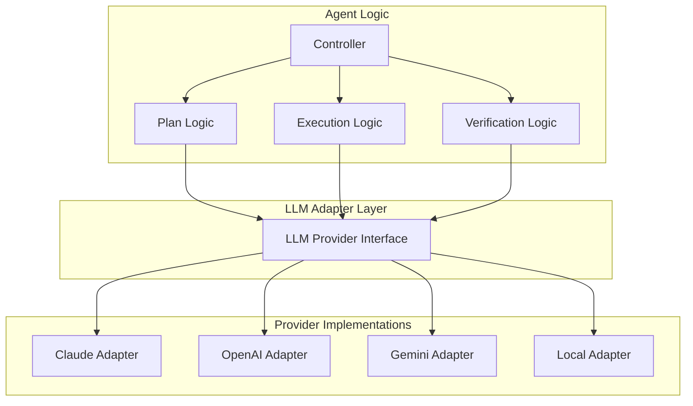
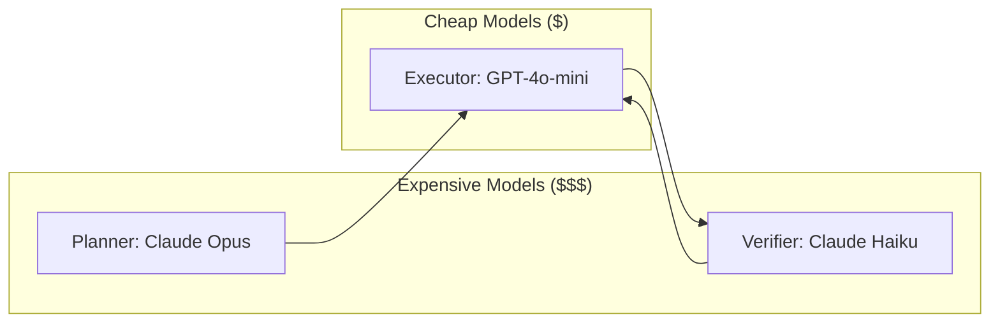

## Overview

This guide shows how to build Plan-Execute-Verify agents that work across multiple LLM providers. Unlike ReAct's single agent, PEV manages **three separate components** (Planner, Executor, Verifier) that can each use different providers.

### Why Multi-Provider Matters for PEV

**Cost Optimization**: Use expensive models where quality matters (planning, verification), cheap models where speed matters (execution).

**Flexibility**: Each component can independently use the best-fit provider:

- **Planner**: Use best reasoning model (e.g., Claude Opus for complex planning)
- **Executor**: Use fastest model (e.g., GPT-4o-mini for quick execution)
- **Verifier**: Use best evaluation model (e.g., Gemini for different perspective)

**Reliability**: Fallback options per component reduce single points of failure.

### Two Approaches

1. **LangChain/LangGraph (Recommended)**: Framework-managed provider abstraction with latest 2026 patterns
2. **Manual Abstraction (Educational)**: Build your own to understand the internals

## Approach 1: LangChain/LangGraph (Recommended)

LangChain provides excellent provider abstraction out of the box. In 2026, **LangGraph** is the recommended framework for production Plan-Execute agents.

### Latest 2026 Framework Updates

- **LangGraph**: Now the standard for plan-execute workflows using StateGraph
- **Requirements**: `langchain-core >= 0.3` (Pydantic v2 support)
- **Official Docs**: [LangGraph Plan-and-Execute Tutorial](https://langchain-ai.github.io/langgraph/tutorials/plan-and-execute/plan-and-execute/)

### Provider Abstraction in LangChain

LangChain uses a unified interface for all LLM providers:

```python
from langchain_anthropic import ChatAnthropic
from langchain_openai import ChatOpenAI
from langchain_google_genai import ChatGoogleGenerativeAI
from langchain_community.llms import Ollama

# All of these have the same interface!
llm_claude = ChatAnthropic(model="claude-sonnet-4-5-20250929")
llm_gpt = ChatOpenAI(model="gpt-4-turbo-preview")
llm_gemini = ChatGoogleGenerativeAI(model="gemini-1.5-pro")
llm_local = Ollama(model="mistral")

# Same method calls work for all
response = llm_claude.invoke("Hello!")
response = llm_gpt.invoke("Hello!")
```

### Setup

```bash
pip install langchain>=0.3.0 langchain-anthropic langchain-openai langchain-google-genai langchain-community
```

### Step 1: Define Data Models

```python
from dataclasses import dataclass
from enum import Enum
from typing import List, Dict, Any, Optional

class StepStatus(Enum):
    PENDING = "pending"
    IN_PROGRESS = "in_progress"
    COMPLETE = "complete"
    FAILED = "failed"

@dataclass
class Step:
    step_id: str
    name: str
    description: str
    actions: List[str]
    acceptance_criteria: List[str]
    expected_outputs: List[str]
    status: StepStatus = StepStatus.PENDING
    retry_count: int = 0
    feedback: List[str] = None

@dataclass
class Plan:
    goal: str
    steps: List[Step]
    success_criteria: List[str]

@dataclass
class VerificationResult:
    passed: bool
    action: str  # "pass", "retry", "replan"
    feedback: Optional[str] = None
    evidence: Optional[str] = None
```

### Step 2: Planner Component

```python
from langchain_core.messages import SystemMessage, HumanMessage
import json

class PlannerComponent:
    """Creates structured plans using any LLM"""

    SYSTEM_PROMPT = """You are an expert planning specialist.

Create a detailed plan for the given task. Respond with ONLY valid JSON:

{
  "goal": "High-level objective",
  "steps": [
    {
      "step_id": "1",
      "name": "Brief step name",
      "description": "What to do in detail",
      "actions": ["action1", "action2"],
      "acceptance_criteria": ["Specific measurable criterion 1"],
      "expected_outputs": ["file1.md"]
    }
  ],
  "success_criteria": ["Overall success criterion"]
}

Make criteria SPECIFIC and MEASURABLE."""

    def __init__(self, llm):
        self.llm = llm

    def create_plan(self, user_request: str, context: Dict[str, Any]) -> Plan:
        messages = [
            SystemMessage(content=self.SYSTEM_PROMPT),
            HumanMessage(content=f"REQUEST: {user_request}\n\nCONTEXT: {json.dumps(context)}")
        ]
        response = self.llm.invoke(messages)
        plan_json = self._extract_json(response.content)

        steps = [Step(**s) for s in plan_json["steps"]]
        return Plan(
            goal=plan_json["goal"],
            steps=steps,
            success_criteria=plan_json["success_criteria"]
        )
```

### Step 3: Executor Component

```python
from langchain_core.tools import tool
from langchain_core.messages import ToolMessage

class ExecutorComponent:
    """Executes steps using tools with any LLM"""

    def __init__(self, llm, tools: List):
        self.llm = llm
        self.tools = tools
        self.tool_map = {tool.name: tool for tool in tools}
        self.llm_with_tools = llm.bind_tools(tools)

    def execute_step(self, step: Step, context: Dict[str, Any]) -> Dict[str, Any]:
        messages = [
            SystemMessage(content="Execute the step thoroughly using tools."),
            HumanMessage(content=f"STEP: {step.name}\nCRITERIA: {step.acceptance_criteria}")
        ]

        artifacts = []
        actions_taken = []

        for i in range(10):  # Max 10 tool iterations
            response = self.llm_with_tools.invoke(messages)
            messages.append(response)

            if not response.tool_calls:
                return {
                    "summary": response.content,
                    "artifacts": artifacts,
                    "actions_taken": actions_taken
                }

            # Execute tools
            for tool_call in response.tool_calls:
                result = self.tool_map[tool_call["name"]].invoke(tool_call["args"])
                actions_taken.append({"tool": tool_call["name"], "result": str(result)[:200]})
                messages.append(ToolMessage(content=str(result), tool_call_id=tool_call["id"]))

        return {"summary": "Execution incomplete", "artifacts": artifacts, "actions_taken": actions_taken}
```

### Step 4: Verifier Component

```python
class VerifierComponent:
    """Verifies step execution with any LLM"""

    SYSTEM_PROMPT = """You are a verification specialist.
Check if execution meets ALL acceptance criteria.

Respond with ONLY valid JSON:
{
  "passed": true/false,
  "action": "pass|retry|replan",
  "evidence": "Specific evidence",
  "feedback": "Actionable feedback if retry needed"
}"""

    def __init__(self, llm):
        self.llm = llm

    def verify(self, step: Step, result: Dict[str, Any]) -> VerificationResult:
        messages = [
            SystemMessage(content=self.SYSTEM_PROMPT),
            HumanMessage(content=f"STEP: {step.name}\nCRITERIA: {step.acceptance_criteria}\nRESULT: {result}")
        ]

        response = self.llm.invoke(messages)
        verification_json = json.loads(response.content)

        return VerificationResult(
            passed=verification_json["passed"],
            action=verification_json["action"],
            feedback=verification_json.get("feedback"),
            evidence=verification_json.get("evidence")
        )
```

### Step 5: Complete PEV Agent

```python
class PlanExecuteVerifyAgent:
    """Complete PEV agent with LangChain - works with ANY providers!"""

    def __init__(self, planner_llm, executor_llm, verifier_llm, tools: List):
        self.planner = PlannerComponent(planner_llm)
        self.executor = ExecutorComponent(executor_llm, tools)
        self.verifier = VerifierComponent(verifier_llm)

    def run(self, user_request: str, context: Dict[str, Any]) -> Optional[Plan]:
        # Phase 1: Planning
        plan = self.planner.create_plan(user_request, context)

        # Phase 2: Execute with verification
        for step in plan.steps:
            success = self._execute_step_with_verification(step, context)
            if not success:
                return None

        return plan

    def _execute_step_with_verification(self, step: Step, context: Dict[str, Any]) -> bool:
        max_retries = 3
        for attempt in range(1, max_retries + 1):
            result = self.executor.execute_step(step, context)
            verification = self.verifier.verify(step, result)

            if verification.passed:
                step.status = StepStatus.COMPLETE
                return True
            elif verification.action == "retry" and attempt < max_retries:
                step.feedback.append(verification.feedback)
                step.retry_count += 1
            else:
                step.status = StepStatus.FAILED
                return False
        return False
```

### Switching Providers (One Line!)

```python
# Use Claude for everything
planner = ChatAnthropic(model="claude-opus-4-6")
executor = ChatAnthropic(model="claude-sonnet-4-5-20250929")
verifier = ChatAnthropic(model="claude-haiku-4-5-20251001")

# OR use OpenAI:
from langchain_openai import ChatOpenAI
planner = ChatOpenAI(model="gpt-4-turbo-preview")
executor = ChatOpenAI(model="gpt-4-turbo-preview")
verifier = ChatOpenAI(model="gpt-3.5-turbo")

# OR mix providers for cost optimization:
planner = ChatAnthropic(model="claude-opus-4-6")  # Best reasoning
executor = ChatOpenAI(model="gpt-4o-mini")  # Fast & cheap
verifier = ChatGoogleGenerativeAI(model="gemini-1.5-flash")  # Good evaluation

agent = PlanExecuteVerifyAgent(planner, executor, verifier, tools)
```

## Approach 2: Manual Abstraction (Educational)

Build your own provider abstraction to understand how it works internally.

### Architecture with Three Agents



### Step 1: Provider Interface

```python
from abc import ABC, abstractmethod
from dataclasses import dataclass
from typing import List, Dict, Any

@dataclass
class LLMRequest:
    messages: List[Dict[str, str]]
    tools: Optional[List[Dict]] = None
    temperature: float = 0.7
    max_tokens: int = 4000

@dataclass
class LLMResponse:
    content: str
    tool_calls: List[Dict]
    finish_reason: str

class LLMProvider(ABC):
    @abstractmethod
    def complete(self, request: LLMRequest) -> LLMResponse:
        """Send request to LLM and get standardized response"""
        pass
```

### Step 2: Provider Implementations

```python
import anthropic

class ClaudeProvider(LLMProvider):
    def __init__(self, api_key: str, model: str = "claude-sonnet-4-5-20250929"):
        self.client = anthropic.Anthropic(api_key=api_key)
        self.model = model

    def complete(self, request: LLMRequest) -> LLMResponse:
        response = self.client.messages.create(
            model=self.model,
            messages=request.messages,
            tools=request.tools or [],
            temperature=request.temperature,
            max_tokens=request.max_tokens
        )

        return LLMResponse(
            content=response.content[0].text if response.content else "",
            tool_calls=[{"name": tc.name, "args": tc.input} for tc in response.content if tc.type == "tool_use"],
            finish_reason=response.stop_reason
        )
```

### Step 3: AgnosticPEVAgent

```python
class AgnosticPEVAgent:
    """PEV agent that works with any LLM providers via manual abstraction"""

    def __init__(self, planner: LLMProvider, executor: LLMProvider, verifier: LLMProvider, tools: List):
        self.planner = planner
        self.executor = executor
        self.verifier = verifier
        self.tools = tools

    def run(self, user_request: str, context: str = "") -> Dict[str, Any]:
        # Phase 1: Planning
        plan = self._create_plan(user_request, context)

        # Phase 2: Execute steps with verification
        results = []
        for step in plan.steps:
            step_result = self._execute_and_verify_step(step)
            results.append(step_result)

            if not step_result["verified"]:
                if step_result["retry_count"] >= step.max_retries:
                    return {"success": False, "error": f"Step {step.id} failed"}

        return {"success": True, "result": results[-1]["output"], "plan": plan}
```

### Step 4: Using Manual Abstraction

```python
# Each component can use a different provider!
planner_provider = ClaudeProvider(api_key=os.getenv("ANTHROPIC_API_KEY"), model="claude-opus-4-6")
executor_provider = OpenAIProvider(api_key=os.getenv("OPENAI_API_KEY"), model="gpt-4o-mini")
verifier_provider = GeminiProvider(api_key=os.getenv("GOOGLE_API_KEY"), model="gemini-1.5-flash")

agent = AgnosticPEVAgent(
    planner=planner_provider,
    executor=executor_provider,
    verifier=verifier_provider,
    tools=tools
)

result = agent.run("Review legal documents")
```

## Provider Comparison

| Provider              | Best For                 | Cost        | Speed     | Reasoning Quality |
| --------------------- | ------------------------ | ----------- | --------- | ----------------- |
| **Claude Opus 4.6**   | Planning                 | High        | Slow      | Excellent         |
| **Claude Sonnet 4.5** | Balanced                 | Medium      | Medium    | Very Good         |
| **Claude Haiku 4.5**  | Execution/Verification   | Low         | Fast      | Good              |
| **GPT-4 Turbo**       | General Purpose          | Medium-High | Fast      | Very Good         |
| **GPT-4o-mini**       | Fast Execution           | Low         | Very Fast | Good              |
| **Gemini 1.5 Pro**    | Multimodal, Long Context | Medium      | Medium    | Very Good         |
| **Gemini 1.5 Flash**  | Verification             | Low         | Fast      | Good              |
| **Local (Ollama)**    | Privacy, Offline         | Free        | Varies    | Varies            |

## Complete Implementation Example

```python
import os
from langchain_anthropic import ChatAnthropic
from langchain_openai import ChatOpenAI
from langchain_core.tools import tool

# Define tools
@tool
def read_file(path: str) -> str:
    """Read a file from disk."""
    with open(path, 'r') as f:
        return f.read()

@tool
def write_file(path: str, content: str) -> str:
    """Write content to a file."""
    os.makedirs(os.path.dirname(path) or ".", exist_ok=True)
    with open(path, 'w') as f:
        f.write(content)
    return f"Success: Wrote to {path}"

tools = [read_file, write_file]

# Cost-optimized mixed provider setup
planner_llm = ChatAnthropic(model="claude-opus-4-6", temperature=0)  # Best reasoning
executor_llm = ChatOpenAI(model="gpt-4o-mini", temperature=0)  # Fast & cheap
verifier_llm = ChatAnthropic(model="claude-haiku-4-5-20251001", temperature=0)  # Cheap verification

# Create agent
agent = PlanExecuteVerifyAgent(
    planner_llm=planner_llm,
    executor_llm=executor_llm,
    verifier_llm=verifier_llm,
    tools=tools
)

# Run
result = agent.run(
    user_request="Review all legal documents and create comprehensive reports",
    context={"folder_path": "/project/legal_docs"}
)
```

## Production Recommendations

### When to Use What

| Scenario                       | Recommendation                                      |
| ------------------------------ | --------------------------------------------------- |
| **Production system**          | LangChain/LangGraph (Approach 1)                    |
| **Learning internals**         | Manual abstraction (Approach 2)                     |
| **Cost optimization**          | Mixed providers (expensive planner, cheap executor) |
| **Maximum control**            | Manual abstraction with custom logic                |
| **Rapid prototyping**          | LangChain with all same provider                    |
| **Provider-specific features** | Hybrid (LangChain + custom adapters)                |

### Cost Optimization Strategy



**Strategy**: Use expensive models where quality matters (planning, final verification), cheap models where speed matters (execution).

### Testing Across Providers

```python
import pytest

@pytest.fixture
def providers():
    return {
        "claude": ChatAnthropic(model="claude-sonnet-4-5-20250929"),
        "gpt": ChatOpenAI(model="gpt-4-turbo-preview"),
        "gemini": ChatGoogleGenerativeAI(model="gemini-1.5-pro")
    }

@pytest.mark.parametrize("planner,executor,verifier", [
    ("claude", "claude", "claude"),
    ("claude", "gpt", "claude"),
    ("gpt", "gpt", "gpt"),
])
def test_pev_agent(providers, planner, executor, verifier):
    agent = PlanExecuteVerifyAgent(
        planner_llm=providers[planner],
        executor_llm=providers[executor],
        verifier_llm=providers[verifier],
        tools=test_tools
    )

    result = agent.run("Simple test task", {})
    assert result is not None
```

## Comparison: LangChain vs Manual

| Aspect                 | LangChain (Approach 1)    | Manual (Approach 2)            |
| ---------------------- | ------------------------- | ------------------------------ |
| **Setup Time**         | Fast (~100 lines)         | Slow (~500 lines for adapters) |
| **Provider Switching** | One line                  | Update adapter classes         |
| **Tool Calling**       | Unified `bind_tools()`    | Parse each provider's format   |
| **Maintenance**        | LangChain handles updates | You maintain adapters          |
| **Control**            | Some abstraction overhead | Full control                   |
| **Learning Value**     | Use framework patterns    | Understand internals           |
| **Production Ready**   | ✅ Yes (2026 standard)    | ⚠️ Requires testing            |

## Key Takeaways

**For Production**: Use LangChain/LangGraph (Approach 1)

- Built-in provider abstraction
- Latest 2026 patterns with StateGraph
- Rich ecosystem (memory, callbacks, observability)
- Community support and regular updates

**For Learning**: Try Manual Abstraction (Approach 2)

- Understand provider differences
- Learn how tool calling works across APIs
- Build custom features when needed

**Cost Optimization**: Mix providers strategically

- Expensive model for planning (Claude Opus)
- Cheap model for execution (GPT-4o-mini)
- Fast model for verification (Claude Haiku, Gemini Flash)

## Next Steps

- **Implementation**: See [Claude SDK Implementation](/ai-agent-study/plan-execute-verify/02-claude-implementation/) for a working example
- **Related**: Check [ReAct Multi-Provider](/ai-agent-study/react/03-multi-provider/) for simpler single-agent version

## Resources

- [LangGraph Plan-and-Execute Tutorial](https://langchain-ai.github.io/langgraph/tutorials/plan-and-execute/plan-and-execute/) - Official 2026 documentation
- [LangChain Agents Guide](https://blog.langchain.com/planning-agents/) - Planning agent patterns
- [ReAct Multi-Provider](/ai-agent-study/react/03-multi-provider/) - Simpler single-agent pattern
