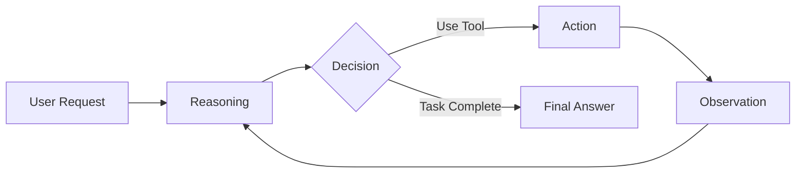
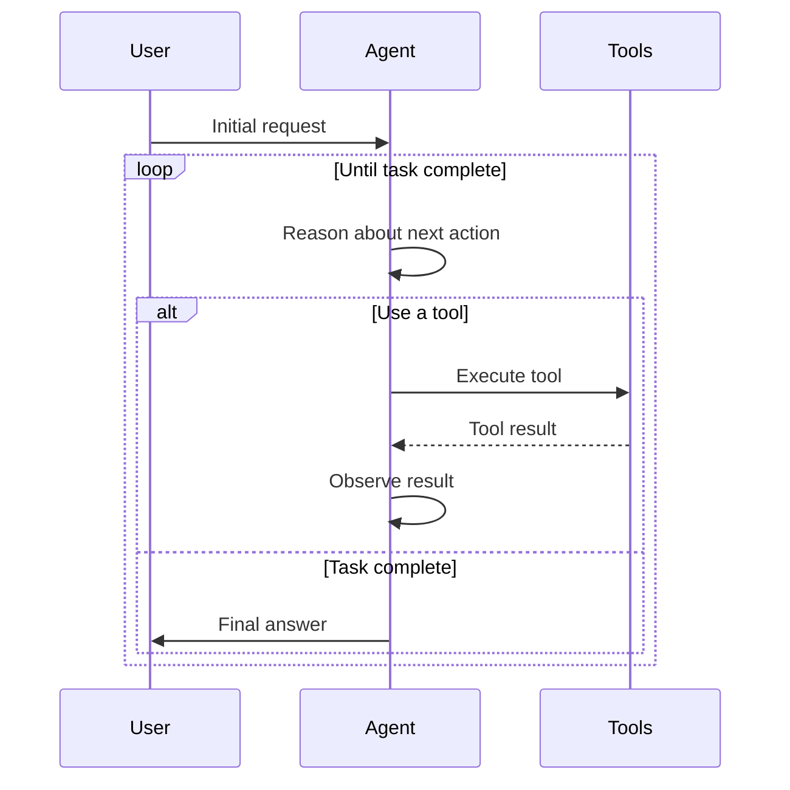
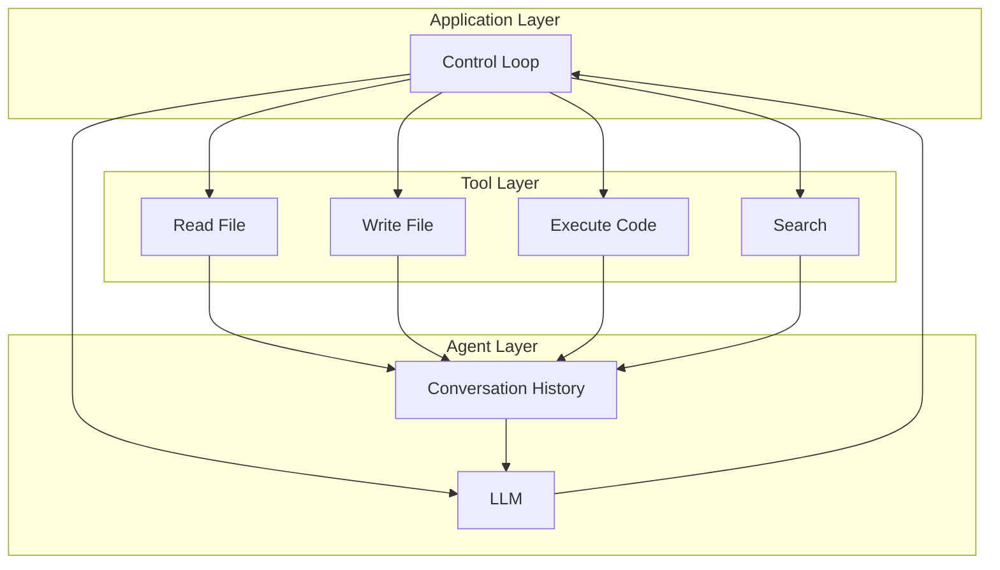
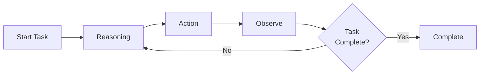
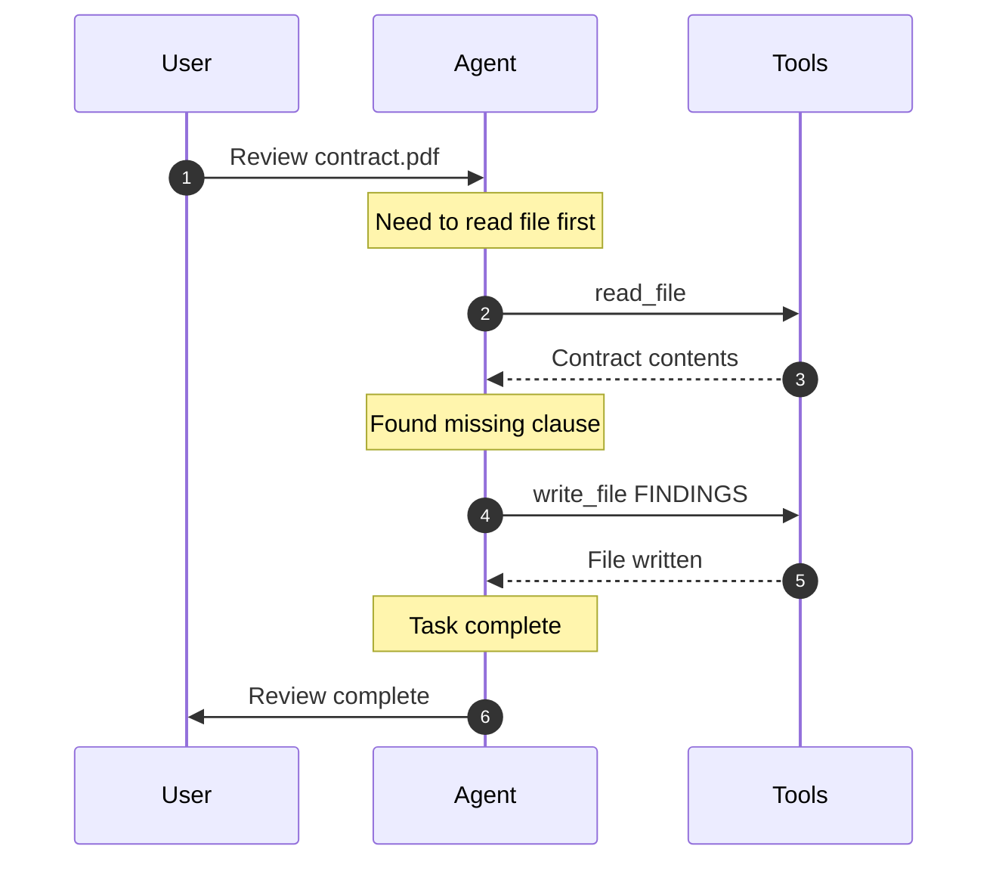
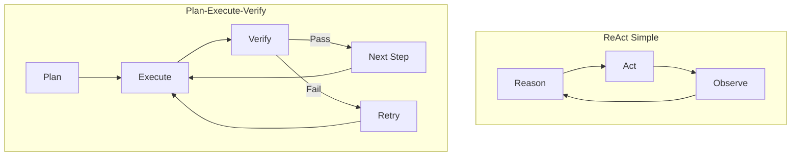

## What is ReAct?

**ReAct** (Reasoning + Acting) is the simplest AI agent architecture. The agent alternates between **reasoning** about what to do next, **taking an action**, and **observing** the result.

The name "ReAct" combines:

- **Re**asoning: The model thinks about what to do
- **Act**ing: The model executes a tool or completes the task

## Core Concept

## Control Flow

The ReAct pattern follows a simple loop:

## Architecture Diagram

## Example: Legal Document Review

Here's how ReAct handles a legal document review task:

## Key Characteristics

### ✅ Strengths

- **Simple**: Easy to understand and implement (~200-400 lines)
- **Transparent**: Clear reasoning at each step
- **Debuggable**: Can trace exactly what the agent did and why
- **Flexible**: Works with any LLM that supports tool calling

### ⚠️ Limitations

- **No Quality Checks**: Agent doesn't verify its own work
- **Can Loop**: May get stuck repeating actions
- **No Planning**: Decides one step at a time
- **Error Prone**: No recovery mechanism

## When to Use ReAct

| ✅ Use ReAct When...             | ❌ Avoid ReAct When...              |
| -------------------------------- | ----------------------------------- |
| Building prototypes or MVPs      | Production systems need reliability |
| Learning agent fundamentals      | Complex multi-step workflows        |
| Simple, linear tasks (3-5 steps) | Quality assurance required          |
| Small tool sets (< 10 tools)     | Error recovery is critical          |
| Fast iteration needed            | Compliance/audit trails needed      |

## Message Flow Example

Here's what the conversation looks like:

## Comparison with Plan-Execute-Verify

**Key Difference**: ReAct is a single loop, while Plan-Execute-Verify separates planning, execution, and verification into distinct phases.

## Best For

- **Learning**: Perfect for understanding agent concepts
- **Prototyping**: Quick to build and iterate
- **Simple Tasks**: 3-5 steps, clear requirements
- **Demos**: Easy to explain and visualize

## Implementation Options

Continue to one of the implementation guides:

1. **[Claude SDK Implementation](/ai-agent-study/react/02-claude-implementation/)** - Direct API integration (most control)
2. **[Model Agnostic Design](/ai-agent-study/react/03-model-agnostic/)** - Support multiple LLM providers
3. **[LangChain Implementation](/ai-agent-study/react/04-langchain/)** - Using LangChain framework (fastest development)

## Next Steps

- **New to agents?** → Start with [Claude SDK Implementation](/ai-agent-study/react/02-claude-implementation/)
- **Need flexibility?** → Read [Model Agnostic Design](/ai-agent-study/react/03-model-agnostic/)
- **Want speed?** → Try [LangChain Implementation](/ai-agent-study/react/04-langchain/)
- **Ready for production?** → Explore [Plan-Execute-Verify Pattern](/ai-agent-study/plan-execute-verify/01-overview/)
