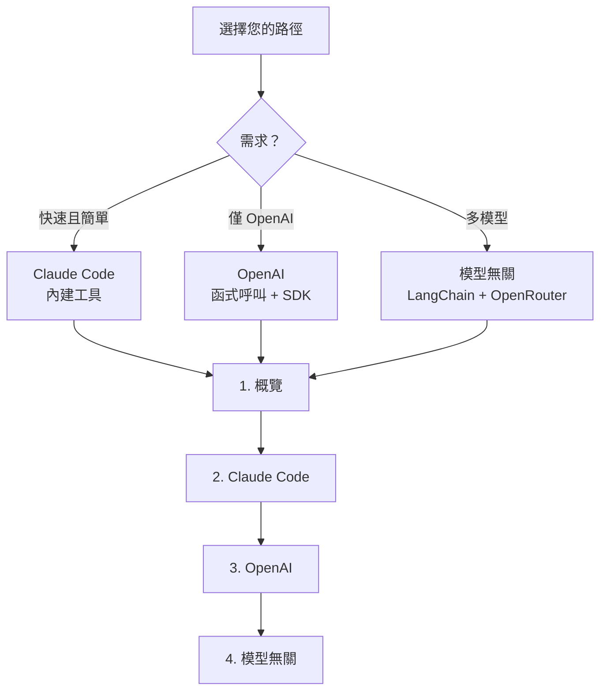
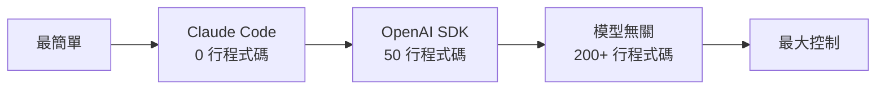
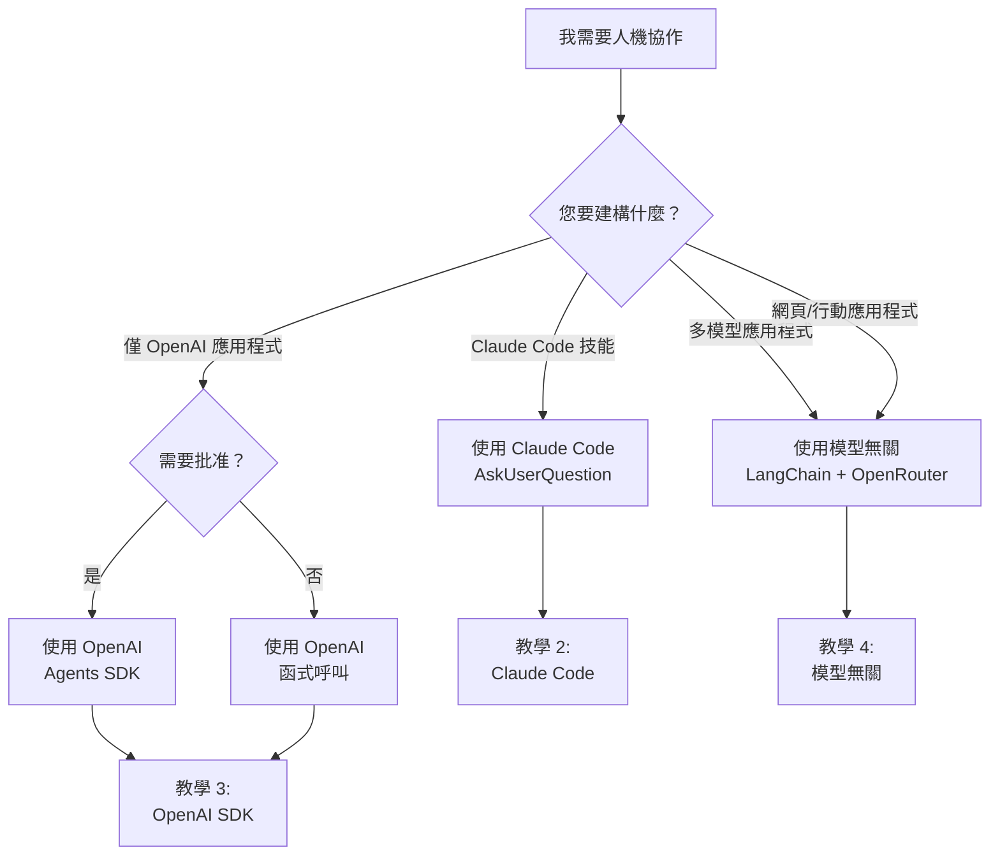
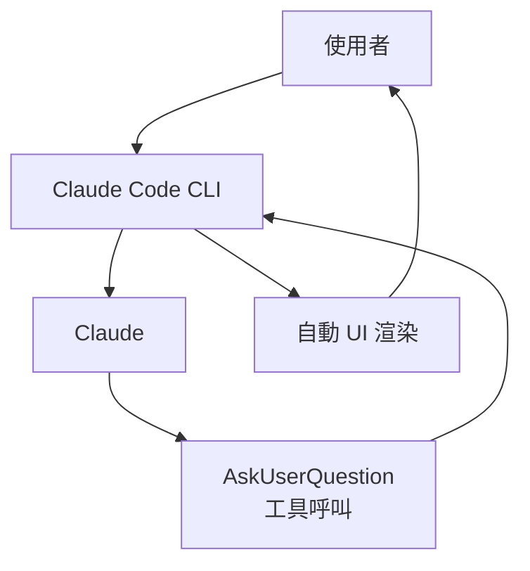
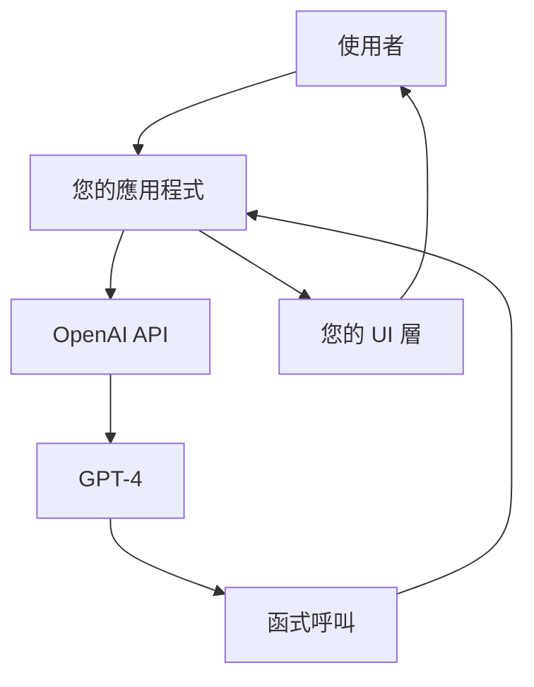
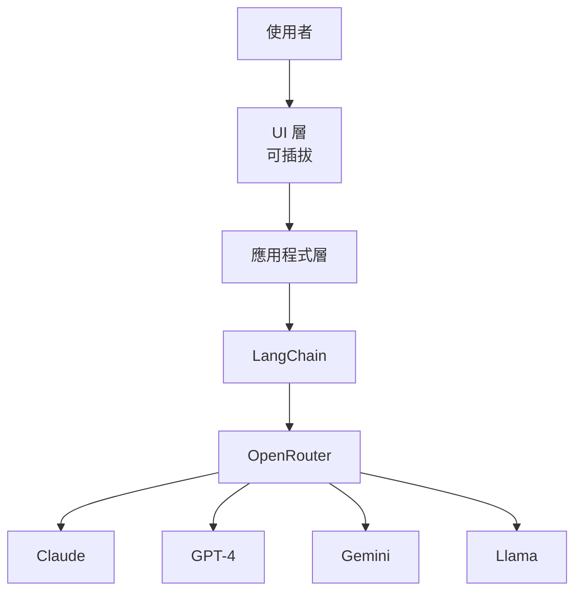

## 您將學到什麼

本教學系列教您如何建構**互動式 AI 代理**，能夠暫停執行、提問並在採取行動前獲得使用者批准。您將學習三種不同的方法，從最簡單的（Claude Code）到最靈活的（模型無關）。

## 教學系列

### 1. [概覽](/ai-agent-study/zh-tw/human-in-the-loop/01-overview/)

**從這裡開始了解基礎知識。**

學習：

- 什麼是人機協作以及為什麼重要
- 常見使用案例（澄清、批准、設定）
- 架構模式與限制
- 不同方法的比較
- 何時使用 HITL 與自主代理

**閱讀此篇如果：** 您是人機協作新手或想了解全貌。

---

### 2. [Claude Code 實作](/ai-agent-study/zh-tw/human-in-the-loop/02-claude-implementation/)

**最簡單的方法 - 零設定需求。**

學習：

- Claude Code 內建的 `AskUserQuestion` 如何運作
- 使用自動 UI 渲染建立互動式技能
- 設計模式（循序、多選、漸進式揭露）
- 問題和選項的最佳實踐
- 限制以及何時使用其他方法

**閱讀此篇如果：** 您正在建構 Claude Code 技能或想要最快的方式加入 HITL。

**優點：**

- ✅ 零程式碼 - 只需撰寫指令
- ✅ 在終端機中自動 UI 渲染
- ✅ 不需要狀態管理

**缺點：**

- ❌ 僅限 Claude Code CLI
- ❌ 無法自訂 UI
- ❌ 不可移植到其他平台

---

### 3. [OpenAI 實作](/ai-agent-study/zh-tw/human-in-the-loop/03-openai-implementation/)

**OpenAI 使用者的兩種強大方法。**

學習：

- **函式呼叫**：完全控制的手動實作
- **Agents SDK**：具有 `needsApproval` 的內建批准工作流程
- 結構化輸出以保證架構合規性
- 處理平行工具呼叫
- 錯誤處理與驗證

**閱讀此篇如果：** 您正在使用 OpenAI 並想要內建批准功能或需要了解函式呼叫。

**優點：**

- ✅ 提供者支援的模式
- ✅ Agents SDK 具有內建批准
- ✅ 結構化輸出保證合規性
- ✅ 良好的文件和範例

**缺點：**

- ❌ 僅限 OpenAI 模型
- ❌ 仍需實作 UI 層
- ❌ SDK 增加相依性

---

### 4. [模型無關實作](/ai-agent-study/zh-tw/human-in-the-loop/04-model-agnostic/)

**最大靈活性 - 適用於任何 LLM 提供者。**

學習：

- LangChain + OpenRouter 架構
- 自訂工具定義與執行迴圈
- 可插拔 UI 處理器（CLI、網頁、行動裝置）
- 跨暫停的狀態管理
- 限制與權衡
- 生產就緒模式

**閱讀此篇如果：** 您需要支援多個 LLM 提供者或建構網頁/行動應用程式。

**優點：**

- ✅ 適用於任何模型（Claude、GPT、Gemini、Llama 等）
- ✅ 完全控制 UI（終端機、網頁、行動裝置）
- ✅ 自訂驗證與邏輯
- ✅ 生產就緒架構

**缺點：**

- ❌ 更多程式碼（約 200+ 行）
- ❌ 手動狀態管理
- ❌ 較高複雜性

---

## 快速比較

### 依複雜性

### 依使用案例

| 使用案例                     | 最佳方法          |
| ---------------------------- | ----------------- |
| **Claude Code 技能開發**     | Claude Code 內建  |
| **快速原型製作**             | Claude Code 內建  |
| **僅 OpenAI 的生產應用程式** | OpenAI Agents SDK |
| **自訂批准邏輯**             | OpenAI 函式呼叫   |
| **網頁/行動應用程式**        | 模型無關          |
| **多提供者支援**             | 模型無關          |
| **最大靈活性**               | 模型無關          |

### 功能矩陣

| 功能           | Claude Code | OpenAI SDK  | 模型無關    |
| -------------- | ----------- | ----------- | ----------- |
| **設定時間**   | 即時        | 數分鐘      | 數小時      |
| **程式碼行數** | 0           | 約 50       | 約 200+     |
| **UI 渲染**    | 自動        | 手動        | 完全自訂    |
| **模型支援**   | 僅 Claude   | 僅 OpenAI   | 任何模型    |
| **UI 選項**    | 僅終端機    | 任何（DIY） | 任何（DIY） |
| **狀態管理**   | 自動        | SDK 協助    | 手動        |
| **批准流程**   | 手動        | 內建        | 手動        |
| **生產就緒**   | 示範        | 是          | 是          |
| **自訂能力**   | 低          | 中          | 高          |
| **可移植性**   | 無          | 低          | 高          |

## 決策樹

## 架構比較

### Claude Code：整合式

**特性：**

- 單一、整合系統
- 代理與 UI 之間無分離
- 一切自動化
- 最不靈活，最易使用

### OpenAI：半整合式

**特性：**

- 半整合（SDK 協助）
- 有些分離（UI 是您的）
- 手動 UI 實作
- 中等靈活性、中等工作量

### 模型無關：完全分離

**特性：**

- 完全分離的層
- 完全獨立
- 最大靈活性
- 最多工作量，最大控制

## 常見模式

### 模式 1：循序問題

根據先前的答案逐一提問。

**範例：** 專案設定精靈

1. "什麼類型的專案？" → 網頁應用程式
2. "哪個框架？" → React
3. "哪種樣式？" → Tailwind CSS

**最佳實作於：**

- ✅ 所有三種方法
- Claude Code 最簡單
- 模型無關最靈活

### 模式 2：批准閘門

在敏感操作前需要確認。

**範例：** 資料庫操作

- "刪除 10,000 筆記錄？"
- "部署到生產環境？"
- "發送電子郵件給所有使用者？"

**最佳實作於：**

- ✅ OpenAI Agents SDK（內建 `needsApproval`）
- ⚠️ Claude Code 需手動
- ⚠️ 模型無關需手動

### 模式 3：條件分支

根據初始答案提出不同的後續問題。

**範例：** 設定複雜度

- 初學者 → 使用預設值，跳過問題
- 中級 → 詢問關鍵問題
- 進階 → 詢問所有設定細節

**最佳實作於：**

- ✅ 所有三種方法
- 模型無關最優雅（完全控制）

### 模式 4：多選功能

允許使用者選擇多個非互斥選項。

**範例：** 功能選擇

- 選擇所有適用項目：
  - ☑ 身份驗證
  - ☑ 資料庫
  - ☐ 電子郵件
  - ☑ 測試

**最佳實作於：**

- ✅ Claude Code（`multiSelect: true`）
- ✅ OpenAI（自訂邏輯）
- ✅ 模型無關（自訂邏輯）

## 所有方法的關鍵限制

### 1. 工具呼叫可靠性

並非所有模型在工具呼叫上表現同樣出色：

| 模型               | 可靠性 | 備註       |
| ------------------ | ------ | ---------- |
| Claude (Anthropic) | 95%+   | 業界最佳   |
| GPT-4 (OpenAI)     | 95%+   | 非常可靠   |
| Gemini (Google)    | 85%+   | 通常良好   |
| Llama 3            | 60-80% | 取決於微調 |
| Mistral            | 50-70% | 有限支援   |

**影響：** 生產系統應採用 Claude 或 GPT-4。

### 2. UI 分離

只有 Claude Code 具有內建 UI。其他所有方法，您必須：

- 實作自己的 UI 層
- 處理渲染邏輯
- 管理使用者輸入收集
- 驗證回應

### 3. 狀態管理

暫停執行需要保留對話狀態：

- 必須維護訊息歷史
- 必須追蹤工具呼叫
- 答案必須正確格式化
- 上下文必須回流到 LLM

### 4. 使用者體驗

考慮認知負荷：

- 每個問題**2-4 個選項**（最多）
- 每次互動**1-4 個問題**
- 每個選項**清楚的描述**
- 複雜性的**漸進式揭露**

## 實際範例

### 範例 1：功能開發助手

**情境：** 透過提出澄清問題幫助開發者實作新功能。

**最佳方法：** 模型無關

- 需要適用於多個 LLM
- 網頁 UI 以促進協作
- 複雜驗證邏輯
- 與 GitHub、Jira 整合

**實作：**

- 教學 4：模型無關
- 網頁 UI（Streamlit 或 React）
- LangChain 以獲得靈活性
- OpenRouter 以存取模型

### 範例 2：Claude Code 技能

**情境：** Claude Code 使用者的互動式資料庫設定技能。

**最佳方法：** Claude Code 內建

- 目標受眾使用 Claude Code
- 終端機 UI 就足夠
- 想要零設定體驗
- 快速開發

**實作：**

- 教學 2：Claude Code
- 使用內建 `AskUserQuestion`
- 以 Markdown 撰寫技能
- 約 0 行程式碼

### 範例 3：部署助手

**情境：** 基於 ChatGPT 的部署工具，具有安全檢查。

**最佳方法：** OpenAI Agents SDK

- 僅 OpenAI 可接受
- 需要內建批准
- 生產部署（高風險）
- 標準化流程

**實作：**

- 教學 3：OpenAI Agents SDK
- 使用 `needsApproval: true`
- 生產環境的條件批准
- 約 50 行程式碼

## 入門指南

### 路徑 1：完全初學者

1. **開始：** [概覽](/ai-agent-study/zh-tw/human-in-the-loop/01-overview/) - 了解概念
2. **嘗試：** [Claude Code](/ai-agent-study/zh-tw/human-in-the-loop/02-claude-implementation/) - 最簡單實作
3. **探索：** 執行範例並修改它們
4. **進階：** 需要時嘗試 OpenAI 或模型無關

### 路徑 2：OpenAI 開發者

1. **開始：** [概覽](/ai-agent-study/zh-tw/human-in-the-loop/01-overview/) - 了解全景
2. **深入：** [OpenAI](/ai-agent-study/zh-tw/human-in-the-loop/03-openai-implementation/) - 學習兩種方法
3. **實作：** 選擇函式呼叫或 Agents SDK
4. **考慮：** 多提供者支援的模型無關

### 路徑 3：生產工程師

1. **開始：** [概覽](/ai-agent-study/zh-tw/human-in-the-loop/01-overview/) - 了解選項
2. **比較：** 閱讀所有三個實作教學
3. **決定：** 根據需求（單一或多提供者）
4. **實作：** [模型無關](/ai-agent-study/zh-tw/human-in-the-loop/04-model-agnostic/) 以獲得最大靈活性

## 延伸資源

### 官方文件

- [Claude Code 文件](https://github.com/anthropics/claude-code)
- [OpenAI 函式呼叫](https://platform.openai.com/docs/guides/function-calling)
- [OpenAI Agents SDK](https://openai.github.io/openai-agents-python/)
- [LangChain 文件](https://python.langchain.com/docs/)
- [OpenRouter API](https://openrouter.ai/)

### 相關模式

- [ReAct 模式](/ai-agent-study/zh-tw/react/01-overview/) - 簡單推理與行動迴圈
- [計劃-執行-驗證](/ai-agent-study/zh-tw/plan-execute-verify/01-overview/) - 生產級代理模式

### 社群資源

- [Anthropic Cookbook](https://github.com/anthropics/anthropic-cookbook)
- [OpenAI Cookbook](https://cookbook.openai.com/)
- [LangChain 人機協作指南](https://python.langchain.com/docs/how_to/human_in_the_loop)
- [提示工程指南 - 函式呼叫](https://www.promptingguide.ai/agents/function-calling)

## 需要協助？

- **概念性問題？** → 從 [概覽](/ai-agent-study/zh-tw/human-in-the-loop/01-overview/) 開始
- **Claude Code 專屬？** → 查看 [Claude 實作](/ai-agent-study/zh-tw/human-in-the-loop/02-claude-implementation/)
- **OpenAI 專屬？** → 檢查 [OpenAI 實作](/ai-agent-study/zh-tw/human-in-the-loop/03-openai-implementation/)
- **架構問題？** → 審查 [模型無關實作](/ai-agent-study/zh-tw/human-in-the-loop/04-model-agnostic/)

---

**準備好開始了嗎？** → 從 [概覽](/ai-agent-study/zh-tw/human-in-the-loop/01-overview/) 開始了解基礎知識！
