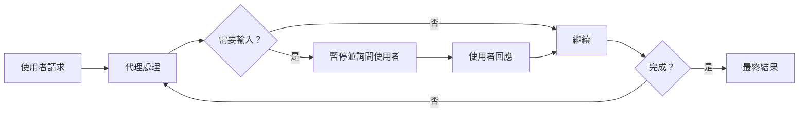
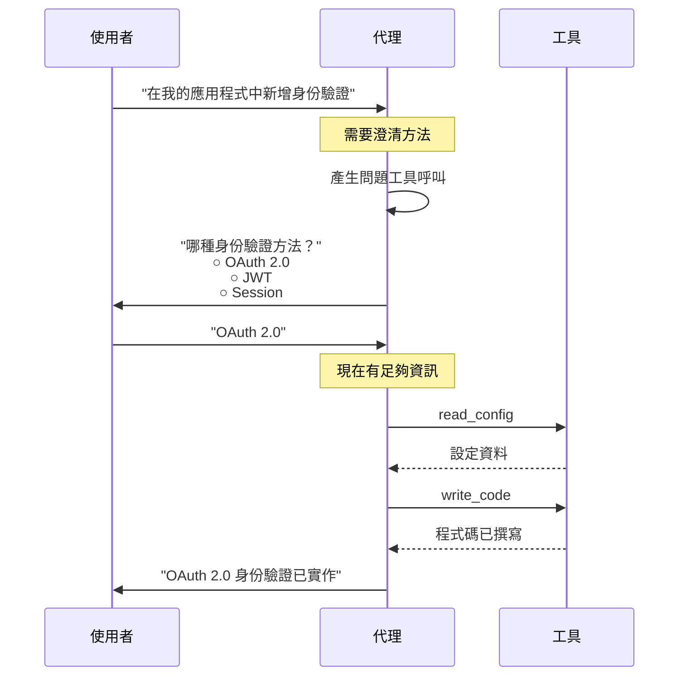
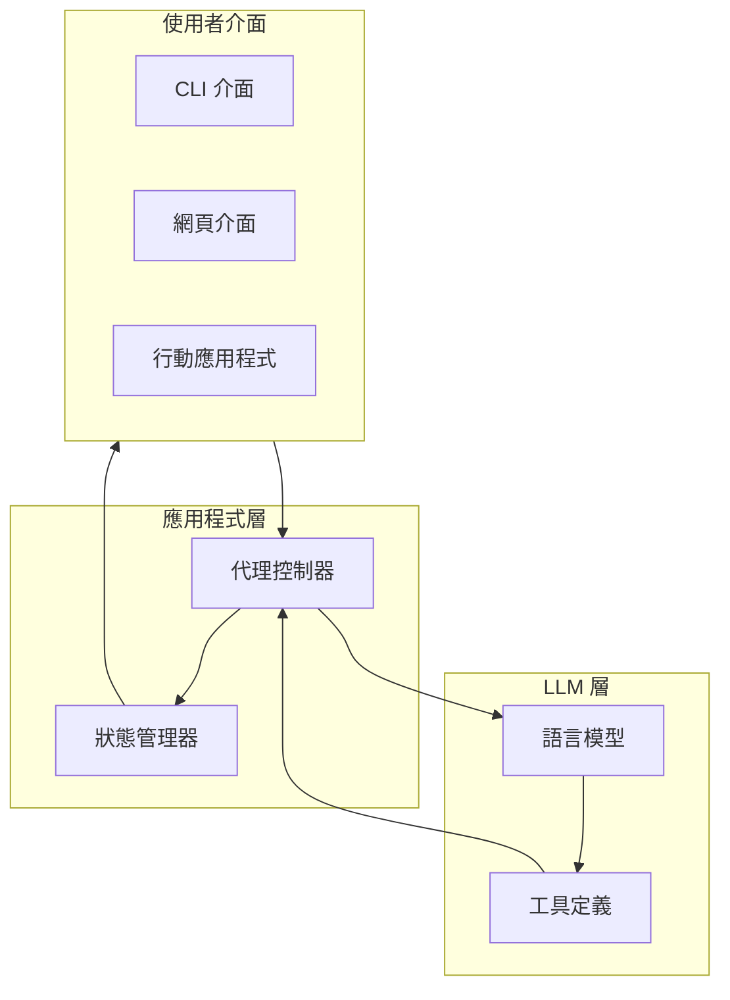
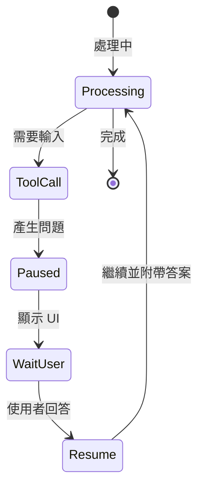
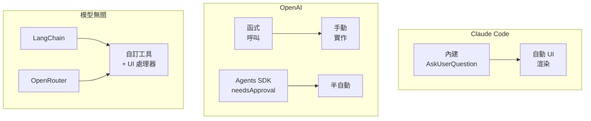
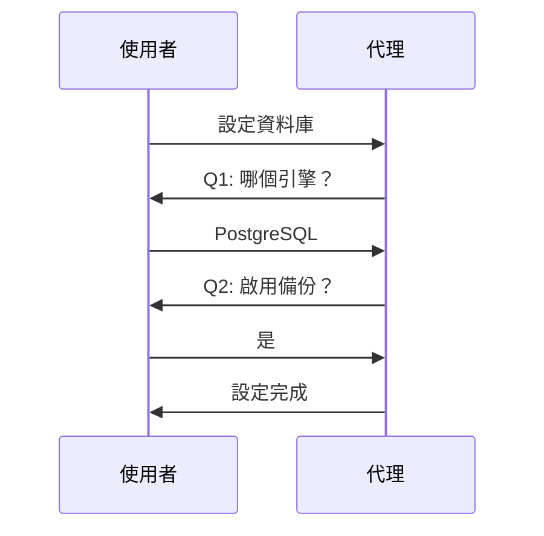
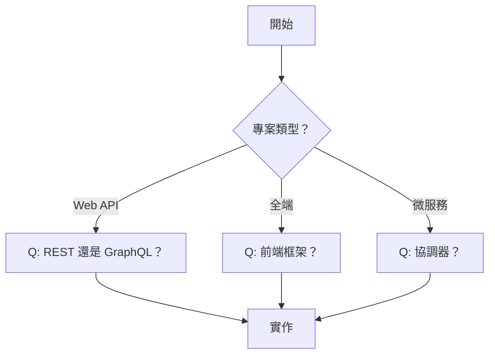
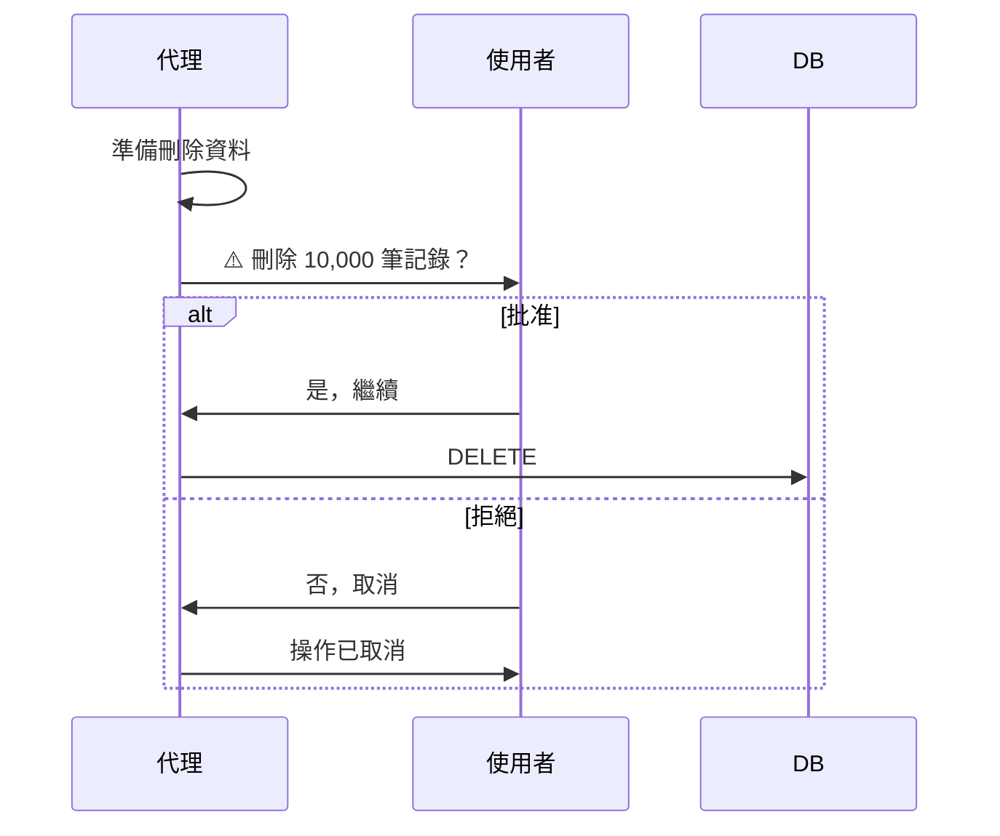
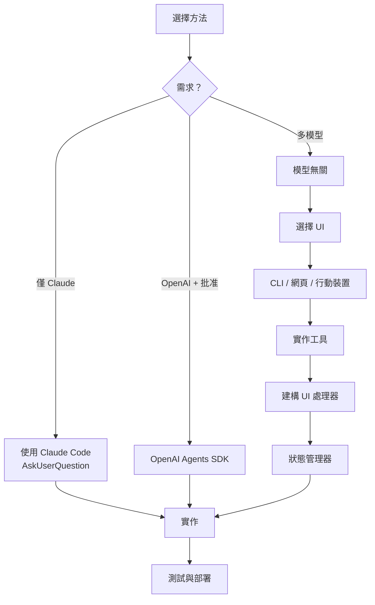

## 什麼是人機協作？

**人機協作（HITL）** 是一種 AI 代理暫停執行以收集使用者輸入、提出澄清問題或在繼續前請求批准的模式。這使代理能夠處理模糊情況、做出更好的決策，並為敏感操作提供安全護欄。

## 核心概念



## 為什麼需要人機協作？

### 常見使用案例

1. **澄清需求**
   - "我應該使用哪個資料庫？"
   - "您偏好哪種身份驗證方法？"
   - "這應該是 REST API 還是 GraphQL？"

2. **批准工作流程**
   - "部署到生產環境？（影響 10,000 位使用者）"
   - "刪除所有測試資料？"
   - "發送電子郵件給 5,000 位客戶？"

3. **設定收集**
   - "您想啟用哪些功能？"
   - "選擇部署區域"
   - "選擇要安裝的相依套件"

4. **決策制定**
   - "找到多種方法。您選擇哪一個？"
   - "速度與準確性之間的權衡。您的偏好？"
   - "檢測到衝突需求。如何解決？"

## 互動流程



## 關鍵特性

### ✅ 優點

- **更好的決策**：代理獲得澄清而非猜測
- **安全性**：風險操作需要批准
- **靈活性**：適應使用者偏好
- **透明度**：使用者看到並控制代理動作
- **錯誤預防**：及早發現誤解

### ⚠️ 挑戰

- **中斷流程**：打破自主操作
- **需要 UI**：需要向使用者呈現問題
- **狀態管理**：必須在暫停期間保留上下文
- **複雜性**：比自主代理有更多運作部分

## 架構概覽



## 運作方式：技術觀點

### 1. 工具呼叫機制

現代 LLM 可以為「工具呼叫」產生結構化 JSON - 模型可以呼叫的預定義函式：

```json
{
  "tool_call": {
    "name": "ask_user_question",
    "arguments": {
      "question": "哪個資料庫？",
      "options": ["PostgreSQL", "MongoDB", "Redis"]
    }
  }
}
```

### 2. 執行暫停

當代理產生 `ask_user_question` 工具呼叫時：



### 3. 狀態保留

應用程式必須維護對話狀態：

```python
messages = [
    SystemMessage("You are a helpful assistant"),
    HumanMessage("Add authentication"),
    AIMessage("I need to know which method"),
    AIMessage(tool_calls=[...]),  # ← 在此暫停
    # 使用者回答...
    ToolMessage("OAuth 2.0"),     # ← 答案已新增
    AIMessage("Implementing OAuth...")  # ← 已恢復
]
```

## 提供者比較

不同的 LLM 提供者以不同方式處理 HITL：



### 主要差異

| 面向         | Claude Code          | OpenAI             | 模型無關    |
| ------------ | -------------------- | ------------------ | ----------- |
| **內建工具** | ✅ `AskUserQuestion` | ❌ 必須定義        | ❌ 必須定義 |
| **UI 渲染**  | ✅ 自動              | ⚠️ SDK 協助        | ❌ 手動     |
| **批准流程** | 手動                 | ✅ `needsApproval` | ❌ 手動     |
| **靈活性**   | ❌ 僅 CLI            | ⚠️ 有限            | ✅ 完全控制 |
| **複雜性**   | 低                   | 中                 | 高          |

## 實作方法

### 方法 1：內建工具（Claude Code）

**優點：**

- 對開發者來說極其簡單
- 整合 UI
- 零設定

**缺點：**

- Claude Code 專屬
- 限於終端機 UI
- 無自訂能力

### 方法 2：提供者 SDK（OpenAI Agents）

**優點：**

- 標準化批准流程
- 提供者支援
- 良好文件

**缺點：**

- 提供者專屬
- 有限 UI 選項
- SDK 相依性

### 方法 3：自訂實作（模型無關）

**優點：**

- 適用於任何 LLM
- 完全 UI 控制（CLI、網頁、行動裝置）
- 最大靈活性

**缺點：**

- 需撰寫最多程式碼
- 手動狀態管理
- 複雜架構

## 工作流程模式

### 模式 1：循序問題

逐一提問：



### 模式 2：條件分支

根據答案提出後續問題：



### 模式 3：批准閘門

敏感操作需要確認：



## 何時使用 HITL

| ✅ 在以下情況使用 HITL... | ❌ 在以下情況跳過 HITL... |
| ------------------------- | ------------------------- |
| 存在多種有效方法          | 需求非常清楚              |
| 使用者偏好很重要          | 完全自動化工作流程        |
| 操作有風險/不可逆         | 簡單、安全的操作          |
| 需求模糊                  | 使用者不可用              |
| 設定複雜                  | 批次處理                  |

## 最佳實踐

### 1. 設計清晰的問題

**不好：**

```
問題："選擇一個"
選項：["A", "B", "C"]
```

**好：**

```
問題："我們應該使用哪個資料庫引擎？"
選項：[
  "PostgreSQL - 關聯式、ACID 合規、複雜查詢",
  "MongoDB - 文件儲存、彈性架構、水平擴展",
  "Redis - 記憶體內、微秒延遲、快取"
]
```

### 2. 限制選項

- 每個問題 **2-4 個選項**（5+ 會令人不知所措）
- 對複雜選擇使用漸進式揭露
- 分組相關選項

### 3. 提供上下文

- 解釋**為什麼**詢問
- 描述每個選擇的**影響**
- 相關時提及**權衡**

### 4. 優雅地處理錯誤

- 驗證使用者輸入
- 允許「取消」或「返回」
- 適當時提供預設值
- 記錄所有互動

## 限制與考量

### 技術限制

1. **工具呼叫變異性**：並非所有模型具有相同的工具呼叫能力
2. **無通用標準**：每個提供者以不同方式實作 HITL
3. **狀態管理**：應用程式必須處理對話暫停
4. **UI 分離**：渲染邏輯與代理邏輯分離

### 設計限制

1. **回應時間**：使用者期望亞秒級 UI 渲染
2. **上下文保留**：不得遺失對話歷史
3. **錯誤復原**：處理網路問題、逾時
4. **多輪支援**：問題可能導致更多問題

### UX 限制

1. **認知負荷**：過多問題 = 差的 UX
2. **漸進式揭露**：從簡單開始，僅在需要時詳細
3. **清晰動作**：使用者必須了解將發生什麼
4. **復原/取消**：提供逃生出口

## 實作路線圖



## 下一步

探索具體實作：

1. **[Claude Code 實作](/ai-agent-study/zh-tw/human-in-the-loop/02-claude-implementation/)** - 內建 `AskUserQuestion` 工具
2. **[OpenAI 實作](/ai-agent-study/zh-tw/human-in-the-loop/03-openai-implementation/)** - 函式呼叫與 Agents SDK
3. **[模型無關實作](/ai-agent-study/zh-tw/human-in-the-loop/04-model-agnostic/)** - LangChain + OpenRouter 方法

## 延伸閱讀

- [工具呼叫指南](https://platform.openai.com/docs/guides/function-calling)
- [Claude Code 文件](https://github.com/anthropics/claude-code)
- [LangChain 人機協作](https://python.langchain.com/docs/how_to/human_in_the_loop)
- [OpenAI Agents SDK](https://openai.github.io/openai-agents-python/)
