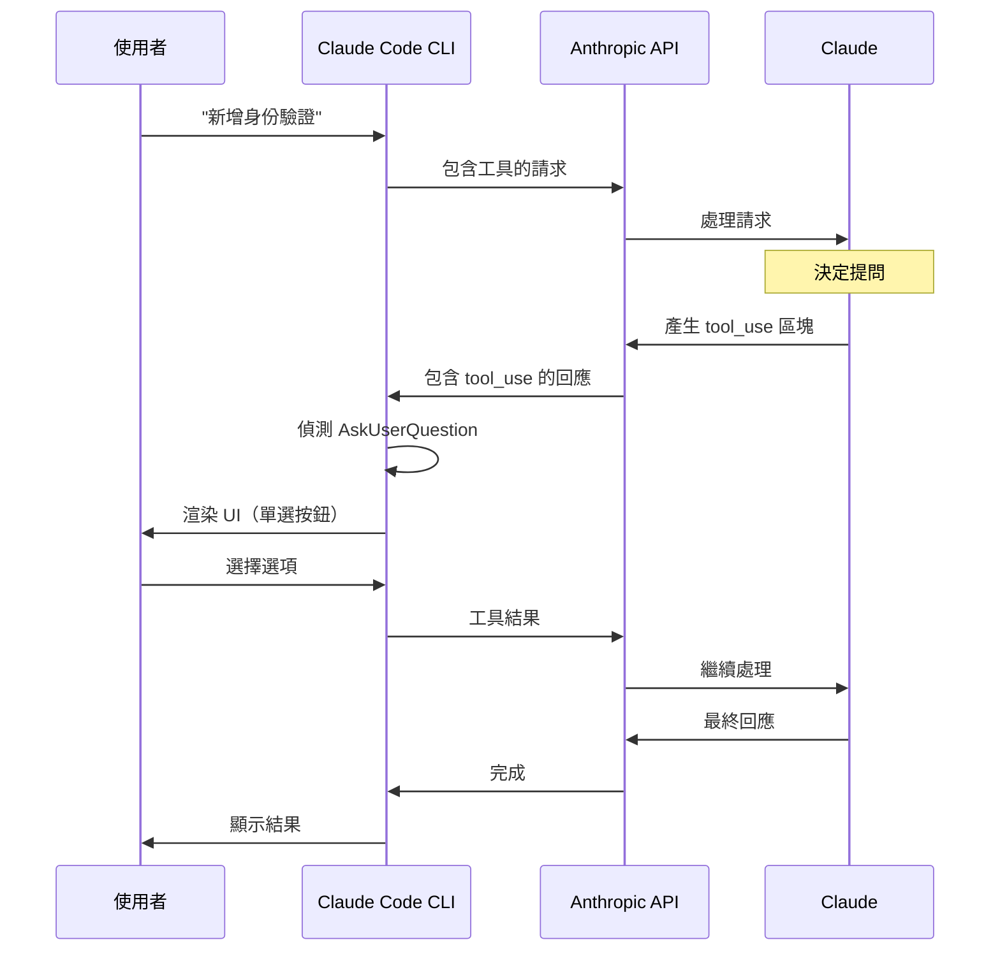
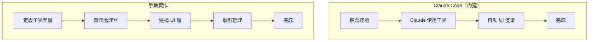

## 概覽

Claude Code 透過其內建的 `AskUserQuestion` 工具提供**最無縫**的人機協作體驗。與其他方法不同，Claude Code **同時**自動處理工具定義和 UI 渲染。


## 運作方式

### 內建工具

Claude Code 自動為 Claude 提供 `AskUserQuestion` 工具。您不需要自己定義它。

**工具簽章：**

```typescript
interface AskUserQuestionInput {
  questions: Question[];
  answers?: Record<string, string | string[]>;
  metadata?: { source?: string };
}

interface Question {
  question: string; // 問題文字
  header: string; // 短標籤（最多 12 字元）
  multiSelect: boolean; // 允許多選？
  options: Option[]; // 2-4 個選擇
}

interface Option {
  label: string; // 顯示文字（1-5 個字）
  description: string; // 說明（1-2 句）
}
```

### 架構



## 建立互動式技能

### 基本技能結構

在 `~/.claude/plugins/your-plugin/skills/` 中建立技能檔案：

```markdown
---
description: '互動式資料庫設定'
allowed-tools: ['AskUserQuestion', 'Read', 'Write', 'Bash']
---

# 資料庫設定

協助使用者為專案設定資料庫。

## 階段 1：收集需求

使用 AskUserQuestion 工具收集使用者偏好。

**問題 1 - 資料庫引擎：**

- question: "我們應該使用哪個資料庫引擎？"
- header: "資料庫"
- multiSelect: false
- options:
  - PostgreSQL（關聯式、ACID 合規、最適合複雜查詢）
  - MongoDB（文件儲存、彈性架構、快速迭代）
  - Redis（記憶體內、快速、最適合快取和會話）

**問題 2 - 功能：**

- question: "您想啟用哪些功能？"
- header: "功能"
- multiSelect: true
- options:
  - Migrations（資料庫架構版本控制）
  - Seeding（樣本資料產生）
  - Backups（自動化備份系統）
  - Replication（高可用性設定）

## 階段 2：實作

根據使用者的選擇：

1. 安裝所選的資料庫驅動程式
2. 產生設定檔
3. 設定所選功能
4. 建立範例程式碼

## 階段 3：確認

顯示建立的內容並提供下一步。
```

### Claude 如何解讀此內容

當 Claude 讀取這個技能時，它會：

1. 看到使用 `AskUserQuestion` 的指令
2. 讀取問題規格
3. 產生符合架構的結構化工具呼叫
4. 等待回應
5. 根據答案繼續

## 工具呼叫範例

### Claude 產生的內容

```json
{
  "type": "tool_use",
  "id": "toolu_01ABC",
  "name": "AskUserQuestion",
  "input": {
    "questions": [
      {
        "question": "我們應該使用哪個資料庫引擎？",
        "header": "資料庫",
        "multiSelect": false,
        "options": [
          {
            "label": "PostgreSQL",
            "description": "關聯式、ACID 合規、最適合複雜查詢"
          },
          {
            "label": "MongoDB",
            "description": "文件儲存、彈性架構、快速迭代"
          },
          {
            "label": "Redis",
            "description": "記憶體內、快速、最適合快取和會話"
          }
        ]
      }
    ]
  }
}
```

### Claude Code 做什麼

1. **解析**工具呼叫
2. **渲染**互動式 UI：

   ```
   ❓ 我們應該使用哪個資料庫引擎？
   ━━━━━━━━━━━━━━━━━━━━━━━━━━━━━━━━━━━━━
   ○ PostgreSQL
     關聯式、ACID 合規、最適合複雜查詢

   ○ MongoDB
     文件儲存、彈性架構、快速迭代

   ○ Redis
     記憶體內、快速、最適合快取和會話

   ○ 其他
   ```

3. **等待**使用者選擇
4. **回傳**結果給 Claude：

   ```json
   {
     "資料庫": "PostgreSQL"
   }
   ```

## 設計模式

### 模式 1：循序問題

逐一提問：

```markdown
## 步驟 1：選擇技術堆疊

使用 AskUserQuestion：

**問題**："哪個技術堆疊？"

- Node.js + Express
- Python + FastAPI
- Go + Fiber

## 步驟 2：選擇資料庫（根據步驟 1）

如果選擇 Node.js：
**問題**："哪個 Node.js 資料庫客戶端？"

- pg (PostgreSQL)
- mongoose (MongoDB)
- ioredis (Redis)

如果選擇 Python：
**問題**："哪個 Python 資料庫函式庫？"

- psycopg2 (PostgreSQL)
- pymongo (MongoDB)
- redis-py (Redis)
```

### 模式 2：多選功能

允許多個選擇：

```markdown
**問題**："您想要哪些功能？"

- header: "功能"
- multiSelect: true # ← 允許多個選擇
- options:
  - 身份驗證（使用者登入與會話）
  - API（REST API 端點）
  - 資料庫（資料庫整合）
  - 測試（單元測試與整合測試）
```

### 模式 3：漸進式揭露

從簡單開始，僅在需要時詳細：

```markdown
## 問題 1：經驗等級

**問題**："您的經驗等級是？"

- 初學者（使用預設值和最佳實踐）
- 中級（自訂常見設定）
- 進階（完全控制設定）

## 條件性後續問題

如果是初學者：
套用預設值，跳過詳細問題

如果是中級：
詢問關鍵偏好（身份驗證、資料庫、部署）

如果是進階：
詢問關於架構、優化、安全性的詳細問題
```

## 最佳實踐

### 1. 清晰、具體的問題

**❌ 不好：**

```markdown
**問題**："選擇一個"

- 選項 1
- 選項 2
```

**✅ 好：**

```markdown
**問題**："我們應該實作哪種身份驗證方法？"

- OAuth 2.0（業界標準，支援 Google、GitHub 等）
- JWT（無狀態權杖，適合 API 和微服務）
- Session（傳統伺服器端會話與 cookies）
```

### 2. 描述性選項

**❌ 不好：**

```markdown
- 快的那個
- 可靠的那個
- 其他的那個
```

**✅ 好：**

```markdown
- Redis（記憶體內、微秒延遲、最適合快取）
- PostgreSQL（ACID 合規、資料完整性、複雜查詢）
- MongoDB（彈性架構、水平擴展、快速開發）
```

### 3. 尊重限制

- **Header**：最多 12 個字元
- **選項**：每個問題 2-4 個（5+ 會令人不知所措）
- **問題**：每次工具呼叫 1-4 個
- **描述**：1-2 句話，專注於關鍵優點

**❌ 不好的 header：**

```markdown
header: "身份驗證方法選擇" # 30 字元！
```

**✅ 好的 header：**

```markdown
header: "身份驗證" # 11 字元
```

### 4. 適當使用多選

**✅ 用於非互斥選擇：**

```markdown
**問題**："您想啟用哪些功能？"
multiSelect: true

- 日誌記錄
- 指標
- 警報
- 備份
```

**❌ 不用於互斥選擇：**

```markdown
**問題**："哪個資料庫引擎？"
multiSelect: true # ❌ 錯誤！只能使用一個引擎
```

## 實際範例

### 功能開發技能

```markdown
---
description: '具有人機協作的引導式功能開發'
allowed-tools: ['AskUserQuestion', 'Glob', 'Grep', 'Read', 'Write', 'Edit', 'Bash']
---

# 功能開發工作流程

## 階段 1：了解程式碼庫

使用 Glob 和 Grep 了解現有架構：

1. 尋找類似功能
2. 識別模式和慣例
3. 定位相關檔案

## 階段 2：澄清需求

使用 AskUserQuestion 收集需求。

**問題 1 - 功能範圍：**

- question: "這個功能的範圍是？"
- header: "範圍"
- multiSelect: false
- options:
  - 小（單一檔案、< 100 行、1-2 小時）
  - 中（多個檔案、< 500 行、1 天）
  - 大（架構變更、> 500 行、數天）

**問題 2 - 實作方法：**

- question: "您偏好哪種實作方法？"
- header: "方法"
- multiSelect: false
- options:
  - 快速（最少變更，快速讓它運作）
  - 平衡（速度與品質的良好平衡）
  - 徹底（最佳實踐、全面測試、文件）

**問題 3 - 需求：**

- question: "這個功能還應該包括什麼？"
- header: "包含"
- multiSelect: true
- options:
  - 測試（單元測試和整合測試）
  - 文件（API 文件和範例）
  - 錯誤處理（全面的錯誤情況）
  - 日誌記錄（除錯和審計日誌）

## 階段 3：設計

根據答案設計實作：

- 如果是小 + 快速：內聯實作、最小抽象化
- 如果是中 + 平衡：模組化設計、關鍵測試
- 如果是大 + 徹底：完整架構、綜合套件

## 階段 4：實作

按照所選方法撰寫程式碼。

## 階段 5：審查

顯示建立的內容並請求確認：

**問題**："看起來如何？"

- 是的，完美（標記為完成）
- 需要調整（進行請求的變更）
- 重新開始（從頭重新設計）
```

## 工具回應格式

### Claude 接收的內容

當使用者選擇選項時，Claude 接收：

```json
{
  "範圍": "中",
  "方法": "平衡",
  "包含": ["測試", "錯誤處理"]
}
```

Claude 接著可以在其推理中使用這些資訊：

```
使用者選擇了中等範圍與平衡方法。
他們想包含測試和錯誤處理。

我應該：
1. 建立 2-3 個檔案
2. 專注於核心功能 + 測試
3. 包含全面的錯誤處理
4. 暫時跳過文件
```

## 限制

### UI 限制

- **僅終端機**：僅在 Claude Code CLI 中運作
- **無自訂樣式**：無法變更顏色、字型等
- **有限控制項**：僅單選按鈕和核取方塊

### 互動限制

- **同步**：阻塞直到使用者回應
- **無驗證**：無法新增自訂驗證規則
- **無分支**：無法在同一問題中條件性顯示/隱藏選項

### 規模限制

- **最多 4 個問題**：每次工具呼叫
- **最多 4 個選項**：每個問題
- **最多 12 字元**：header

## 除錯提示

### 問題沒有出現？

**檢查 1：工具在 allowed-tools 中？**

```markdown
---
allowed-tools: ['AskUserQuestion', ...] # ✅ 必須包含
---
```

**檢查 2：格式有效？**

```markdown
# ✅ 正確格式

**問題**："哪一個？"

- 選項 A（描述）
- 選項 B（描述）

# ❌ 錯誤格式

問題：哪一個？
選項：A、B
```

**檢查 3：符合限制？**

- 2-4 個選項？ ✅
- Header ≤ 12 字元？ ✅
- 問題清楚？ ✅

### 無效回應？

Claude Code 驗證工具呼叫。如果無效：

- 檢查必填欄位（`question`、`header`、`options`）
- 驗證 `multiSelect` 是布林值
- 確保每個問題有 2-4 個選項

## 與其他方法的比較



| 面向         | Claude Code         | 手動                   |
| ------------ | ------------------- | ---------------------- |
| **設定**     | 零                  | 定義工具 + UI          |
| **UI**       | 自動                | 自己建構               |
| **靈活性**   | 有限                | 完全控制               |
| **複雜性**   | 低（約 0 行程式碼） | 高（約 200+ 行程式碼） |
| **可移植性** | 僅 Claude Code      | 任何平台               |

## 何時使用 Claude Code 的方法

| ✅ 在以下情況使用...  | ❌ 在以下情況避免... |
| --------------------- | -------------------- |
| 建構 Claude Code 技能 | 需要自訂 UI          |
| 終端機介面即可        | 需要網頁/行動裝置    |
| 快速原型製作          | 多提供者支援         |
| 標準問答模式          | 複雜驗證             |
| 學習 HITL 概念        | 生產網頁應用程式     |

## 下一步

- **想要更多控制？** → 查看 [OpenAI 實作](/ai-agent-study/zh-tw/human-in-the-loop/03-openai-implementation/)
- **需要靈活性？** → 檢查 [模型無關方法](/ai-agent-study/zh-tw/human-in-the-loop/04-model-agnostic/)

## 延伸閱讀

- [Claude Code 文件](https://github.com/anthropics/claude-code)
- [工具呼叫指南](https://docs.anthropic.com/en/docs/build-with-claude/tool-use)
- [Claude Code 外掛開發](https://github.com/anthropics/claude-code/tree/main/plugins)
