## 概覽

OpenAI 提供**兩種主要方法**來實現人機協作：

1. **Function Calling**（Chat Completions API）- 具有完全控制權的手動實作
2. **Agents SDK** - 具有 `needsApproval` 的內建批准工作流程

```mermaid
graph TB
    A[OpenAI HITL] --> B[Function Calling]
    A --> C[Agents SDK]

    B --> D[自訂實作]
    B --> E[完全控制]

    C --> F[needsApproval 標記]
    C --> G[自動暫停]

```



## 方法一：Function Calling

### 運作原理

您定義 GPT 可以呼叫的自訂函式（工具）：

```mermaid
sequenceDiagram
    participant U as 使用者
    participant App as 您的應用程式
    participant API as OpenAI API
    participant GPT as GPT-4

    U->>App: "新增驗證功能"
    App->>API: 請求 + 工具
    API->>GPT: 處理

    GPT->>API: 產生函式呼叫
    API->>App: 包含 tool_calls 的回應

    App->>App: 偵測 ask_user_question
    App->>U: 渲染 UI

    U->>App: 選擇選項
    App->>API: 工具結果
    API->>GPT: 繼續

    GPT->>API: 最終回應
    API->>App: 完成
    App->>U: 顯示結果
```



### 定義工具

```python
import openai
import json

# Define the ask_user_question function
tools = [
    {
        "type": "function",
        "function": {
            "name": "ask_user_question",
            "description": "Ask the user a multiple choice question and wait for their response",
            "parameters": {
                "type": "object",
                "properties": {
                    "question": {
                        "type": "string",
                        "description": "The question to ask the user"
                    },
                    "options": {
                        "type": "array",
                        "description": "Available answer choices",
                        "items": {
                            "type": "object",
                            "properties": {
                                "label": {
                                    "type": "string",
                                    "description": "Display text for this option"
                                },
                                "value": {
                                    "type": "string",
                                    "description": "Value to return if selected"
                                },
                                "description": {
                                    "type": "string",
                                    "description": "Explanation of this option"
                                }
                            },
                            "required": ["label", "value", "description"]
                        },
                        "minItems": 2,
                        "maxItems": 5
                    },
                    "allow_multiple": {
                        "type": "boolean",
                        "description": "Whether user can select multiple options"
                    }
                },
                "required": ["question", "options"]
            }
        }
    }
]
```

### 發送請求

```python
# Send request to OpenAI
response = openai.chat.completions.create(
    model="gpt-4o",
    messages=[
        {"role": "system", "content": "You are a helpful assistant that asks clarifying questions."},
        {"role": "user", "content": "Help me set up authentication for my app"}
    ],
    tools=tools,
    tool_choice="auto"  # Let model decide when to use tools
)
```

### 處理回應

```python
# Check for tool calls
if response.choices[0].message.tool_calls:
    tool_call = response.choices[0].message.tool_calls[0]

    if tool_call.function.name == "ask_user_question":
        # Parse arguments
        args = json.loads(tool_call.function.arguments)

        # Display to user (your custom UI logic)
        user_answer = display_question_ui(
            question=args["question"],
            options=args["options"],
            allow_multiple=args.get("allow_multiple", False)
        )

        # Return result to GPT
        messages.append(response.choices[0].message)
        messages.append({
            "role": "tool",
            "tool_call_id": tool_call.id,
            "content": json.dumps({"selected": user_answer})
        })

        # Continue conversation
        response = openai.chat.completions.create(
            model="gpt-4o",
            messages=messages,
            tools=tools
        )
```

### 範例：完整實作

```python
def interactive_agent(user_request: str):
    """Run an interactive agent with human-in-the-loop"""

    messages = [
        {"role": "system", "content": "You are a helpful assistant. Use ask_user_question when you need clarification."},
        {"role": "user", "content": user_request}
    ]

    max_iterations = 10

    for iteration in range(max_iterations):
        # Call OpenAI
        response = openai.chat.completions.create(
            model="gpt-4o",
            messages=messages,
            tools=tools
        )

        message = response.choices[0].message

        # Check if done
        if not message.tool_calls:
            return message.content

        # Handle tool calls
        for tool_call in message.tool_calls:
            if tool_call.function.name == "ask_user_question":
                # Ask user
                args = json.loads(tool_call.function.arguments)
                user_answer = ask_user_in_terminal(args)

                # Add to conversation
                messages.append(message)
                messages.append({
                    "role": "tool",
                    "tool_call_id": tool_call.id,
                    "content": json.dumps({"answer": user_answer})
                })

    return "Max iterations reached"


def ask_user_in_terminal(args):
    """Simple terminal UI"""
    print(f"\n❓ {args['question']}")
    print("─" * 70)

    for i, option in enumerate(args['options'], 1):
        print(f"  {i}. {option['label']}")
        print(f"     {option['description']}")
        print()

    choice = input(f"Select option (1-{len(args['options'])}): ").strip()
    idx = int(choice) - 1
    return args['options'][idx]['value']
```

### Structured Outputs（保證合規性）

使用 `strict: true` 以獲得 100% 的架構合規性：

```python
tools = [
    {
        "type": "function",
        "function": {
            "name": "ask_user_question",
            "strict": True,  # ← Enables Structured Outputs
            "parameters": {
                "type": "object",
                "properties": {
                    "question": {"type": "string"},
                    "options": {
                        "type": "array",
                        "items": {
                            "type": "object",
                            "properties": {
                                "label": {"type": "string"},
                                "value": {"type": "string"}
                            },
                            "required": ["label", "value"],
                            "additionalProperties": False
                        }
                    }
                },
                "required": ["question", "options"],
                "additionalProperties": False
            }
        }
    }
]
```

**優點：**

- 🎯 100% 架構合規性
- 🛡️ 保證類型安全
- 🚫 無幻覺欄位
- ✅ 更好的可靠性

## 方法二：OpenAI Agents SDK

### 概覽

Agents SDK 提供**內建的批准工作流程**：

```mermaid
graph LR
    A[工具定義] --> B{needsApproval?}
    B -->|true| C[總是暫停]
    B -->|function| D[條件式暫停]
    B -->|false| E[自動執行]
    C --> F[等待使用者]
    D --> F
    F --> G[已批准？]
    G -->|是| H[執行]
    G -->|否| I[拒絕]
```



### 安裝

```bash
npm install openai @openai/agents
```

### 基本用法

```typescript
import { Agent } from '@openai/agents';

const agent = new Agent({
  name: 'My Agent',
  model: 'gpt-4o',
  instructions: 'You are a helpful assistant',
  tools: [
    {
      name: 'send_email',
      description: 'Send an email to customers',
      needsApproval: true, // ← Always requires approval
      execute: async ({ to, subject, body }) => {
        // This only runs after approval
        return await sendEmail(to, subject, body);
      },
    },
  ],
});
```

### 執行批准流程

```typescript
// Run the agent
const result = await agent.run('Send welcome email to new customers');

// Check for interruptions (approval requests)
if (result.interruptions && result.interruptions.length > 0) {
  for (const interruption of result.interruptions) {
    // Show approval UI to user
    const approved = await showApprovalUI({
      action: interruption.tool.name,
      arguments: interruption.arguments,
      description: interruption.tool.description,
    });

    if (approved) {
      result.state.approve(interruption);
    } else {
      result.state.reject(interruption);
    }
  }

  // Resume execution after approvals
  const finalResult = await agent.resume(result.state);
  console.log(finalResult.content);
}
```

### 條件式批准

使用函式來決定何時需要批准：

```typescript
const agent = new Agent({
  tools: [
    {
      name: 'delete_data',
      description: 'Delete data from database',
      needsApproval: async ({ table, where }) => {
        // Require approval only for sensitive tables
        const sensitiveTables = ['users', 'payments', 'accounts'];
        return sensitiveTables.includes(table);
      },
      execute: async ({ table, where }) => {
        return await db.delete(table, where);
      },
    },
    {
      name: 'send_email',
      description: 'Send email',
      needsApproval: async ({ recipients }) => {
        // Require approval for bulk emails
        return recipients.length > 100;
      },
      execute: async ({ recipients, subject, body }) => {
        return await sendBulkEmail(recipients, subject, body);
      },
    },
  ],
});
```

### 完整範例

```typescript
import { Agent } from '@openai/agents';

// Create agent with approval workflow
const deploymentAgent = new Agent({
  name: 'Deployment Assistant',
  model: 'gpt-4o',
  instructions: `You help users deploy applications.
    Always use appropriate tools for each environment.`,

  tools: [
    // Production - always needs approval
    {
      name: 'deploy_to_production',
      description: 'Deploy to production environment',
      needsApproval: true,
      execute: async ({ version }) => {
        await deployToProduction(version);
        return { status: 'deployed', environment: 'production', version };
      },
    },

    // Staging - no approval needed
    {
      name: 'deploy_to_staging',
      description: 'Deploy to staging environment',
      needsApproval: false,
      execute: async ({ version }) => {
        await deployToStaging(version);
        return { status: 'deployed', environment: 'staging', version };
      },
    },

    // Rollback - conditional approval
    {
      name: 'rollback',
      description: 'Rollback to previous version',
      needsApproval: async ({ environment }) => {
        // Approval only needed for production
        return environment === 'production';
      },
      execute: async ({ environment, version }) => {
        await rollback(environment, version);
        return { status: 'rolled back', environment, version };
      },
    },
  ],
});

// Usage
async function deployApp() {
  const result = await deploymentAgent.run('Deploy version 2.5.0 to production');

  // Handle approvals
  if (result.interruptions?.length > 0) {
    console.log('⚠️ Approval required:');

    for (const interruption of result.interruptions) {
      console.log(`\nAction: ${interruption.tool.name}`);
      console.log(`Arguments:`, interruption.arguments);

      // Show approval UI (your implementation)
      const approved = await promptUser(`Approve ${interruption.tool.name}?`, ['Yes', 'No']);

      if (approved) {
        console.log('✅ Approved');
        result.state.approve(interruption);
      } else {
        console.log('❌ Rejected');
        result.state.reject(interruption);
      }
    }

    // Resume after handling approvals
    const finalResult = await deploymentAgent.resume(result.state);
    console.log('\n📝 Final result:', finalResult.content);
  } else {
    console.log('\n✅ Completed without approvals');
    console.log(result.content);
  }
}
```

## 比較：Function Calling vs Agents SDK

```mermaid
graph TB
    subgraph FC["Function Calling"]
        FC1[定義工具架構]
        FC2[處理工具呼叫]
        FC3[實作 UI]
        FC4[管理狀態]
        FC1 --> FC2 --> FC3 --> FC4
    end

    subgraph SDK["Agents SDK"]
        SDK1[定義工具 + needsApproval]
        SDK2[執行代理]
        SDK3[處理中斷]
        SDK1 --> SDK2 --> SDK3
    end

```



| 面向         | Function Calling     | Agents SDK                |
| ------------ | -------------------- | ------------------------- |
| **設定**     | 手動工具定義         | 使用 `needsApproval` 定義 |
| **批准流程** | 手動實作             | 內建中斷機制              |
| **狀態管理** | 手動                 | 透過 `result.state` 自動  |
| **複雜度**   | 高（~200+ 行程式碼） | 中等（~50 行程式碼）      |
| **靈活性**   | 完全控制             | 標準化模式                |
| **UI**       | 完全自訂             | 需要實作                  |
| **適用於**   | 自訂工作流程         | 標準批准                  |

## 最佳實踐

### 1. 使用 Structured Outputs

```python
# ✅ 良好：保證架構合規性
{
    "strict": True,
    "parameters": {
        "type": "object",
        "properties": {...},
        "additionalProperties": False  # No extra fields
    }
}

# ❌ 不良：鬆散的架構
{
    "parameters": {
        "type": "object",
        "properties": {...}
        # No strict mode, no protection
    }
}
```

### 2. 處理並行工具呼叫

```python
# GPT-4 can make multiple tool calls at once
if response.choices[0].message.tool_calls:
    for tool_call in response.choices[0].message.tool_calls:
        # Process each tool call
        result = execute_tool(tool_call)
```

### 3. 驗證使用者輸入

```python
def ask_user_in_terminal(args):
    """Validated terminal input"""
    while True:
        try:
            choice = input(f"Select (1-{len(args['options'])}): ").strip()
            idx = int(choice) - 1

            if 0 <= idx < len(args['options']):
                return args['options'][idx]['value']
            else:
                print("❌ Invalid choice. Try again.")
        except (ValueError, KeyboardInterrupt):
            print("❌ Invalid input.")
```

### 4. 錯誤處理

```python
def execute_tool(tool_call):
    """Safe tool execution"""
    try:
        function_name = tool_call.function.name
        arguments = json.loads(tool_call.function.arguments)

        # Execute
        result = TOOL_MAP[function_name](**arguments)

        return {
            "role": "tool",
            "tool_call_id": tool_call.id,
            "content": json.dumps(result)
        }

    except json.JSONDecodeError as e:
        return {
            "role": "tool",
            "tool_call_id": tool_call.id,
            "content": json.dumps({
                "error": f"Invalid JSON: {str(e)}"
            })
        }

    except Exception as e:
        return {
            "role": "tool",
            "tool_call_id": tool_call.id,
            "content": json.dumps({
                "error": f"Execution failed: {str(e)}"
            })
        }
```

### 5. 工具選擇控制

```python
# Let model decide
tool_choice="auto"

# Force tool use
tool_choice="required"

# Specific tool
tool_choice={"type": "function", "function": {"name": "ask_user_question"}}

# No tools
tool_choice="none"
```

## 常見陷阱

### ❌ 陷阱 1：未處理並行呼叫

```python
# Wrong: Assumes only one tool call
tool_call = response.choices[0].message.tool_calls[0]  # May crash!

# Correct: Handle multiple
for tool_call in response.choices[0].message.tool_calls:
    process_tool_call(tool_call)
```

### ❌ 陷阱 2：忘記新增訊息

```python
# Wrong: Loses context
response = openai.chat.completions.create(
    model="gpt-4o",
    messages=messages  # Missing assistant message and tool result
)

# Correct: Maintain full history
messages.append(response.choices[0].message)  # Assistant message
messages.append(tool_result)                   # Tool result
response = openai.chat.completions.create(
    model="gpt-4o",
    messages=messages
)
```

### ❌ 陷阱 3：無效的 JSON 解析

```python
# Wrong: No error handling
args = json.loads(tool_call.function.arguments)

# Correct: Handle errors
try:
    args = json.loads(tool_call.function.arguments)
except json.JSONDecodeError:
    return create_error_response(tool_call.id, "Invalid JSON")
```

### ❌ 陷阱 4：未檢查 finish_reason

```python
# Wrong: Assumes content exists
print(response.choices[0].message.content)  # May be None!

# Correct: Check finish_reason
finish_reason = response.choices[0].finish_reason
if finish_reason == "tool_calls":
    handle_tool_calls(response.choices[0].message.tool_calls)
elif finish_reason == "stop":
    print(response.choices[0].message.content)
```

## 何時使用各方法

| 使用情境         | 建議                         |
| ---------------- | ---------------------------- |
| **簡單問答**     | Function Calling             |
| **批准工作流程** | Agents SDK                   |
| **自訂驗證**     | Function Calling             |
| **標準批准**     | Agents SDK                   |
| **複雜 UI**      | Function Calling             |
| **快速設定**     | Agents SDK                   |
| **跨模型**       | Function Calling + LangChain |

## 下一步

- **需要靈活性？** → 查看[模型無關方法](/ai-agent-study/zh-tw/human-in-the-loop/04-model-agnostic/)
- **想要簡單？** → 審查 [Claude Code 實作](/ai-agent-study/zh-tw/human-in-the-loop/02-claude-implementation/)

## 延伸閱讀

- [OpenAI Function Calling](https://platform.openai.com/docs/guides/function-calling)
- [OpenAI Agents SDK](https://openai.github.io/openai-agents-python/)
- [Structured Outputs Guide](https://platform.openai.com/docs/guides/structured-outputs)
- [OpenAI Cookbook](https://cookbook.openai.com/)
