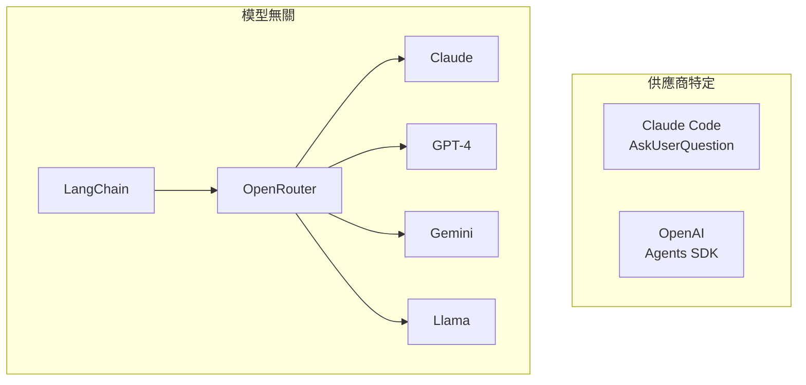
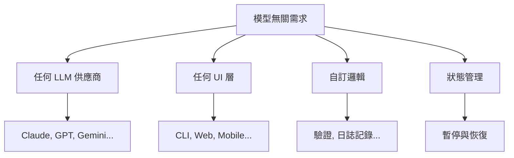
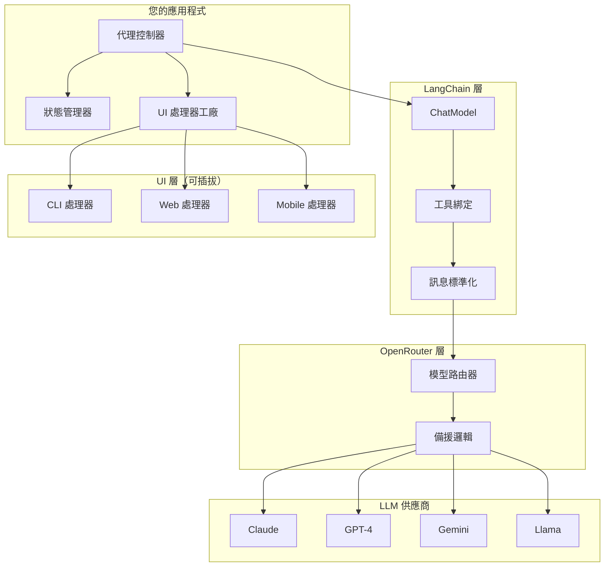
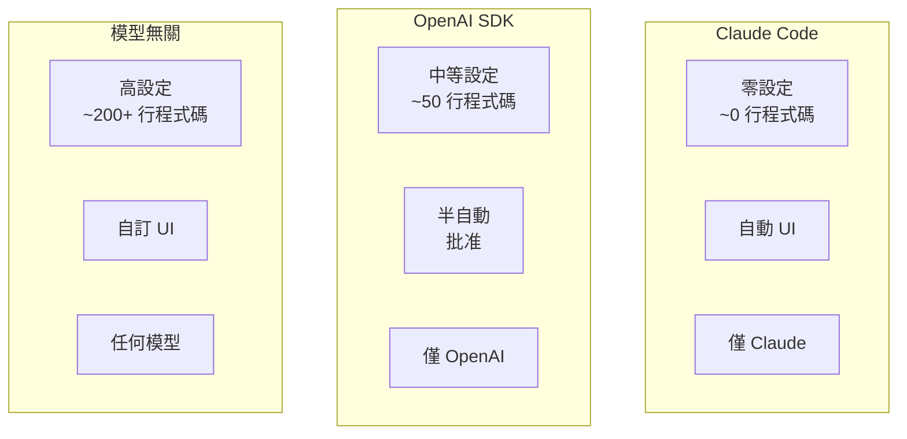
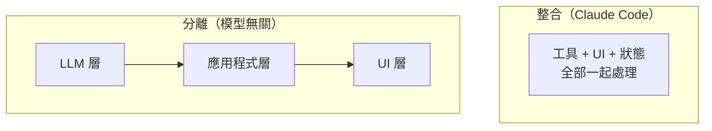
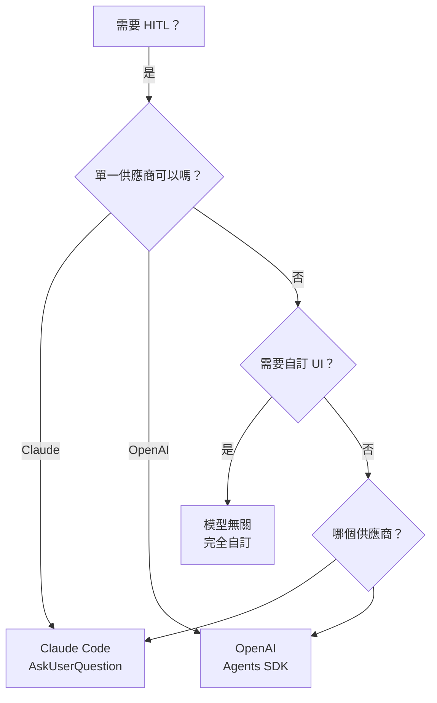

## 概覽

建構適用於**任何 LLM 供應商**（Claude、GPT、Gemini、Llama、Mistral 等）的人機協作代理需要不同於供應商特定方法的架構。本指南展示如何使用 **LangChain + OpenRouter** 來建立彈性、多模型的 HITL 代理。



## 挑戰

### 為什麼供應商工具無法運作

**Claude Code 的 `AskUserQuestion`：**

- ✅ 無縫體驗
- ❌ 僅在 Claude Code CLI 中運作
- ❌ 僅適用於 Claude 模型
- ❌ 與基礎設施緊密耦合

**OpenAI 的 Agents SDK：**

- ✅ 內建批准功能
- ❌ 僅適用於 OpenAI 模型
- ❌ SDK 特定 API
- ❌ 限於其模式

### 我們需要什麼



## 架構限制

### 限制 1：工具呼叫變異性

**並非所有模型都具有相同的工具呼叫能力：**

| 供應商                 | 原生支援  | 可靠性 | 注意事項       |
| ---------------------- | --------- | ------ | -------------- |
| **Claude** (Anthropic) | ✅ 優秀   | 95%+   | 最佳的工具呼叫 |
| **GPT-4** (OpenAI)     | ✅ 優秀   | 95%+   | 非常可靠       |
| **Gemini** (Google)    | ✅ 良好   | 85%+   | 通常可靠       |
| **Llama 3**            | ⚠️ 依情況 | 60-80% | 依賴微調       |
| **Mistral**            | ⚠️ 有限   | 50-70% | 經常需要提示   |
| **本地模型**           | ❌ 變化   | 30-60% | 高度變化       |

**影響：** 您需要針對較弱模型的備援策略。

### 限制 2：無標準「詢問使用者」工具

與檔案操作或網路搜尋不同，**沒有「暫停並詢問使用者」的通用標準**。

這意味著：

- ❌ 您必須自己定義工具
- ❌ 您必須處理執行迴圈中斷
- ❌ 您必須管理暫停和恢復之間的狀態
- ❌ 您必須實作 UI 層

### 限制 3：狀態管理

當您暫停詢問使用者時，必須保留上下文：

```python
# Current conversation state when pausing
messages = [
    SystemMessage("You are an assistant"),
    HumanMessage("Build a feature"),
    AIMessage("I need to know which database"),
    AIMessage(tool_calls=[{
        "name": "ask_user_question",
        "args": {...}
    }])  # ← Paused here
]

# After user answers:
messages.append(ToolMessage(
    content="PostgreSQL",
    tool_call_id="..."
))  # ← Add answer

# Resume with full context
response = llm.invoke(messages)
```

**影響：** 您的應用程式管理暫停之間的對話狀態。

### 限制 4：UI 是應用程式特定的

像 Claude Code 這樣的供應商工具有內建 UI。**您必須提供自己的：**

- 終端機（CLI、rich CLI）
- 網頁（React、Vue、Streamlit）
- 行動裝置（React Native、Flutter）
- API（REST、GraphQL）

**影響：** 代理邏輯與 UI 渲染之間的關注點分離。

## LangChain + OpenRouter 架構

### 為什麼選擇這個技術棧？

**LangChain：**

- 🔄 所有供應商的統一介面
- 🛠️ 標準化工具呼叫
- 📝 訊息格式轉換
- 🎯 豐富的生態系統（記憶、回調、鏈）

**OpenRouter：**

- 🌐 100+ 模型的單一 API
- 🔀 自動路由和備援
- 💰 成本優化
- 🔑 所有供應商的單一 API 金鑰

### 架構圖



## 實作

### 設定

```bash
pip install langchain langchain-openai langchain-core
```

```python
import os

# OpenRouter API key (single key for all models)
os.environ["OPENROUTER_API_KEY"] = "your-key"
```

### 步驟 1：定義工具

```python
from langchain_core.tools import tool
from typing import List

@tool
def ask_user_question(
    question: str,
    options: List[str],
    multi_select: bool = False
) -> str:
    """
    Ask the user a question with multiple choice options.

    Use this when you need user input to make decisions.

    Args:
        question: The question to ask (be clear and specific)
        options: List of 2-4 options for the user to choose from
        multi_select: If True, user can select multiple options

    Returns:
        The user's selected option(s)

    Example:
        ask_user_question(
            question="Which database should we use?",
            options=["PostgreSQL", "MongoDB", "Redis"],
            multi_select=False
        )
    """
    # This is intercepted by the agent's execution loop
    return "PAUSE_FOR_USER_INPUT"
```

### 步驟 2：建立 UI 處理器介面

```python
from abc import ABC, abstractmethod

class UIHandler(ABC):
    """Abstract base for UI implementations"""

    @abstractmethod
    def ask_question(
        self,
        question: str,
        options: List[str],
        multi_select: bool = False
    ) -> str:
        """Render question and get user response"""
        pass


class CLIHandler(UIHandler):
    """Simple command-line interface"""

    def ask_question(
        self,
        question: str,
        options: List[str],
        multi_select: bool = False
    ) -> str:
        print(f"\n{'='*70}")
        print(f"❓ {question}")
        print(f"{'='*70}")

        for i, option in enumerate(options, 1):
            print(f"  {i}. {option}")

        if multi_select:
            print("\nSelect multiple (comma-separated, e.g., 1,3)")

        while True:
            try:
                choice = input(f"\nSelect (1-{len(options)}): ").strip()

                if multi_select:
                    indices = [int(c.strip()) - 1 for c in choice.split(',')]
                    if all(0 <= idx < len(options) for idx in indices):
                        selected = [options[idx] for idx in indices]
                        return ", ".join(selected)
                else:
                    idx = int(choice) - 1
                    if 0 <= idx < len(options):
                        return options[idx]

                print("❌ Invalid choice. Try again.")
            except (ValueError, KeyboardInterrupt):
                print("❌ Invalid input.")
```

### 步驟 3：建構互動代理

```python
from langchain_core.messages import (
    HumanMessage,
    AIMessage,
    SystemMessage,
    ToolMessage
)
from langchain_openai import ChatOpenAI

class InteractiveAgent:
    """
    Model-agnostic agent with human-in-the-loop support.

    Works with any LLM via OpenRouter + LangChain.
    """

    SYSTEM_PROMPT = """You are a helpful assistant that can interact with users.

When you need user input to make decisions, use the ask_user_question tool.

Guidelines:
- Ask clear, specific questions
- Provide 2-4 well-described options
- Use multi_select=True for non-exclusive choices
- Use multi_select=False for mutually exclusive choices"""

    def __init__(
        self,
        llm,
        tools: List,
        ui_handler: UIHandler = None
    ):
        self.llm = llm
        self.tools = tools
        self.tool_map = {tool.name: tool for tool in tools}
        self.llm_with_tools = llm.bind_tools(tools)
        self.ui_handler = ui_handler or CLIHandler()

    def run(
        self,
        user_request: str,
        max_iterations: int = 20,
        verbose: bool = True
    ) -> str:
        """Run the agent with human-in-the-loop support"""

        messages = [
            SystemMessage(content=self.SYSTEM_PROMPT),
            HumanMessage(content=user_request)
        ]

        if verbose:
            print(f"\n{'='*70}")
            print("🤖 INTERACTIVE AGENT STARTED")
            print(f"{'='*70}")

        for iteration in range(1, max_iterations + 1):
            if verbose:
                print(f"\n{'─'*70}")
                print(f"Iteration {iteration}/{max_iterations}")

            # Call LLM
            response = self.llm_with_tools.invoke(messages)
            messages.append(response)

            # Check if done (no tool calls)
            if not response.tool_calls:
                if verbose:
                    print("\n✅ COMPLETED")
                return response.content

            # Process tool calls
            for tool_call in response.tool_calls:
                tool_name = tool_call["name"]
                tool_args = tool_call["args"]

                if verbose:
                    print(f"\n⚡ Tool: {tool_name}")

                # Special handling for ask_user_question
                if tool_name == "ask_user_question":
                    result = self._handle_user_question(tool_args, verbose)
                else:
                    result = self._execute_tool(tool_name, tool_args)

                # Add tool result to messages
                messages.append(ToolMessage(
                    content=str(result),
                    tool_call_id=tool_call["id"]
                ))

        return "⚠️ Max iterations reached"

    def _handle_user_question(self, tool_args, verbose):
        """Handle ask_user_question tool call"""
        question = tool_args.get("question", "Please choose")
        options = tool_args.get("options", [])
        multi_select = tool_args.get("multi_select", False)

        if verbose:
            print(f"   Question: {question}")
            print(f"   Options: {len(options)}")

        # Use UI handler to get user input
        answer = self.ui_handler.ask_question(
            question=question,
            options=options,
            multi_select=multi_select
        )

        return answer

    def _execute_tool(self, tool_name, tool_args):
        """Execute a regular tool"""
        if tool_name in self.tool_map:
            tool = self.tool_map[tool_name]
            try:
                return tool.invoke(tool_args)
            except Exception as e:
                return f"Error: {str(e)}"
        else:
            return f"Error: Unknown tool {tool_name}"
```

### 步驟 4：透過 OpenRouter 取得 LLM

```python
def get_llm(
    model: str = "anthropic/claude-sonnet-4",
    temperature: float = 0,
    max_tokens: int = 4000
) -> ChatOpenAI:
    """
    Get LLM via OpenRouter.

    Supported models:
    - anthropic/claude-sonnet-4
    - anthropic/claude-opus-4
    - openai/gpt-4-turbo
    - openai/gpt-3.5-turbo
    - google/gemini-pro-1.5
    - meta-llama/llama-3-70b-instruct
    - mistralai/mistral-large
    """
    return ChatOpenAI(
        model=model,
        openai_api_key=os.environ["OPENROUTER_API_KEY"],
        openai_api_base="https://openrouter.ai/api/v1",
        temperature=temperature,
        max_tokens=max_tokens
    )
```

### 步驟 5：使用方式

```python
# Choose any model via OpenRouter
llm = get_llm("anthropic/claude-sonnet-4")
# Or: llm = get_llm("openai/gpt-4-turbo")
# Or: llm = get_llm("google/gemini-pro-1.5")

# Create agent
tools = [ask_user_question]
agent = InteractiveAgent(llm, tools)

# Run
result = agent.run("Help me set up authentication for my app")
print(result)
```

## 進階：豐富的 UI 處理器

### 使用 InquirerPy 的終端機 UI

```bash
pip install InquirerPy
```

```python
from InquirerPy import inquirer
from InquirerPy.base.control import Choice

class RichCLIHandler(UIHandler):
    """Rich terminal UI with InquirerPy"""

    def ask_question(
        self,
        question: str,
        options: List[str],
        multi_select: bool = False
    ) -> str:
        choices = [Choice(value=opt, name=opt) for opt in options]

        if multi_select:
            selected = inquirer.checkbox(
                message=question,
                choices=choices,
                instruction="(Space to select, Enter to confirm)"
            ).execute()
            return ", ".join(selected)
        else:
            selected = inquirer.select(
                message=question,
                choices=choices,
                instruction="(Use arrow keys, Enter to select)"
            ).execute()
            return selected


# Usage
ui = RichCLIHandler()
agent = InteractiveAgent(llm, tools, ui_handler=ui)
```

### 使用 Streamlit 的網頁 UI

```python
import streamlit as st
from queue import Queue
import threading

class StreamlitUIHandler(UIHandler):
    """Web-based UI using Streamlit"""

    def __init__(self):
        self.response_queue = Queue()

    def ask_question(
        self,
        question: str,
        options: List[str],
        multi_select: bool = False
    ) -> str:
        # Store question in session state
        st.session_state.current_question = {
            "question": question,
            "options": options,
            "multi_select": multi_select
        }

        # Wait for user response
        return self.response_queue.get()


# Streamlit app
def main():
    st.title("Interactive AI Agent")

    if "messages" not in st.session_state:
        st.session_state.messages = []

    # Display chat history
    for msg in st.session_state.messages:
        with st.chat_message(msg["role"]):
            st.write(msg["content"])

    # Pending question?
    if "current_question" in st.session_state:
        q = st.session_state.current_question

        st.subheader(q["question"])

        if q["multi_select"]:
            selected = st.multiselect("Choose options:", q["options"])
        else:
            selected = st.radio("Choose one:", q["options"])

        if st.button("Submit"):
            ui_handler.response_queue.put(selected)
            del st.session_state.current_question
            st.rerun()

    # User input
    if prompt := st.chat_input("What would you like to do?"):
        run_agent_in_background(prompt)
```

## 比較：所有方法



| 面向       | Claude Code | OpenAI SDK | 模型無關 |
| ---------- | ----------- | ---------- | -------- |
| **設定**   | 零          | 中等       | 高       |
| **程式碼** | ~0 行       | ~50 行     | ~200+ 行 |
| **UI**     | 自動（CLI） | 手動       | 完全自訂 |
| **模型**   | 僅 Claude   | 僅 OpenAI  | 任何模型 |
| **靈活性** | 低          | 中等       | 高       |
| **複雜度** | 非常低      | 中等       | 高       |
| **可攜性** | 無          | 低         | 高       |
| **生產**   | 示範        | 良好       | 最佳     |

## 取捨

### 更多程式碼 vs 更多靈活性

**Claude Code：**

```markdown
Use AskUserQuestion to ask which database.
```

**模型無關：**

```python
# ~200 lines:
# 1. Define tool
# 2. Create UI handler
# 3. Build agent with execution loop
# 4. Handle state management
# 5. Implement error handling
```

### 手動狀態 vs 完全控制

**自動（Claude Code）：**

- ✅ 不需要狀態管理
- ❌ 無法自訂流程
- ❌ 綁定於一個供應商

**手動（模型無關）：**

- ❌ 必須管理對話狀態
- ✅ 完全控制流程
- ✅ 適用於任何供應商

### 關注點分離



## 何時使用模型無關

| ✅ 使用時機...          | ❌ 避免使用時機... |
| ----------------------- | ------------------ |
| 需要多模型支援          | Claude Code 已足夠 |
| 建構生產級網頁/行動應用 | 簡單 CLI 示範      |
| 需要自訂 UI             | 標準 UI 即可       |
| 複雜驗證邏輯            | 直接的工作流程     |
| 跨供應商規模化          | 單一供應商即可     |

## 最佳實踐

### 1. 模型備援策略

```python
def get_llm_with_fallback(preferred_model: str):
    """Try preferred, fallback to reliable models"""

    models = [
        preferred_model,
        "anthropic/claude-sonnet-4",  # Reliable fallback
        "openai/gpt-4-turbo",          # Another option
    ]

    for model in models:
        try:
            llm = get_llm(model)
            # Test with simple call
            llm.invoke([HumanMessage(content="Hi")])
            return llm
        except Exception as e:
            print(f"Failed {model}: {e}")
            continue

    raise RuntimeError("No working LLM available")
```

### 2. UI 工廠模式

```python
class UIFactory:
    """Create UI handlers based on environment"""

    @staticmethod
    def create(ui_type: str) -> UIHandler:
        if ui_type == "cli":
            return CLIHandler()
        elif ui_type == "rich-cli":
            return RichCLIHandler()
        elif ui_type == "web":
            return StreamlitUIHandler()
        elif ui_type == "api":
            return APIUIHandler()
        else:
            raise ValueError(f"Unknown UI type: {ui_type}")


# Usage
ui_type = os.environ.get("UI_TYPE", "cli")
ui = UIFactory.create(ui_type)
agent = InteractiveAgent(llm, tools, ui_handler=ui)
```

### 3. 日誌記錄與監控

```python
import json
from datetime import datetime

class LoggingAgent(InteractiveAgent):
    """Agent that logs all interactions"""

    def __init__(self, *args, log_file: str = "interactions.jsonl", **kwargs):
        super().__init__(*args, **kwargs)
        self.log_file = log_file

    def _handle_user_question(self, tool_args, verbose):
        # Log question
        self._log_event("question_asked", tool_args)

        # Get answer
        answer = super()._handle_user_question(tool_args, verbose)

        # Log answer
        self._log_event("question_answered", {"answer": answer})

        return answer

    def _log_event(self, event_type, data):
        with open(self.log_file, 'a') as f:
            log_entry = {
                "timestamp": datetime.now().isoformat(),
                "event": event_type,
                "data": data
            }
            f.write(json.dumps(log_entry) + "\n")
```

### 4. 錯誤恢復

```python
def run(self, user_request: str, max_iterations: int = 20):
    """Run with error recovery"""
    try:
        messages = [...]

        for iteration in range(max_iterations):
            try:
                response = self.llm_with_tools.invoke(messages)
                # ...

                if tool_name == "ask_user_question":
                    try:
                        answer = self.ui_handler.ask_question(...)
                    except KeyboardInterrupt:
                        return "User cancelled"
                    except Exception as e:
                        # Fallback to simple input
                        answer = input("Error in UI. Enter answer: ")

            except Exception as e:
                print(f"Error in iteration {iteration}: {e}")
                continue

    except Exception as e:
        return f"Agent failed: {str(e)}"
```

## 完整範例

主要功能：

- ✅ 透過 OpenRouter 適用於任何模型
- ✅ 可插拔 UI 處理器（CLI、Rich CLI、Web）
- ✅ 狀態管理
- ✅ 錯誤處理
- ✅ 日誌記錄支援
- ✅ ~200 行乾淨的程式碼

## 總結

### 關鍵要點

1. **無通用標準**：每個供應商實作 HITL 的方式不同
2. **LangChain + OpenRouter**：模型無關實作的最佳技術棧
3. **更複雜、更可控**：用程式碼換取靈活性
4. **關注點分離**：LLM、應用程式、UI 層
5. **生產就緒**：適用於網頁/行動應用

### 決策矩陣



### 何時選擇各方法

| 情境                      | 建議              |
| ------------------------- | ----------------- |
| **建構 Claude Code 技能** | Claude Code 內建  |
| **僅 OpenAI 的生產應用**  | OpenAI Agents SDK |
| **多模型研究平台**        | 模型無關          |
| **網頁/行動應用**         | 模型無關          |
| **快速原型**              | Claude Code 內建  |
| **跨供應商規模化**        | 模型無關          |

## 下一步

- **學習基礎** → 審查[概覽](/ai-agent-study/zh-tw/human-in-the-loop/01-overview/)
- **探索模式** → 查看本系列的其他教學

## 延伸閱讀

- [LangChain Documentation](https://python.langchain.com/docs/)
- [OpenRouter API](https://openrouter.ai/)
- [InquirerPy](https://github.com/kazhala/InquirerPy)
- [Streamlit](https://streamlit.io/)
- [Human-in-the-Loop Design Patterns](https://www.promptingguide.ai/agents/function-calling)
