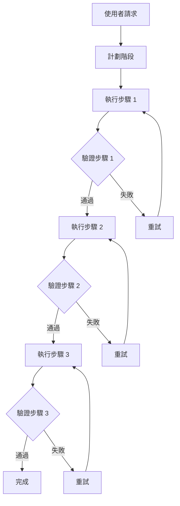
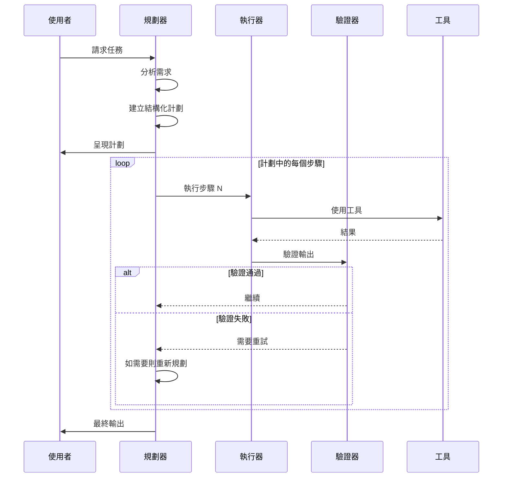
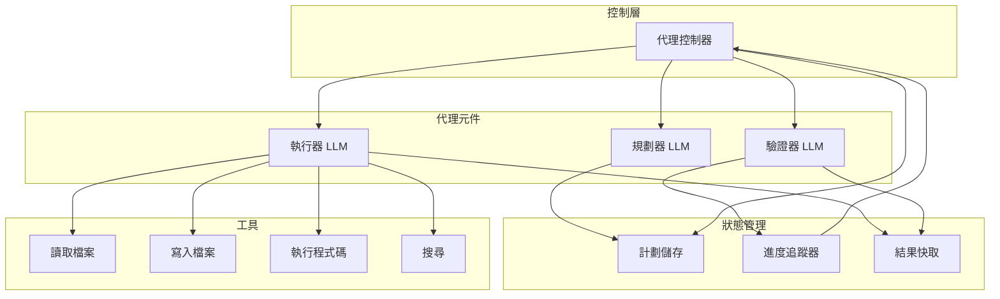
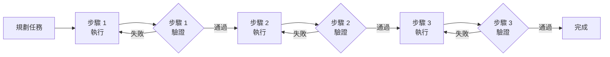
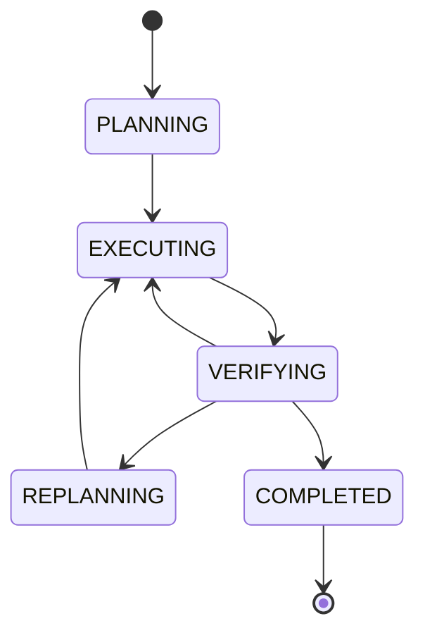
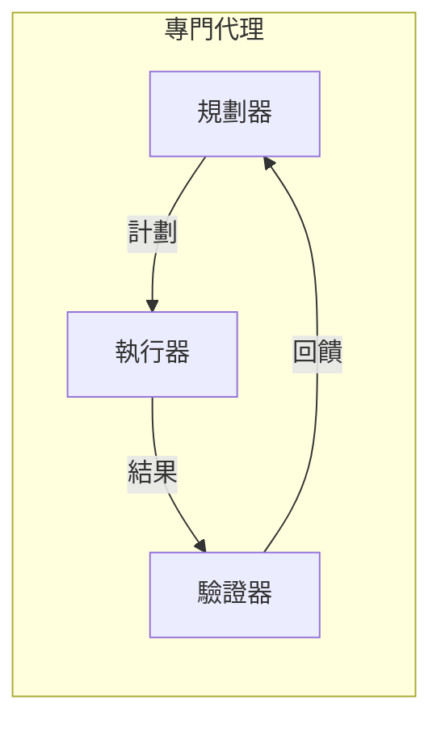
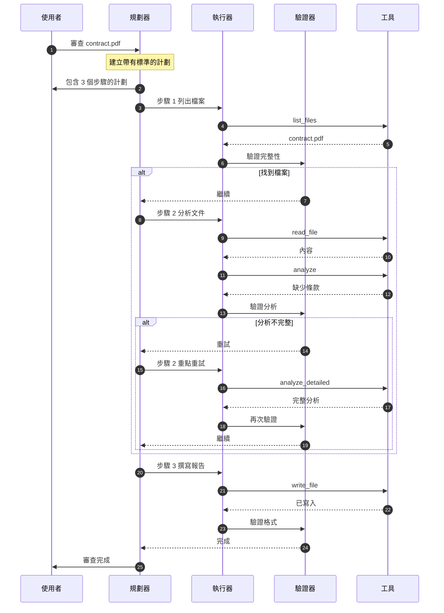
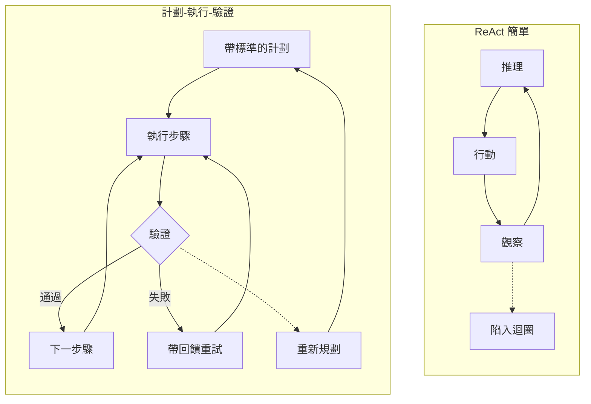
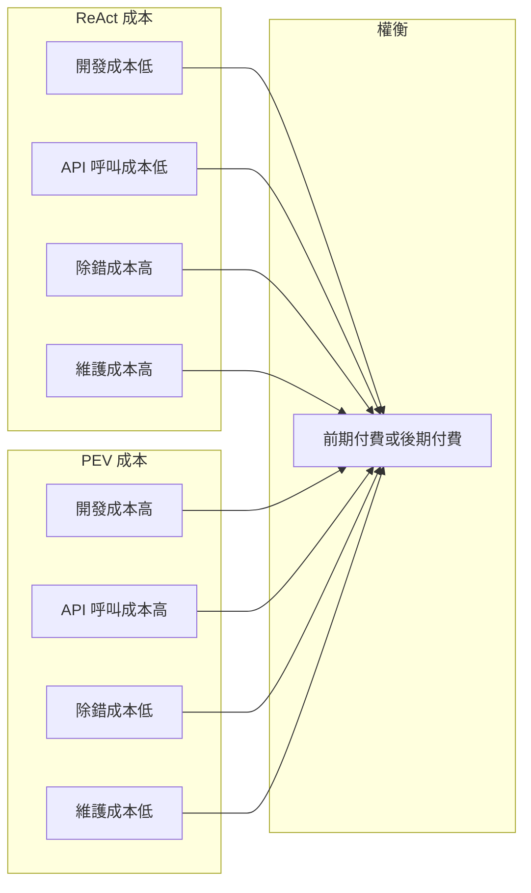

## 什麼是計劃-執行-驗證？

**計劃-執行-驗證（Plan-Execute-Verify, PEV）**是一種生產級的 AI 代理架構，將關注點分離為三個專門的階段：

1. **計劃（Plan）**：建立結構化計劃並設定驗收標準
2. **執行（Execute）**：獨立執行每個步驟
3. **驗證（Verify）**：在繼續之前檢查品質

這種分離使得能夠實現強健的錯誤處理、品質保證和自動恢復。

## 核心概念

## 控制流程

與 ReAct 的簡單迴圈不同，PEV 具有不同的階段和品質閘門：

## 架構圖

## 範例：法律文件審查

以下展示 PEV 如何處理具有品質閘門的法律文件審查任務：

## 狀態機視圖

## 主要特性

### OK 優勢

- **強健**：內建錯誤處理和恢復
- **品質保證**：在繼續之前進行驗證
- **透明**：清晰的計劃並設有驗收標準
- **生產就緒**：自動處理邊界情況
- **可確定性**：可以稽核每個決策

### ⚠️ 權衡

- **更複雜**：約 1000-1500 行程式碼，相比 ReAct 的約 400 行
- **較慢**：每個步驟需要多次 LLM 呼叫
- **成本更高**：3 倍 API 呼叫（計劃 + 執行 + 驗證）
- **過度設計**：對於簡單的線性任務

## 何時使用 PEV

| OK 使用 PEV 的情況...     | FAIL 避免使用 PEV 的情況... |
| ------------------------- | --------------------------- |
| 生產系統                  | 快速原型/MVP                |
| 品質至關重要              | 簡單的 3 步驟任務           |
| 複雜的工作流程（5+ 步驟） | 學習代理基礎                |
| 需要稽核追蹤              | 成本是主要考量              |
| 需要錯誤恢復              | 需要快速迭代                |
| 多階段驗證                | 即時回應至關重要            |

## 三代理架構

**為什麼要分離代理？**

- **規劃器**：針對策略思考進行優化（可以使用較慢但更聰明的模型）
- **執行器**：針對快速工具執行進行優化（可以使用更快的模型）
- **驗證器**：針對品質檢查進行優化（可以使用不同的評估標準）

## 訊息流程範例

以下是顯示驗證的詳細互動：

## 與 ReAct 的比較

## 成本效益分析

**PEV 哲學**：支付更高的前期成本（開發 + API 呼叫）以降低長期成本（除錯 + 維護）。

## 最適合的場景

- **生產系統**：面向客戶的應用程式
- **複雜工作流程**：多步驟、決策密集的任務
- **品質關鍵**：法律、醫療、金融領域
- **可稽核性**：需要解釋每個決策
- **可靠性**：無法承受代理失敗

## 實作選項

繼續閱讀其中一個實作指南：

1. **[Claude SDK 實作](/ai-agent-study/zh-tw/plan-execute-verify/02-claude-implementation/)** - 完整的生產範例
2. **[模型無關設計](/ai-agent-study/zh-tw/plan-execute-verify/03-model-agnostic/)** - 多提供商架構
3. **[LangChain 實作](/ai-agent-study/zh-tw/plan-execute-verify/04-langchain/)** - 基於框架的方法

## 下一步

- **剛接觸 PEV？** → 從 [Claude SDK 實作](/ai-agent-study/zh-tw/plan-execute-verify/02-claude-implementation/) 開始
- **需要靈活性？** → 閱讀 [模型無關設計](/ai-agent-study/zh-tw/plan-execute-verify/03-model-agnostic/)
- **想要快速開發？** → 嘗試 [LangChain 實作](/ai-agent-study/zh-tw/plan-execute-verify/04-langchain/)
- **還在學習？** → 回到 [ReAct 模式](/ai-agent-study/zh-tw/react/01-overview/) 學習基礎
