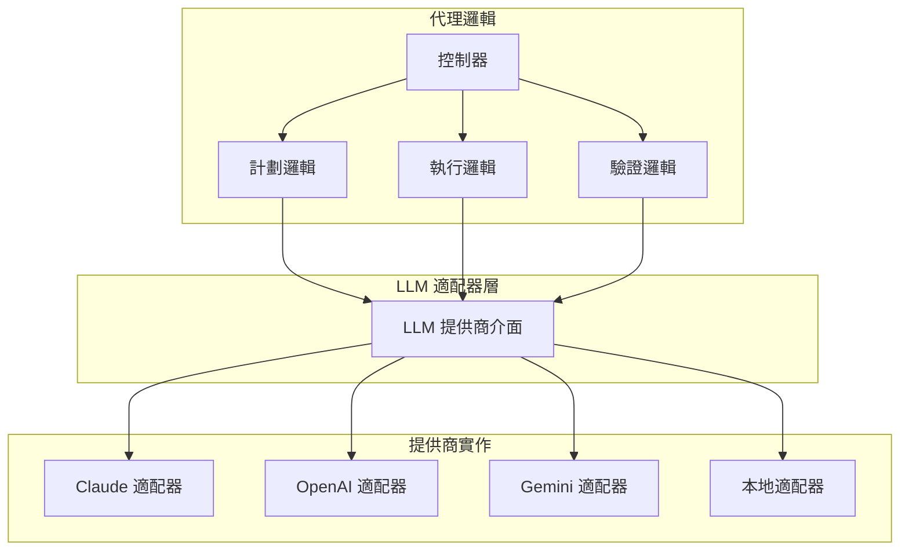
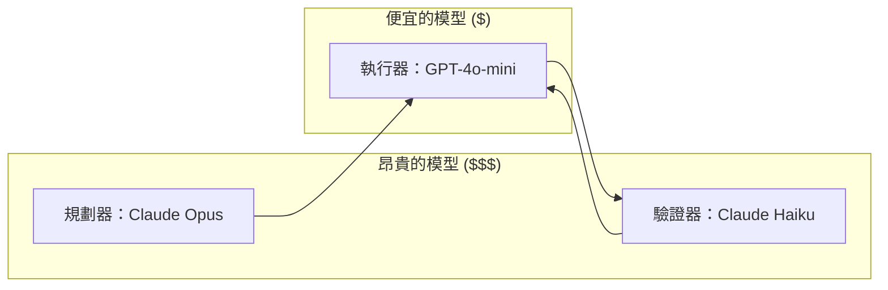

## 概覽

本指南展示如何建構可跨多個 LLM 供應商運作的計劃-執行-驗證代理。與 ReAct 的單一代理不同，PEV 管理**三個獨立元件**（規劃器、執行器、驗證器），每個都可以使用不同的供應商。

### 為何跨模型對 PEV 很重要

**成本優化**：在品質重要的地方使用昂貴的模型（規劃、驗證），在速度重要的地方使用便宜的模型（執行）。

**靈活性**：每個元件可以獨立使用最適合的供應商：

- **規劃器**：使用最佳推理模型（例如 Claude Opus 用於複雜規劃）
- **執行器**：使用最快的模型（例如 GPT-4o-mini 用於快速執行）
- **驗證器**：使用最佳評估模型（例如 Gemini 提供不同視角）

**可靠性**：每個元件的備援選項減少單點故障。

### 兩種方法

1. **LangChain/LangGraph（推薦）**：框架管理的供應商抽象，採用最新的 2026 模式
2. **手動抽象（教育性）**：建構您自己的實作以了解內部運作

## 方法 1：LangChain/LangGraph（推薦）

LangChain 預設提供出色的供應商抽象。在 2026 年，**LangGraph** 是生產環境計劃-執行代理的推薦框架。

### 最新 2026 框架更新

- **LangGraph**：現在是使用 StateGraph 進行計劃-執行工作流程的標準
- **需求**：`langchain-core >= 0.3`（支援 Pydantic v2）
- **官方文件**：[LangGraph 計劃與執行教學](https://langchain-ai.github.io/langgraph/tutorials/plan-and-execute/plan-and-execute/)

### LangChain 中的供應商抽象

LangChain 為所有 LLM 供應商使用統一的介面：

```python
from langchain_anthropic import ChatAnthropic
from langchain_openai import ChatOpenAI
from langchain_google_genai import ChatGoogleGenerativeAI
from langchain_community.llms import Ollama

# 所有這些都具有相同的介面！
llm_claude = ChatAnthropic(model="claude-sonnet-4-5-20250929")
llm_gpt = ChatOpenAI(model="gpt-4-turbo-preview")
llm_gemini = ChatGoogleGenerativeAI(model="gemini-1.5-pro")
llm_local = Ollama(model="mistral")

# 相同的方法呼叫適用於所有
response = llm_claude.invoke("Hello!")
response = llm_gpt.invoke("Hello!")
```

### 設定

```bash
pip install langchain>=0.3.0 langchain-anthropic langchain-openai langchain-google-genai langchain-community
```

### 步驟 1：定義資料模型

```python
from dataclasses import dataclass
from enum import Enum
from typing import List, Dict, Any, Optional

class StepStatus(Enum):
    PENDING = "pending"
    IN_PROGRESS = "in_progress"
    COMPLETE = "complete"
    FAILED = "failed"

@dataclass
class Step:
    step_id: str
    name: str
    description: str
    actions: List[str]
    acceptance_criteria: List[str]
    expected_outputs: List[str]
    status: StepStatus = StepStatus.PENDING
    retry_count: int = 0
    feedback: List[str] = None

@dataclass
class Plan:
    goal: str
    steps: List[Step]
    success_criteria: List[str]

@dataclass
class VerificationResult:
    passed: bool
    action: str  # "pass", "retry", "replan"
    feedback: Optional[str] = None
    evidence: Optional[str] = None
```

### 步驟 2：規劃器元件

```python
from langchain_core.messages import SystemMessage, HumanMessage
import json

class PlannerComponent:
    """Creates structured plans using any LLM"""

    SYSTEM_PROMPT = """You are an expert planning specialist.

Create a detailed plan for the given task. Respond with ONLY valid JSON:

{
  "goal": "High-level objective",
  "steps": [
    {
      "step_id": "1",
      "name": "Brief step name",
      "description": "What to do in detail",
      "actions": ["action1", "action2"],
      "acceptance_criteria": ["Specific measurable criterion 1"],
      "expected_outputs": ["file1.md"]
    }
  ],
  "success_criteria": ["Overall success criterion"]
}

Make criteria SPECIFIC and MEASURABLE."""

    def __init__(self, llm):
        self.llm = llm

    def create_plan(self, user_request: str, context: Dict[str, Any]) -> Plan:
        messages = [
            SystemMessage(content=self.SYSTEM_PROMPT),
            HumanMessage(content=f"REQUEST: {user_request}\n\nCONTEXT: {json.dumps(context)}")
        ]
        response = self.llm.invoke(messages)
        plan_json = self._extract_json(response.content)

        steps = [Step(**s) for s in plan_json["steps"]]
        return Plan(
            goal=plan_json["goal"],
            steps=steps,
            success_criteria=plan_json["success_criteria"]
        )
```

### 步驟 3：執行器元件

```python
from langchain_core.tools import tool
from langchain_core.messages import ToolMessage

class ExecutorComponent:
    """Executes steps using tools with any LLM"""

    def __init__(self, llm, tools: List):
        self.llm = llm
        self.tools = tools
        self.tool_map = {tool.name: tool for tool in tools}
        self.llm_with_tools = llm.bind_tools(tools)

    def execute_step(self, step: Step, context: Dict[str, Any]) -> Dict[str, Any]:
        messages = [
            SystemMessage(content="Execute the step thoroughly using tools."),
            HumanMessage(content=f"STEP: {step.name}\nCRITERIA: {step.acceptance_criteria}")
        ]

        artifacts = []
        actions_taken = []

        for i in range(10):  # Max 10 tool iterations
            response = self.llm_with_tools.invoke(messages)
            messages.append(response)

            if not response.tool_calls:
                return {
                    "summary": response.content,
                    "artifacts": artifacts,
                    "actions_taken": actions_taken
                }

            # Execute tools
            for tool_call in response.tool_calls:
                result = self.tool_map[tool_call["name"]].invoke(tool_call["args"])
                actions_taken.append({"tool": tool_call["name"], "result": str(result)[:200]})
                messages.append(ToolMessage(content=str(result), tool_call_id=tool_call["id"]))

        return {"summary": "Execution incomplete", "artifacts": artifacts, "actions_taken": actions_taken}
```

### 步驟 4：驗證器元件

```python
class VerifierComponent:
    """Verifies step execution with any LLM"""

    SYSTEM_PROMPT = """You are a verification specialist.
Check if execution meets ALL acceptance criteria.

Respond with ONLY valid JSON:
{
  "passed": true/false,
  "action": "pass|retry|replan",
  "evidence": "Specific evidence",
  "feedback": "Actionable feedback if retry needed"
}"""

    def __init__(self, llm):
        self.llm = llm

    def verify(self, step: Step, result: Dict[str, Any]) -> VerificationResult:
        messages = [
            SystemMessage(content=self.SYSTEM_PROMPT),
            HumanMessage(content=f"STEP: {step.name}\nCRITERIA: {step.acceptance_criteria}\nRESULT: {result}")
        ]

        response = self.llm.invoke(messages)
        verification_json = json.loads(response.content)

        return VerificationResult(
            passed=verification_json["passed"],
            action=verification_json["action"],
            feedback=verification_json.get("feedback"),
            evidence=verification_json.get("evidence")
        )
```

### 步驟 5：完整的 PEV 代理

```python
class PlanExecuteVerifyAgent:
    """Complete PEV agent with LangChain - works with ANY providers!"""

    def __init__(self, planner_llm, executor_llm, verifier_llm, tools: List):
        self.planner = PlannerComponent(planner_llm)
        self.executor = ExecutorComponent(executor_llm, tools)
        self.verifier = VerifierComponent(verifier_llm)

    def run(self, user_request: str, context: Dict[str, Any]) -> Optional[Plan]:
        # Phase 1: Planning
        plan = self.planner.create_plan(user_request, context)

        # Phase 2: Execute with verification
        for step in plan.steps:
            success = self._execute_step_with_verification(step, context)
            if not success:
                return None

        return plan

    def _execute_step_with_verification(self, step: Step, context: Dict[str, Any]) -> bool:
        max_retries = 3
        for attempt in range(1, max_retries + 1):
            result = self.executor.execute_step(step, context)
            verification = self.verifier.verify(step, result)

            if verification.passed:
                step.status = StepStatus.COMPLETE
                return True
            elif verification.action == "retry" and attempt < max_retries:
                step.feedback.append(verification.feedback)
                step.retry_count += 1
            else:
                step.status = StepStatus.FAILED
                return False
        return False
```

### 切換供應商（一行程式碼！）

```python
# 全部使用 Claude
planner = ChatAnthropic(model="claude-opus-4-6")
executor = ChatAnthropic(model="claude-sonnet-4-5-20250929")
verifier = ChatAnthropic(model="claude-haiku-4-5-20251001")

# 或使用 OpenAI：
from langchain_openai import ChatOpenAI
planner = ChatOpenAI(model="gpt-4-turbo-preview")
executor = ChatOpenAI(model="gpt-4-turbo-preview")
verifier = ChatOpenAI(model="gpt-3.5-turbo")

# 或混合供應商以優化成本：
planner = ChatAnthropic(model="claude-opus-4-6")  # 最佳推理
executor = ChatOpenAI(model="gpt-4o-mini")  # 快速且便宜
verifier = ChatGoogleGenerativeAI(model="gemini-1.5-flash")  # 良好的評估

agent = PlanExecuteVerifyAgent(planner, executor, verifier, tools)
```

## 方法 2：手動抽象（教育性）

建構您自己的供應商抽象以了解其內部運作方式。

### 三代理架構



### 步驟 1：提供商介面

```python
from abc import ABC, abstractmethod
from dataclasses import dataclass
from typing import List, Dict, Any

@dataclass
class LLMRequest:
    messages: List[Dict[str, str]]
    tools: Optional[List[Dict]] = None
    temperature: float = 0.7
    max_tokens: int = 4000

@dataclass
class LLMResponse:
    content: str
    tool_calls: List[Dict]
    finish_reason: str

class LLMProvider(ABC):
    @abstractmethod
    def complete(self, request: LLMRequest) -> LLMResponse:
        """Send request to LLM and get standardized response"""
        pass
```

### 步驟 2：提供商實作

```python
import anthropic

class ClaudeProvider(LLMProvider):
    def __init__(self, api_key: str, model: str = "claude-sonnet-4-5-20250929"):
        self.client = anthropic.Anthropic(api_key=api_key)
        self.model = model

    def complete(self, request: LLMRequest) -> LLMResponse:
        response = self.client.messages.create(
            model=self.model,
            messages=request.messages,
            tools=request.tools or [],
            temperature=request.temperature,
            max_tokens=request.max_tokens
        )

        return LLMResponse(
            content=response.content[0].text if response.content else "",
            tool_calls=[{"name": tc.name, "args": tc.input} for tc in response.content if tc.type == "tool_use"],
            finish_reason=response.stop_reason
        )
```

### 步驟 3：AgnosticPEVAgent

```python
class AgnosticPEVAgent:
    """PEV agent that works with any LLM providers via manual abstraction"""

    def __init__(self, planner: LLMProvider, executor: LLMProvider, verifier: LLMProvider, tools: List):
        self.planner = planner
        self.executor = executor
        self.verifier = verifier
        self.tools = tools

    def run(self, user_request: str, context: str = "") -> Dict[str, Any]:
        # Phase 1: Planning
        plan = self._create_plan(user_request, context)

        # Phase 2: Execute steps with verification
        results = []
        for step in plan.steps:
            step_result = self._execute_and_verify_step(step)
            results.append(step_result)

            if not step_result["verified"]:
                if step_result["retry_count"] >= step.max_retries:
                    return {"success": False, "error": f"Step {step.id} failed"}

        return {"success": True, "result": results[-1]["output"], "plan": plan}
```

### 步驟 4：使用手動抽象

```python
# 每個元件可以使用不同的供應商！
planner_provider = ClaudeProvider(api_key=os.getenv("ANTHROPIC_API_KEY"), model="claude-opus-4-6")
executor_provider = OpenAIProvider(api_key=os.getenv("OPENAI_API_KEY"), model="gpt-4o-mini")
verifier_provider = GeminiProvider(api_key=os.getenv("GOOGLE_API_KEY"), model="gemini-1.5-flash")

agent = AgnosticPEVAgent(
    planner=planner_provider,
    executor=executor_provider,
    verifier=verifier_provider,
    tools=tools
)

result = agent.run("Review legal documents")
```

## 供應商比較

| 供應商                | 最適合           | 成本 | 速度   | 推理品質 |
| --------------------- | ---------------- | ---- | ------ | -------- |
| **Claude Opus 4.6**   | 規劃             | 高   | 慢     | 優秀     |
| **Claude Sonnet 4.5** | 平衡             | 中   | 中     | 非常好   |
| **Claude Haiku 4.5**  | 執行/驗證        | 低   | 快     | 好       |
| **GPT-4 Turbo**       | 通用目的         | 中高 | 快     | 非常好   |
| **GPT-4o-mini**       | 快速執行         | 低   | 非常快 | 好       |
| **Gemini 1.5 Pro**    | 多模態、長上下文 | 中   | 中     | 非常好   |
| **Gemini 1.5 Flash**  | 驗證             | 低   | 快     | 好       |
| **本地 (Ollama)**     | 隱私、離線       | 免費 | 不一定 | 不一定   |

## 完整實作範例

```python
import os
from langchain_anthropic import ChatAnthropic
from langchain_openai import ChatOpenAI
from langchain_core.tools import tool

# 定義工具
@tool
def read_file(path: str) -> str:
    """Read a file from disk."""
    with open(path, 'r') as f:
        return f.read()

@tool
def write_file(path: str, content: str) -> str:
    """Write content to a file."""
    os.makedirs(os.path.dirname(path) or ".", exist_ok=True)
    with open(path, 'w') as f:
        f.write(content)
    return f"Success: Wrote to {path}"

tools = [read_file, write_file]

# 成本優化的混合供應商設定
planner_llm = ChatAnthropic(model="claude-opus-4-6", temperature=0)  # 最佳推理
executor_llm = ChatOpenAI(model="gpt-4o-mini", temperature=0)  # 快速且便宜
verifier_llm = ChatAnthropic(model="claude-haiku-4-5-20251001", temperature=0)  # 便宜的驗證

# 建立代理
agent = PlanExecuteVerifyAgent(
    planner_llm=planner_llm,
    executor_llm=executor_llm,
    verifier_llm=verifier_llm,
    tools=tools
)

# 執行
result = agent.run(
    user_request="Review all legal documents and create comprehensive reports",
    context={"folder_path": "/project/legal_docs"}
)
```

## 生產建議

### 何時使用什麼

| 場景               | 建議                                     |
| ------------------ | ---------------------------------------- |
| **生產系統**       | LangChain/LangGraph（方法 1）            |
| **學習內部運作**   | 手動抽象（方法 2）                       |
| **成本優化**       | 混合供應商（昂貴的規劃器、便宜的執行器） |
| **最大控制**       | 帶有自訂邏輯的手動抽象                   |
| **快速原型**       | LangChain 全部使用相同供應商             |
| **供應商特定功能** | 混合（LangChain + 自訂適配器）           |

### 成本優化策略



**策略**：在品質重要的地方使用昂貴的模型（規劃、最終驗證），在速度重要的地方使用便宜的模型（執行）。

### 跨供應商測試

```python
import pytest

@pytest.fixture
def providers():
    return {
        "claude": ChatAnthropic(model="claude-sonnet-4-5-20250929"),
        "gpt": ChatOpenAI(model="gpt-4-turbo-preview"),
        "gemini": ChatGoogleGenerativeAI(model="gemini-1.5-pro")
    }

@pytest.mark.parametrize("planner,executor,verifier", [
    ("claude", "claude", "claude"),
    ("claude", "gpt", "claude"),
    ("gpt", "gpt", "gpt"),
])
def test_pev_agent(providers, planner, executor, verifier):
    agent = PlanExecuteVerifyAgent(
        planner_llm=providers[planner],
        executor_llm=providers[executor],
        verifier_llm=providers[verifier],
        tools=test_tools
    )

    result = agent.run("Simple test task", {})
    assert result is not None
```

## 比較：LangChain vs 手動

| 方面           | LangChain（方法 1）   | 手動（方法 2）        |
| -------------- | --------------------- | --------------------- |
| **設定時間**   | 快（約 100 行）       | 慢（適配器約 500 行） |
| **供應商切換** | 一行程式碼            | 更新適配器類別        |
| **工具呼叫**   | 統一的 `bind_tools()` | 解析每個供應商的格式  |
| **維護**       | LangChain 處理更新    | 您維護適配器          |
| **控制**       | 一些抽象開銷          | 完全控制              |
| **學習價值**   | 使用框架模式          | 了解內部運作          |
| **生產就緒**   | ✅ 是（2026 標準）    | ⚠️ 需要測試           |

## 關鍵要點

**對於生產環境**：使用 LangChain/LangGraph（方法 1）

- 內建的供應商抽象
- 最新的 2026 模式與 StateGraph
- 豐富的生態系統（記憶體、回呼、可觀測性）
- 社群支援和定期更新

**對於學習**：嘗試手動抽象（方法 2）

- 了解供應商差異
- 學習工具呼叫如何跨 API 運作
- 在需要時建構自訂功能

**成本優化**：策略性地混合供應商

- 用於規劃的昂貴模型（Claude Opus）
- 用於執行的便宜模型（GPT-4o-mini）
- 用於驗證的快速模型（Claude Haiku、Gemini Flash）

## 下一步

- **實作**：參閱 [Claude SDK 實作](/ai-agent-study/zh-tw/plan-execute-verify/02-claude-implementation/) 以獲得實作範例
- **相關**：查看 [ReAct 跨模型](/ai-agent-study/zh-tw/react/03-multi-provider/)以獲得更簡單的單代理版本

## 資源

- [LangGraph 計劃與執行教學](https://langchain-ai.github.io/langgraph/tutorials/plan-and-execute/plan-and-execute/) - 官方 2026 文件
- [LangChain 代理指南](https://blog.langchain.com/planning-agents/) - 規劃代理模式
- [ReAct 跨模型](/ai-agent-study/zh-tw/react/03-multi-provider/) - 更簡單的單代理模式
