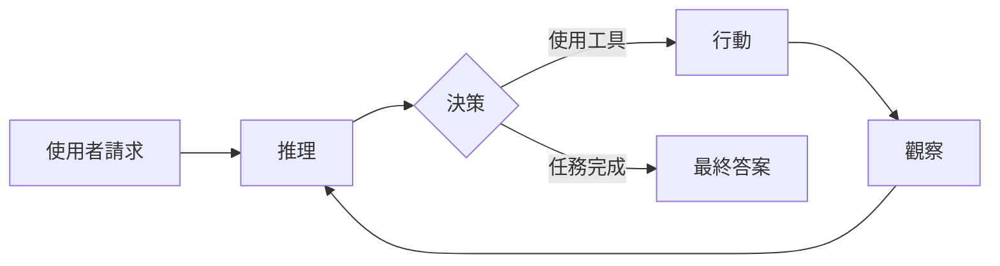
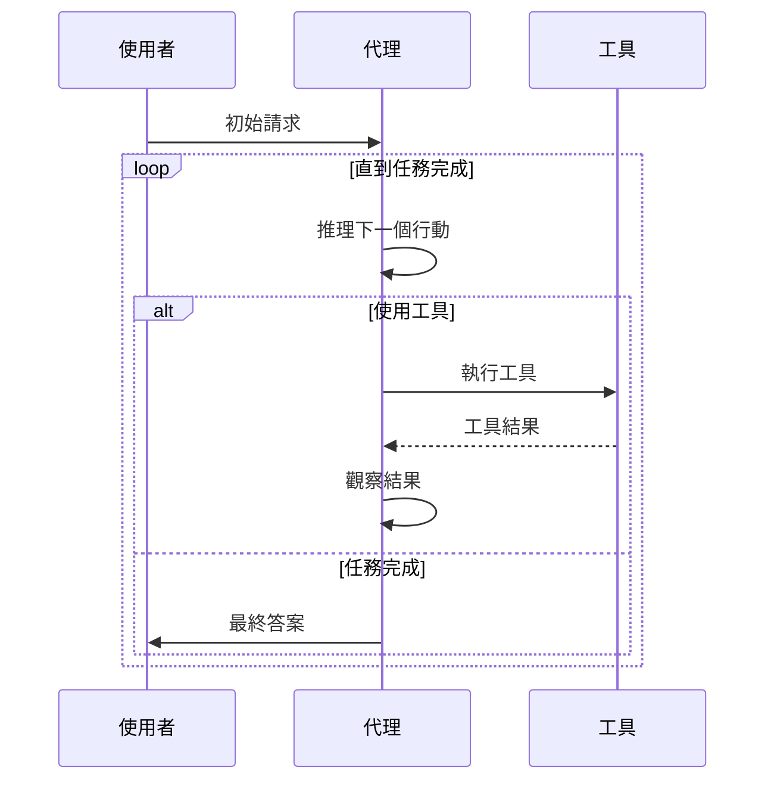
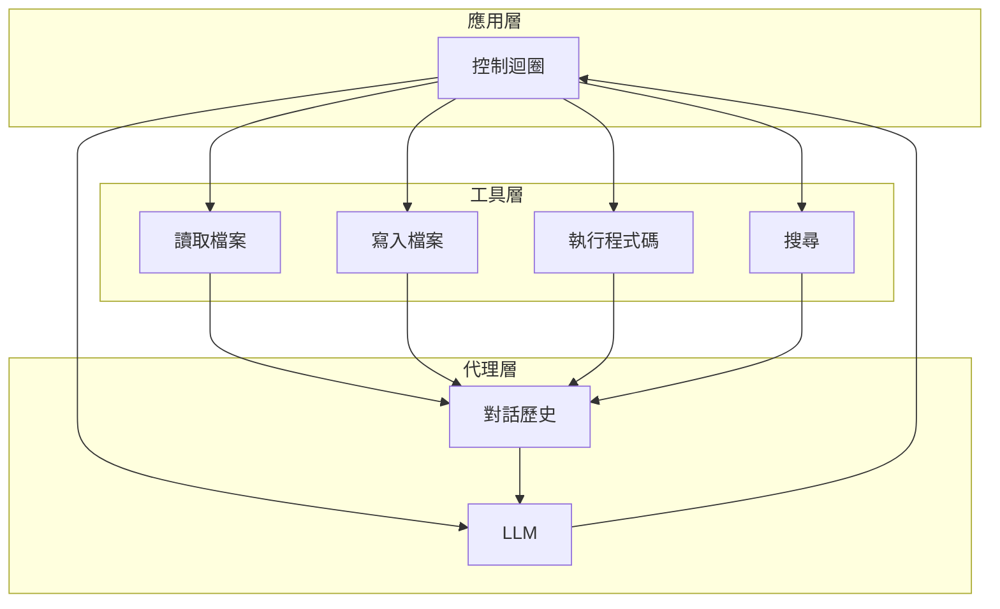
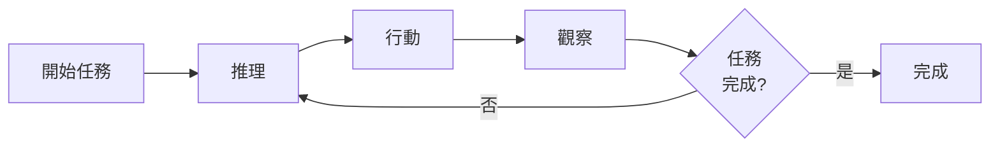
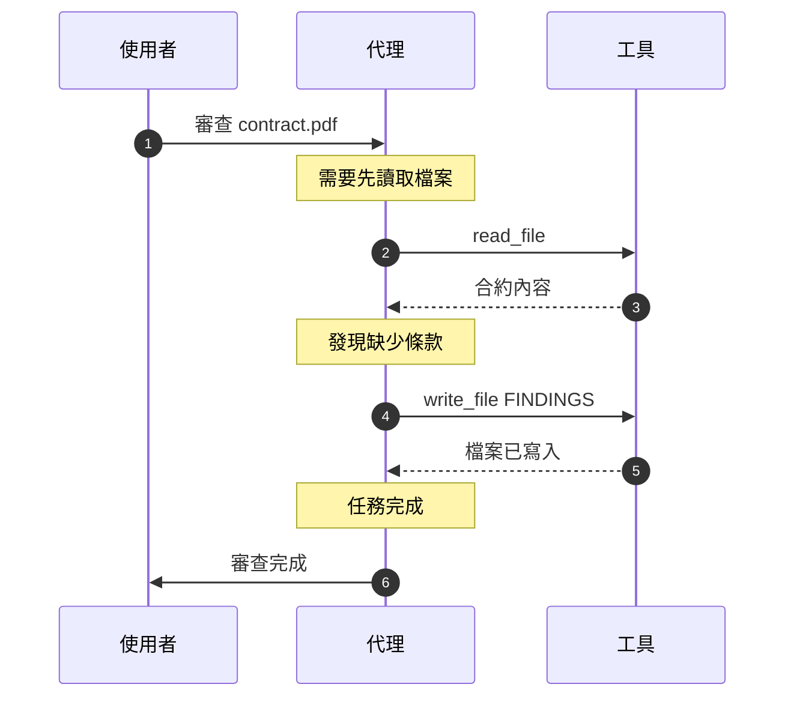
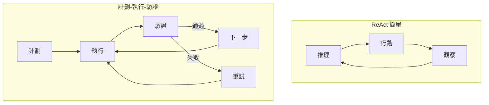

## 什麼是 ReAct？

**ReAct**（推理 + 行動）是最簡單的 AI 代理架構。代理在**推理**下一步該做什麼、**採取行動**和**觀察**結果之間交替進行。

「ReAct」這個名稱結合了：

- **Re**asoning（推理）：模型思考該做什麼
- **Act**ing（行動）：模型執行工具或完成任務

## 核心概念

## 控制流程

ReAct 模式遵循一個簡單的迴圈：

## 架構圖

## 範例：法律文件審查

以下是 ReAct 如何處理法律文件審查任務：

## 關鍵特性

### ✅ 優勢

- **簡單**：易於理解和實作（約 200-400 行程式碼）
- **透明**：每個步驟的推理都很清楚
- **可除錯**：可以準確追蹤代理做了什麼以及為什麼
- **靈活**：適用於任何支援工具呼叫的 LLM

### ⚠️ 限制

- **無品質檢查**：代理不驗證自己的工作
- **可能迴圈**：可能陷入重複行動
- **無計劃**：一次決定一個步驟
- **容易出錯**：無恢復機制

## 何時使用 ReAct

| ✅ 使用 ReAct 的時機...   | ❌ 避免使用 ReAct 的時機... |
| ------------------------- | --------------------------- |
| 建構原型或 MVP            | 生產系統需要可靠性          |
| 學習代理基礎              | 複雜的多步驟工作流程        |
| 簡單的線性任務（3-5 步）  | 需要品質保證                |
| 小型工具集（< 10 個工具） | 錯誤恢復至關重要            |
| 需要快速迭代              | 需要合規/稽核軌跡           |

## 訊息流程範例

以下是對話的樣子：

## 與計劃-執行-驗證的比較

**主要差異**：ReAct 是單一迴圈，而計劃-執行-驗證將計劃、執行和驗證分成不同的階段。

## 最適合

- **學習**：非常適合理解代理概念
- **原型開發**：快速建構和迭代
- **簡單任務**：3-5 個步驟，明確的需求
- **展示**：易於解釋和視覺化

## 實作選項

繼續閱讀其中一個實作指南：

1. **[Claude SDK 實作](/ai-agent-study/zh-tw/react/02-claude-implementation/)** - 直接 API 整合（最高控制度）
2. **[模型無關設計](/ai-agent-study/zh-tw/react/03-model-agnostic/)** - 支援多個 LLM 供應商
3. **[LangChain 實作](/ai-agent-study/zh-tw/react/04-langchain/)** - 使用 LangChain 框架（最快開發速度）

## 下一步

- **代理新手？** → 從 [Claude SDK 實作](/ai-agent-study/zh-tw/react/02-claude-implementation/) 開始
- **需要靈活性？** → 閱讀 [模型無關設計](/ai-agent-study/zh-tw/react/03-model-agnostic/)
- **想要速度？** → 嘗試 [LangChain 實作](/ai-agent-study/zh-tw/react/04-langchain/)
- **準備投入生產？** → 探索 [計劃-執行-驗證模式](/ai-agent-study/zh-tw/plan-execute-verify/01-overview/)
